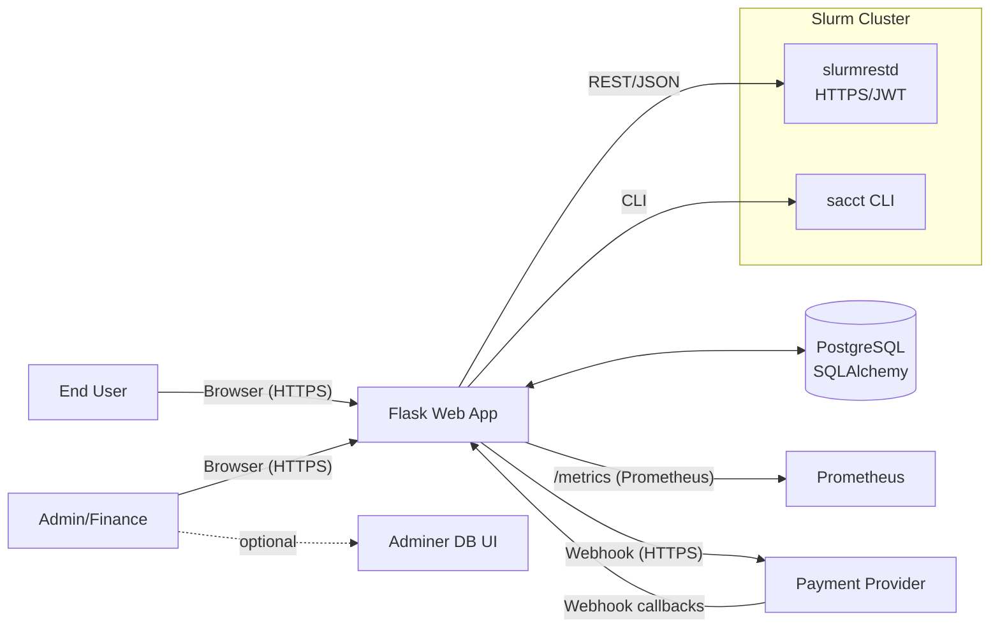
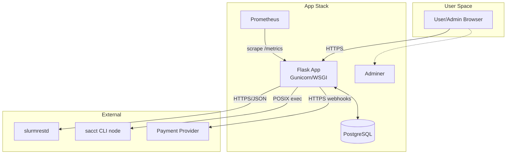
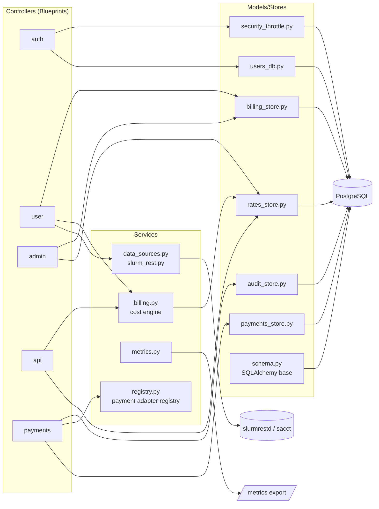
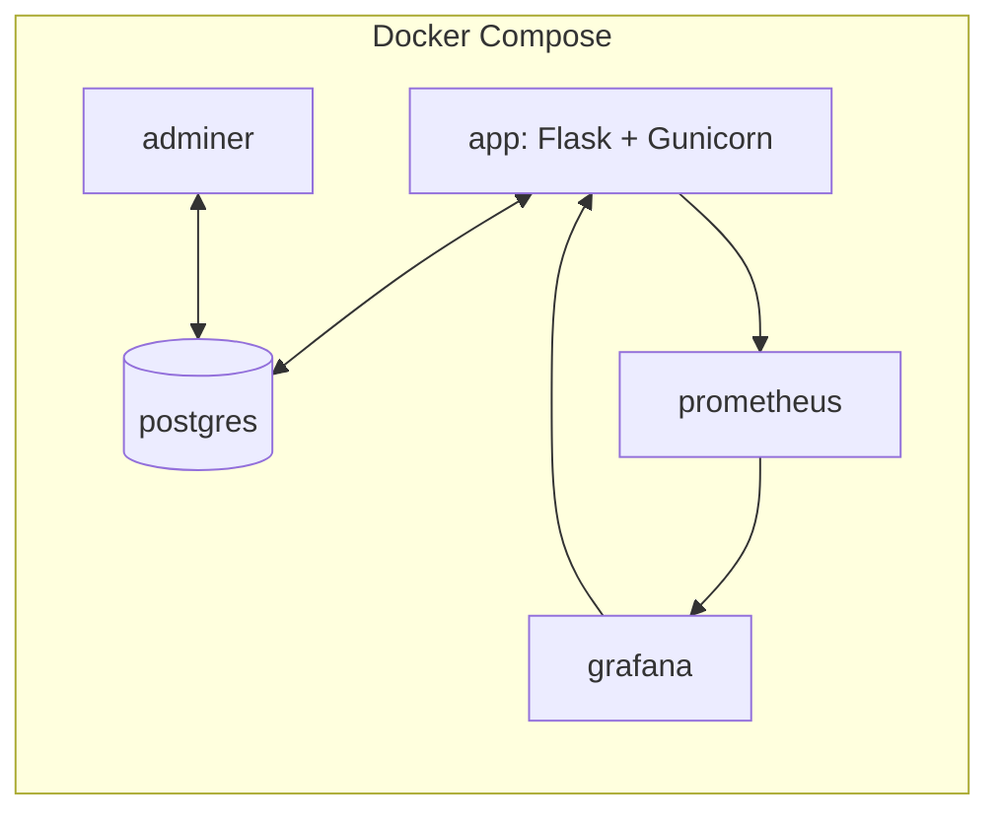
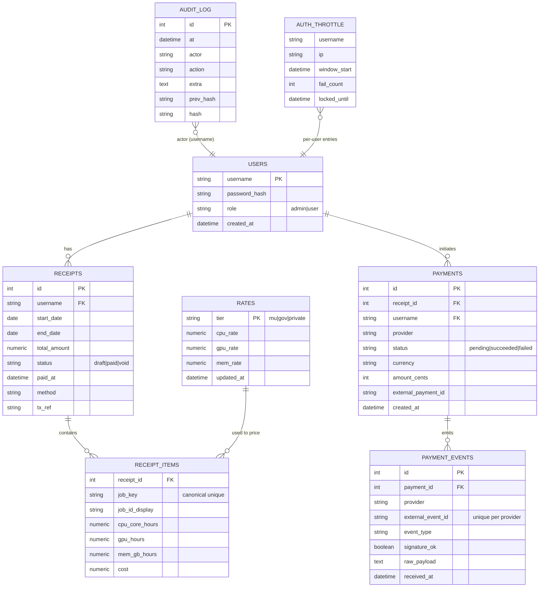
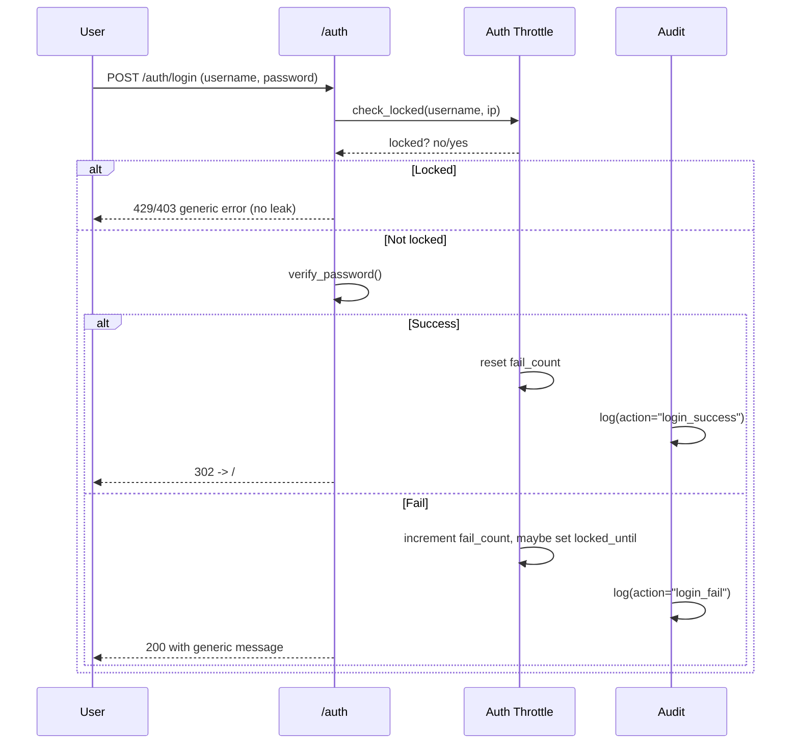
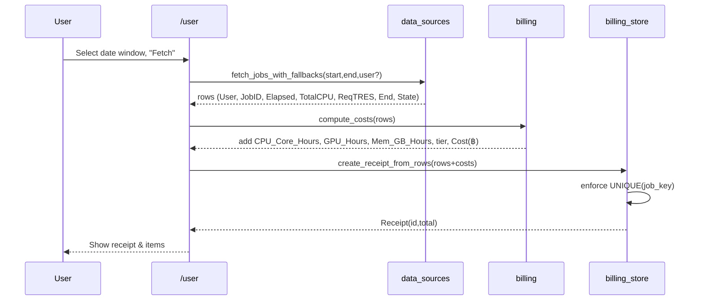
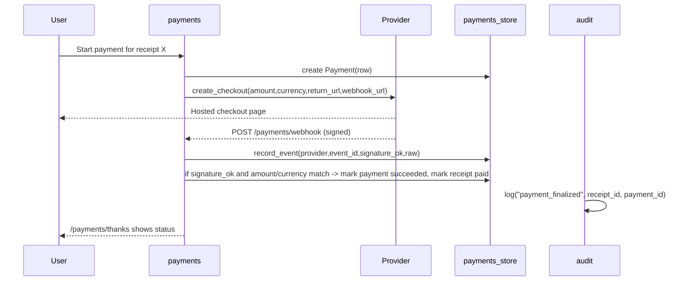
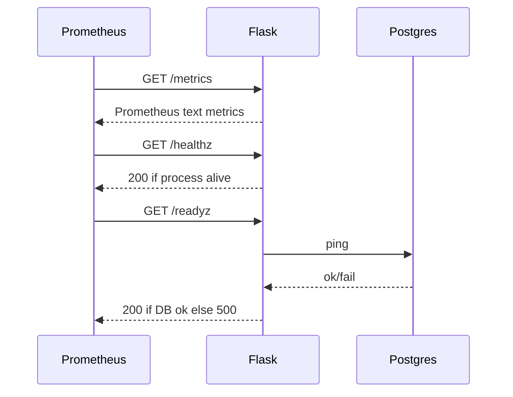

# Architecture

> How the system is structured: context, containers, components, key flows, data, and the main use cases. All diagrams are text-based (Mermaid) so they render in MkDocs Material.

---

## 1) System context (C4-L1)

**Intent**

- The web app ingests job usage from **Slurm** (prefer `slurmrestd`, fall back to `sacct`, last-resort CSV), computes costs, and produces **receipts**.
- Online payments (optional) are finalized **only via provider webhooks**.
- Observability via Prometheus `/metrics`; health endpoints for ops.
- Adminer is only for **dev troubleshooting**.

---

## 2) Containers (C4-L2)

**Security boundaries**

- Public edge terminates at the Flask reverse proxy/app.
- DB and Adminer live on a private network in **dev**; in **prod** Adminer is removed and DB is managed/hosted.
- `slurmrestd` must be TLS-protected and authenticated (e.g., JWT).
- Payment webhooks require **HMAC/signature** verification and strict amount/currency checks.

---

## 3) Components (C4-L3 inside Flask)

**Responsibilities (mapping to files)**

- **Controllers** (route layer): authentication & sessions (`auth.py`), user billing UI (`user.py`), admin console (`admin.py`), public/admin API (`api.py`), payment flows & webhook (`payments.py`).
- **Services**: cost calculation (`billing.py`), Slurm ingestion (`data_sources.py`, `slurm_rest.py`), Prometheus metrics (`metrics.py`), dynamic payment provider binding (`registry.py`).
- **Models/Stores**: SQLAlchemy models and persistence helpers (`schema.py`, `*store.py`), audit hash-chain (`audit_store.py`), login throttling (`security_throttle.py`), users & roles (`users_db.py`), rates CRUD (`rates_store.py`), receipts & items (`billing_store.py`), payments & events (`payments_store.py`).
- **App wiring**: app factory, blueprints, CSRF, i18n, logging, health/ready (`app.py`).

---

## 4) Deployment view

- Dev: `docker compose up -d --build` brings up **app + postgres (+ adminer)**.
- Prod: use a managed Postgres, remove Adminer, front the app with a hardened reverse proxy, and configure secrets via environment (no `.env` in image).

---

## 5) Data model (bird’s-eye)

**Notable constraints**

- `RECEIPT_ITEMS.job_key` is **unique** across all receipts → prevents double billing.
- `PAYMENT_EVENTS (provider, external_event_id)` is **unique** → idempotent webhook handling.
- Role and status fields use CHECK-like guards in store layer.

---

## 6) Key flows (sequence)

### 6.1 Login with throttling & audit

### 6.2 Usage → Receipt

### 6.3 Payment (optional) with webhook finalization

### 6.4 Observability & ops

---

## 7) Costing logic (summary)

- Parse Slurm fields into **resource hours**:

  - CPU core-hours from `TotalCPU`/`AllocCPUs` + elapsed.
  - GPU hours from `ReqTRES` parse (`gres/gpu` or `gpu:` patterns).
  - Memory GB-hours from `ReqTRES` memory spec.

- Select **tier** (e.g., `mu | gov | private`) per user rule.
- Apply **tiered rates** → per-job `Cost (฿)`; sum per receipt.

---

## 8) Use cases

| ID    | Actor    | Goal                 | Preconditions       | Main success                                           | Notes                                        |
| ----- | -------- | -------------------- | ------------------- | ------------------------------------------------------ | -------------------------------------------- |
| UC-01 | User     | View my usage        | Logged in           | Sees jobs in date window; can export CSV               | Skips already-billed jobs                    |
| UC-02 | User     | Create a receipt     | UC-01               | Receipt with total is created; items frozen            | Prevents duplicates via `job_key`            |
| UC-03 | User     | Pay a receipt        | UC-02               | Redirected to provider; after webhook → receipt = paid | Signature + amount/currency check            |
| UC-04 | Admin    | Update rates         | Admin role          | New rates persist; new pricing uses them               | Version by timestamp; no retroactive changes |
| UC-05 | Admin    | Inspect billing      | Admin role          | Filter by user/date/status                             | Export audit CSV                             |
| UC-06 | Ops      | Health/ready checks  | App deployed        | `/healthz` 200; `/readyz` DB reachable                 | For Kubernetes/LB probes                     |
| UC-07 | Ops      | Metrics scrape       | Metrics enabled     | Prometheus scrapes `/metrics`                          | Request & auth/billing counters              |
| UC-08 | Security | Throttle brute force | Repeated bad logins | Account/IP temporarily locked                          | Neutral error messages                       |

---

## 9) Cross-cutting concerns

- **Authentication & sessions**: Flask-Login session cookies; CSRF everywhere except webhooks.
- **RBAC**: `user` and `admin` guards at route level.
- **Throttling**: per-user+IP counters with lockout time windows.
- **Auditing**: append-only, hash-chained log for sensitive actions (login events, rate changes, payment finalization).
- **Idempotency**: webhook events unique per provider; applying events is safe to repeat.
- **Configuration**: environment-driven (`DATABASE_URL`, secrets, `SLURMRESTD_URL`, `PAYMENT_PROVIDER`, etc.).
- **Error handling**: graceful fallbacks on Slurm ingestion (`slurmrestd` → `sacct` → CSV).

---

## 10) Scaling & performance (brief)

- **Read path** (usage fetch + pricing) is CPU-light; cache Slurm calls by window if needed.
- **Write path** (receipt creation/payment finalization) is short, DB-bounded; wrap in transactions.
- Use **indexes** on `receipt_items.job_key`, `payment_events (provider, external_event_id)`, and common filters (username, dates, status).
- Horizontal scale the app (stateless) behind a reverse proxy; keep DB as single source of truth, with regular backups.

---

## 11) Threat model (snapshot)

- **Spoofed webhooks** → verify signatures, enforce amount/currency and receipt binding, log all events.
- **Replay attacks** → unique `(provider, external_event_id)`; ignore duplicates.
- **Credential stuffing** → throttle/lockout + audit; neutral login messages.
- **CSRF** → global CSRF; explicitly exempt only webhook route.
- **Prying on dev DB** → never expose Adminer in production; isolate networks; restrict DB users.
- **Double billing** → `job_key` uniqueness at DB layer + UI filtering.

---

## 12) What to configure (quick checklist)

- `DATABASE_URL`, `FLASK_SECRET_KEY`, `ADMIN_PASSWORD`
- `SLURMRESTD_URL` (+ auth tokens/certs), or path to `sacct`
- `PAYMENT_PROVIDER`, `PAYMENT_CURRENCY`, `SITE_BASE_URL`, provider secrets & webhook signing key
- `METRICS_ENABLED`, log level, probe paths

---
