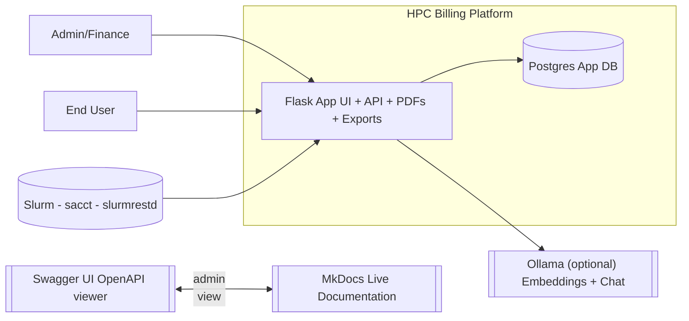
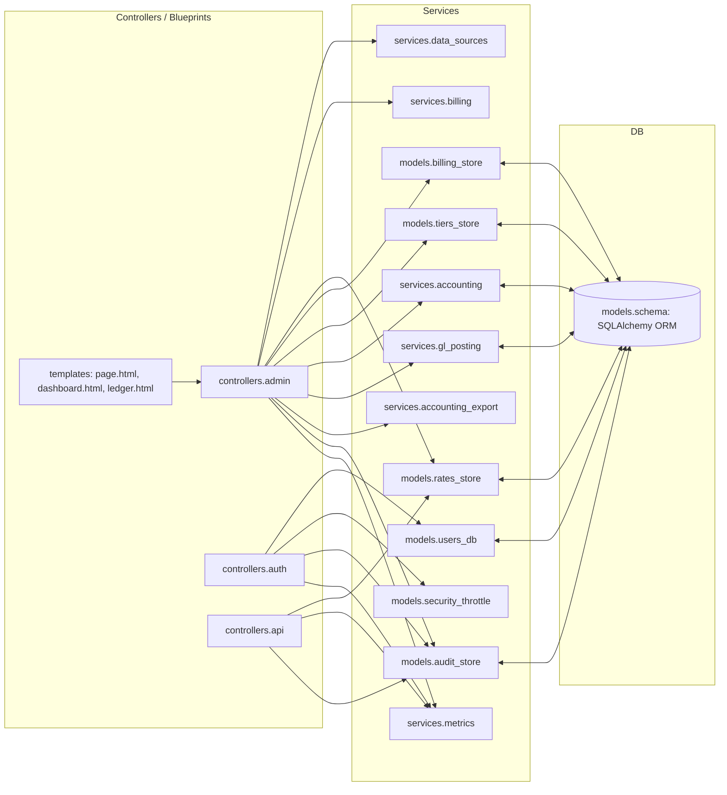
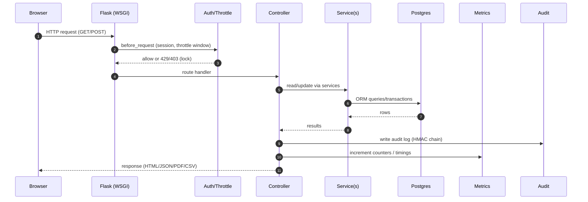
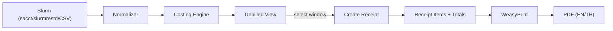
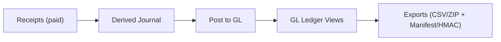

# Architecture

This chapter explains how the HPC Billing Platform is put together: runtime components, internal modules, data flows, and the security/audit model. It’s a pragmatic view grounded in the current codebase and Docker stack.

---

## 1) Big picture

- **Stateless Flask app** that ingests Slurm usage, prices it, produces receipts/PDFs, and exports accounting.
- **Postgres** holds users, rates, receipts/items, audit logs, tier overrides, and posted GL.
- **Docker Compose** brings up the app, DB, and dev‑tools (Adminer, Swagger UI, MkDocs; optional Ollama).
- **Mermaid‑first docs** and **Swagger** live alongside the app for easy review.
- **Prometheus metrics** (opt‑in) expose health, counters, and timings.

---

## 2) Runtime containers

| Service            | Purpose          | Ports (host → container) | Notes                                       |
| ------------------ | ---------------- | ------------------------ | ------------------------------------------- |
| **app**            | Flask web app    | `8000→8000`              | Stateless; reads env; connects to Postgres. |
| **db**             | Postgres         | `5433→5432` (example)    | Persistent volume; single instance in demo. |
| **adminer**        | DB browser (dev) | `8080→8080`              | Dev‑only; don’t expose publicly.            |
| **swagger**        | Swagger UI (dev) | `8081→8080`              | Serves OpenAPI for the app.                 |
| **mkdocs**         | Live docs        | `9999→8000`              | Hot‑reload docs for reviewers.              |
| **ollama** _(opt)_ | LLM/Copilot      | `11434→11434`            | Embedding + chat models.                    |

> In production, expose only the **app**; gate or remove dev‑tools.

---

## 3) App internals (modules → responsibilities)

**Highlights**

- `services.data_sources`: unified fetch layer (slurmrestd → JSON; `sacct` → parsed; CSV → dev/demo).
- `services.billing`: deterministic pricing (CPU/GPU/MEM hours) + tier logic.
- `models.billing_store`: receipt lifecycle; unique `job_key` guard; PDF requestors use this snapshot.
- `services.accounting` & `services.gl_posting`: derive journals, post to GL, period close/reopen.
- `services.accounting_export`: CSV/ZIP exports with manifest + HMAC.
- `models.audit_store`: append‑only HMAC chain; verifier endpoint.
- `models.security_throttle`: login throttle + temporary lock.
- `services.metrics`: dedicated Prometheus registry; pre‑warmed series.

---

## 4) Request lifecycle (what happens per request)

- **CSRF** is enforced on session‑backed POSTs (webhook/certain JSON tools are exempt).
- **Audit** entries include normalized fields and `prev_hash` to maintain chain integrity.
- **Metrics** record request counts and latencies; health/readiness bypass most middleware.

---

## 5) Data flows

### 5.1 Usage → Receipt → PDF

### 5.2 Posting & Export

---

## 6) Security model

- **Auth**: username/password, salted hashes in DB; session cookies with `Secure`, `HttpOnly`, `SameSite` in prod.
- **RBAC**: roles `admin|user`; admin pages/routes protected by decorator.
- **CSRF**: required for session POSTs; JSON ops explicitly exempted where appropriate.
- **Throttle/Lockout**: per `(username, IP)` sliding window; lock events audited.
- **Audit log (HMAC chain)**:

  - Each record hashes a canonical subset of fields + `prev_hash` using a current key id.
  - Chain verification endpoint recomputes and reports breaks.
  - Optional IP/UA anonymization flags controlled by env.

- **Secrets**: provided via env; no credentials hard‑coded; dev tools not exposed in prod.

---

## 7) Internationalization & PDFs

- **Flask‑Babel** powers EN/TH translations (compiled with `pybabel`).
- **WeasyPrint** renders PDFs; container includes required system libs (cairo, pango, gdk‑pixbuf, fonts).
- Two invoice templates are provided: English and Thai; ledger export has a Thai PDF layout as well.

---

## 8) Observability

- **Health/Readiness**: `/healthz` (liveness), `/readyz` (DB reachability).
- **Metrics**: `/metrics` with a dedicated Prometheus registry; counters/gauges pre‑initialized to avoid missing time series.
- **Structured logs**: request logs with method, path, status, latency; warnings for 4xx/5xx.

---

## 9) Deployment notes

- **Prod stance**: run multiple app replicas behind a reverse proxy/TLS terminator; keep Postgres managed (backup, PITR). The app is stateless; scale horizontally.
- **Environment**: configure DB URL, tax settings, audit keys, copilot toggles; disable dev‑tools containers.
- **Backups**: DB backups plus export artifacts; export ZIPs include a manifest + HMAC to support integrity checks at rest.

---

## 10) Future‑proofing (non‑goals today)

- Sharding/HA Postgres, async task runner/queue, and email/sms are out of scope for this release.
- Payment checkout/webhooks exist in code but are not wired into the default stack; re‑enable behind env when required.
