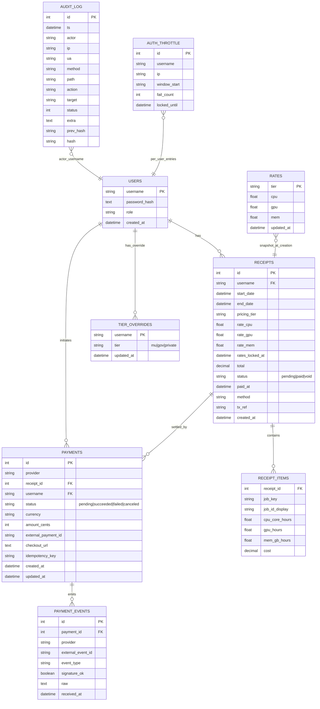
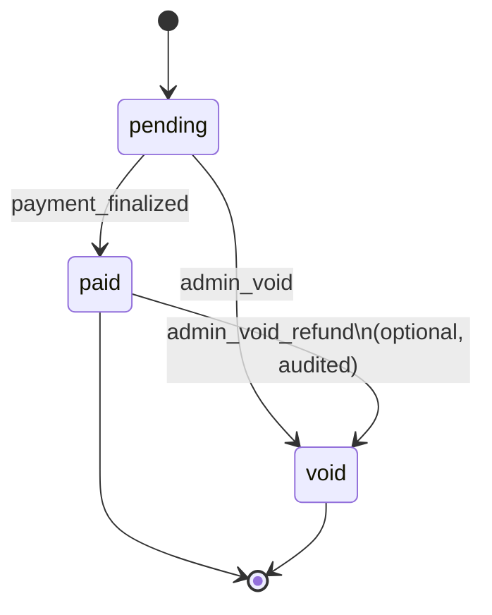
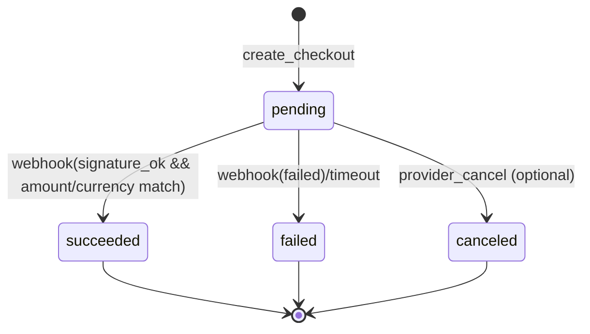
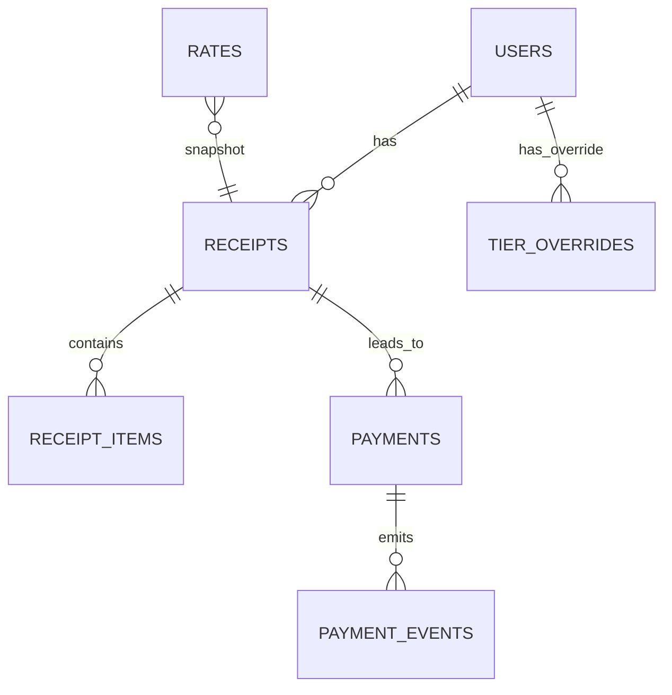

# Data Model

> Canonical entities, relationships, constraints, and lifecycle for the **HPC Billing Platform**.

---

## 1) Entity–Relationship (ER) overview



**Notes**

- A **Receipt** is a priced bundle of jobs for one user and a date window. It now carries a **snapshot of tier and rates** (`pricing_tier`, `rate_cpu/gpu/mem`, `rates_locked_at`) taken at creation to ensure historical reproducibility.
- Each **ReceiptItem** is one priced job; **`job_key` is globally unique** to prevent double billing across receipts.
- **Payments** finalize receipts via **webhooks** (**PaymentEvents**) with idempotency on `(provider, external_event_id)`.
- **AuditLog** forms a hash chain for tamper‐evident auditing.
- **AuthThrottle** backs login throttling/lockout.

---

## 2) Status machines

### 2.1 Receipt status



- Transitions are logged into **AuditLog**.
- Moving from `paid` to `void` is guarded (admin-only) and should record method/tx_ref rationale.

### 2.2 Payment status



- Webhook payloads are persisted as **PaymentEvents** with `(provider, external_event_id)` **unique** for replay protection.
- On `succeeded`, compare **amount** and **currency** to the local **Payment** before marking the **Receipt** paid.

---

## 3) Keys, constraints, and indexes

- **Primary keys**

  - `users.username`, `rates.tier`, `receipts.id`, `payments.id`, `payment_events.id`, `audit_log.id`, `auth_throttle.id`, `tier_overrides.username`.

- **Foreign keys**

  - `receipts.username → users.username`
  - `receipt_items.receipt_id → receipts.id`
  - `payments.receipt_id → receipts.id` (CASCADE recommended)
  - `payments.username → users.username`
  - `payment_events.payment_id → payments.id`
  - `tier_overrides.username → users.username`

- **Uniqueness & idempotency**

  - `receipt_items.job_key` → **UNIQUE (global)** to prevent double billing.
  - `payment_events (provider, external_event_id)` → **UNIQUE** (idempotent webhook handling).
  - `auth_throttle (username, ip)` → **UNIQUE** index.
  - _(Optional/Recommended)_ Partial unique on `(provider, idempotency_key)` where `idempotency_key IS NOT NULL` to dedupe checkout inits.

- **Checks (DB or store layer)**

  - `users.role ∈ {'admin','user'}`
  - `receipts.status ∈ {'pending','paid','void'}`
  - `payments.status ∈ {'pending','succeeded','failed','canceled'}`
  - `payments.amount_cents ≥ 0`
  - `payments.currency` length 3 (ISO 4217)
  - `tier_overrides.tier ∈ {'mu','gov','private'}`

- **Common indexes**

  - `receipts (username, created_at DESC)`
  - `receipts (status, created_at DESC)`
  - `receipt_items (receipt_id)` for loading a receipt
  - `payment_events (provider, external_event_id)` unique
  - `payments (receipt_id)`, `payments (status)`
  - `audit_log (ts DESC)`

---

## 4) Canonical fields & derived values

- **`job_key`** (ReceiptItem) — Canonicalized from Slurm JobID by dropping step/suffix parts (e.g., `12345.1` → `12345`). This is the **de‐duplication** key across all receipts.

- **Resource hours** (ReceiptItem) — Derived during pricing (now **step-aware**):

  - **CPU** core-hours:
    Σ `TotalCPU` (over **steps**) → fallback `CPUTimeRAW/3600` → fallback `AllocCPUS × Elapsed`.
  - **MEM** GB-hours:
    Σ `AveRSS(GB) × Elapsed` (over **steps**) → fallback `mem_from_TRES × Elapsed`.
  - **GPU** hours:
    `AllocGPU × Elapsed` (fallback `ReqGPU × Elapsed` when allocation missing).

- **Costs** — With **snapshot rates captured on the receipt**:
  `cost = cpu_core_hours * rate_cpu + gpu_hours * rate_gpu + mem_gb_hours * rate_mem`
  Receipt `total` is the sum of item costs (rounded).

---

## 5) Table-by-table details

### 5.1 `users`

- **username** (`PK`), **password_hash**, **role** (`admin|user`), **created_at** (ISO 8601).
- Authentication uses salted hashes (Werkzeug). No PII beyond username.

### 5.2 `rates`

- **tier** (`PK`) in `{mu, gov, private}`.
- **cpu**, **gpu**, **mem** (float) with **updated_at** (ISO 8601).
- Admin updates are **non-retroactive**; receipts store **their own snapshot** at creation.

### 5.3 `receipts`

- **id** (`PK`, auto), **username** (`FK`), **start**, **end**, **total**, **status** (`pending|paid|void`), **paid_at**, **method**, **tx_ref**, **created_at**.
- **Snapshot fields**: **pricing_tier**, **rate_cpu**, **rate_gpu**, **rate_mem**, **rates_locked_at** (ISO 8601).
- Lifecycle per state machine above.

### 5.4 `receipt_items`

- **receipt_id** (`FK`), **job_key** (**UNIQUE global**), **job_id_display**, resource hours, **cost**.
- Composite PK pattern recommended: `(receipt_id, job_key)` for locality; keep global `UNIQUE(job_key)` to block cross-receipt duplicates.

### 5.5 `payments`

- **id** (`PK`), **provider**, **receipt_id** (`FK`), **username** (`FK`), **status** (`pending|succeeded|failed|canceled`), **currency** (3 letters), **amount_cents** (int), **external_payment_id**, **checkout_url**, **idempotency_key**, **created_at**, **updated_at**.
- Index on `(receipt_id)`, `(status)`. Consider partial unique on `(provider, idempotency_key)` when present.

### 5.6 `payment_events`

- **id** (`PK`), **payment_id** (`FK`), **provider**, **external_event_id** (**UNIQUE with provider**), **event_type**, **signature_ok** (bool), **raw** (text), **received_at**.
- Enforces webhook **idempotency**.

### 5.7 `auth_throttle`

- **id** (`PK`), **username**, **ip**, **window_start**, **fail_count**, **locked_until**.
- Unique index on `(username, ip)`.

### 5.8 `audit_log`

- **id** (`PK`), **ts**, **actor**, **ip**, **ua**, **method**, **path**, **action**, **target**, **status**, **extra**, **prev_hash**, \*\*hash\`.
- Append-only; **`hash = H(prev_hash || canonical_record)`** for tamper evidence.

### 5.9 `tier_overrides`

- `username (PK, FK → users.username)`
- `tier` in {mu, gov, private}
- `updated_at`
- **Rules**:
  - If an override exists for `username`, use it as the effective tier; otherwise fall back to the classifier.
  - Overrides are not joined to receipts; receipts store the effective tier snapshot at creation.

---

## 6) Normalization & integrity

- **3NF**: Rates separated by tier; receipts carry a **snapshot** so historical totals are reproducible; items split from receipt; payments and events split.
- **Idempotency**: Enforced at DB layer for `job_key` and `(provider, external_event_id)`.
- **Transactions**:

  - Receipt creation (header with snapshot + items) → one transaction.
  - Payment finalization (event insert + payment update + receipt paid + audit) → one transaction.

- **Deletion**: Prefer **voiding** receipts over hard deletes; rely on CASCADE only for dependent rows (e.g., receipt items) during admin cleanup.
- **Overrides**: Keeping `tier_overrides` separate preserves 3NF; receipts carry their own tier/rate snapshot for historical accuracy.

---

## 7) Example queries (reference)

```sql
-- Latest receipts for a user
SELECT id, start, "end", total, status, created_at
FROM receipts
WHERE username = :u
ORDER BY id DESC
LIMIT 50;

-- Load a receipt with its items
SELECT ri.*
FROM receipt_items ri
JOIN receipts r ON r.id = ri.receipt_id
WHERE r.id = :rid
ORDER BY ri.job_id_display;

-- Check if a job has ever been billed
SELECT 1
FROM receipt_items
WHERE job_key = :jobkey;

-- Latest payment (for status page)
SELECT p.*
FROM payments p
WHERE p.receipt_id = :rid
ORDER BY p.id DESC
LIMIT 1;

-- Webhook replay detector (should be 0 rows)
SELECT provider, external_event_id, COUNT(*)
FROM payment_events
GROUP BY provider, external_event_id
HAVING COUNT(*) > 1;

-- Export audit
SELECT * FROM audit_log ORDER BY id DESC;
```

---

## 8) Retention & privacy

- **Users**: store only username and password hash; avoid PII.
- **Receipts/Items/Payments/Events**: retain per financial policy (institutional requirements).
- **Audit logs**: retain per security policy; exportable to CSV.
- **Payment events**: keep raw payloads for reconciliation; redact secrets where applicable.

---

## 9) Migration tips

- Add **snapshot columns** to `receipts` and backfill from current `rates` for historical receipts with a best-effort `rates_locked_at` timestamp.
- Extend `receipts.status` CHECK to include `'pending'|'paid'|'void'`.
- Ensure **`receipt_items(job_key)` UNIQUE** exists to stop duplicate billing.
- Add `(provider, external_event_id)` **UNIQUE** before enabling real webhooks.
- Optional: partial unique index `(provider, idempotency_key)` **WHERE idempotency_key IS NOT NULL**.

---

## 10) Compact ER (for slide decks)



---
