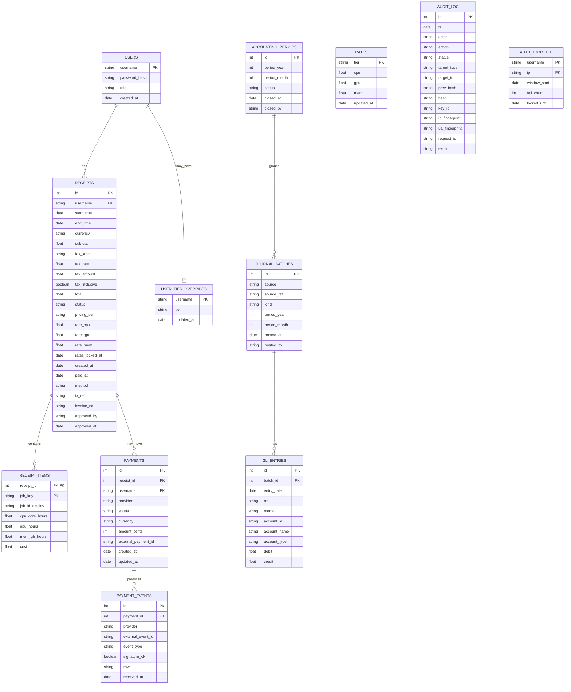

# Data Model (ERD)

This chapter describes the relational schema as implemented today. Field names and constraints are aligned with the SQLAlchemy models under `models/` (e.g., `schema.py`, `users_db.py`, `billing_store.py`, `audit_store.py`, `gl.py`/`gl_posting.py`).

---

## 1) Entity–Relationship Diagram

> **Note**: Payment tables are present for future online‑payment integrations. In the default app wiring, receipts are marked paid manually and audited; webhook routes may be disabled.

---

## 2) Table dictionary

Below are the most relevant columns, types, and constraints. Monetary fields use **DECIMAL/NUMERIC** (not float) to avoid rounding errors.

### 2.1 `users`

- `username` (PK, `String`)
- `password_hash` (`Text`)
- `role` (`String`, check: `admin|user`)
- `created_at` (`DateTime(timezone=True)`)

### 2.2 `rates`

- `tier` (PK, `String` = `mu|gov|private`)
- `cpu`, `gpu`, `mem` (`Numeric(18,2)`)
- `updated_at` (`DateTime(timezone=True)`)

### 2.3 `user_tier_overrides`

- `username` (PK, FK → `users.username`)
- `tier` (`mu|gov|private`, check constraint)
- `updated_at`

### 2.4 `receipts`

- Keys: `id` (PK)
- User/date: `username` (FK), `start`, `end`, `created_at`
- Currency & tax snapshot: `currency` (e.g., `THB`), `subtotal`, `tax_label?`, `tax_rate%`, `tax_amount`, `tax_inclusive`, `total`
- Pricing snapshot: `pricing_tier`, `rate_cpu`, `rate_gpu`, `rate_mem`, `rates_locked_at`
- Lifecycle: `status` (`pending|paid|void`), `paid_at?`, `method?`, `tx_ref?`, `invoice_no? (UNIQUE)`, `approved_by?`, `approved_at?`

### 2.5 `receipt_items`

- PK: `(receipt_id, job_key)`; `job_key` also **UNIQUE** globally
- Display & measures: `job_id_display`, `cpu_core_hours`, `gpu_hours`, `mem_gb_hours`, `cost`

### 2.6 `payments`

- Core: `id` (PK), `receipt_id` (FK), `username` (FK), `provider`, `status`, `currency`, `amount_cents`
- External IDs: `external_payment_id (UNIQUE)`
- Timestamps: `created_at`, `updated_at`

### 2.7 `payment_events`

- Core: `id` (PK), `payment_id` (FK)
- Idempotency: `(provider, external_event_id)` **UNIQUE**
- Validation: `signature_ok` (bool), `raw` (JSON), `received_at`

### 2.8 `audit_log`

- Hash chain: `prev_hash`, `hash`, `key_id`
- Who/what: `ts`, `actor`, `action`, `status`, `target_type`, `target_id`
- Request telemetry: `ip_fingerprint`, `ua_fingerprint`, `request_id`
- `extra` (JSON; selected whitelisted keys)

### 2.9 `auth_throttle`

- PK: `(username, ip)`
- Window & counters: `window_start`, `fail_count`, `locked_until`

### 2.10 GL tables

- `accounting_periods`: `(period_year, period_month, status=open|closed, closed_at?, closed_by?)`
- `journal_batches`: `source`, `source_ref`, `kind`, `period_*`, `posted_at`, `posted_by`
- `gl_entries`: FK to batch + `date`, `ref`, `memo`, `account_*`, `debit`, `credit`

---

## 3) Derived & computed fields

### 3.1 `job_key` (global uniqueness)

Canonicalized unique job identifier used to prevent double‑billing:

- Strip step suffixes like `.batch`/`.extern` → `123456`.
- Normalize array or step IDs consistently.
- Join with cluster/source if multi‑cluster is later introduced (current build is single cluster).

### 3.2 Resource hours

Computed per job during pricing:

- **CPU core‑hours** = `AllocCPUs × ElapsedHours`
- **GPU hours** = `AllocGPUs × ElapsedHours`
- **Mem GB‑hours** = `AllocMemGB × ElapsedHours`

All costs are `hours × rate` at the **locked snapshot rate** captured on the receipt.

---

## 4) Lifecycle & invariants

- **Receipt status**: `pending → paid → (optionally) void`. Revert to `pending` is allowed only when no external payment linkage and no downstream locks (period closed / exported / customer‑sent flags) are present.
- **Uniqueness guard**: `job_key` is globally unique across all `receipt_items`; attempts to bill an already‑billed job fail atomically.
- **Rates immutability per receipt**: changing global rates does **not** retro‑change existing receipts because per‑receipt rate fields are stored.
- **Audit chain**: every administrative mutation writes an `audit_log` record linked by `prev_hash → hash`.
- **Period control**: GL postings are grouped in `journal_batches` bound to an `accounting_period`; close/reopen flips the `status` and is itself audited.

---

## 5) Indexes & constraints (summary)

- `users.role` check in (`admin`,`user`).
- `rates.tier` check in (`mu`,`gov`,`private`).
- `user_tier_overrides.tier` check in (`mu`,`gov`,`private`).
- `receipt_items.job_key` **UNIQUE**; composite PK `(receipt_id, job_key)`.
- `payment_events (provider, external_event_id)` **UNIQUE**.
- Suggested indexes: `receipts(username, status)`, `receipt_items(receipt_id)`, `audit_log(ts)`, `gl_entries(batch_id)`, `journal_batches(period_year, period_month)`.

---

## 6) Data retention & privacy

- Store minimal PII: usernames only (no email/addresses by default).
- Payment PAN/CVV never touch the DB; only provider IDs and statuses are stored when that module is enabled.
- Optional anonymization of IP/UA fingerprints for audit can be toggled via env.

---

## 7) Migration notes

- Monetary columns use DECIMAL; avoid floats when extending the schema.
- When adding new tiers or resources (e.g., energy kWh‑hours), extend both `rates` and `receipt_items` (and cost engine) in lock‑step; migrate with defaults.
- For multi‑cluster support, extend `job_key` canonicalization to include a cluster namespace and add a clustered index.
