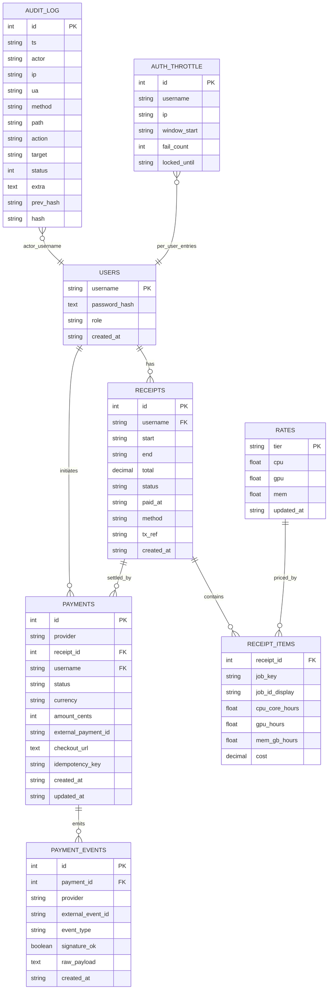
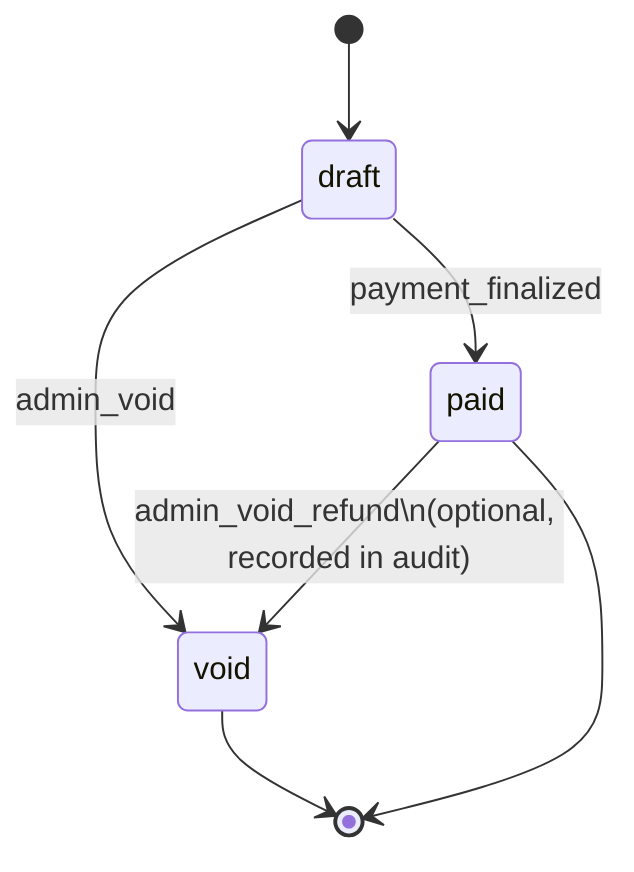
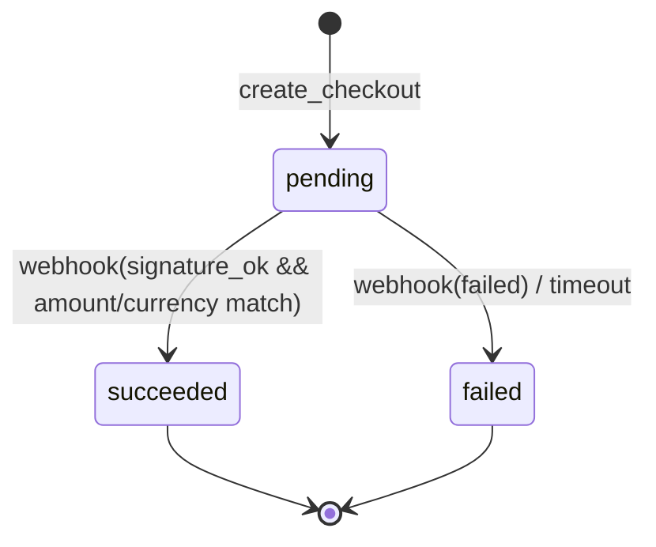
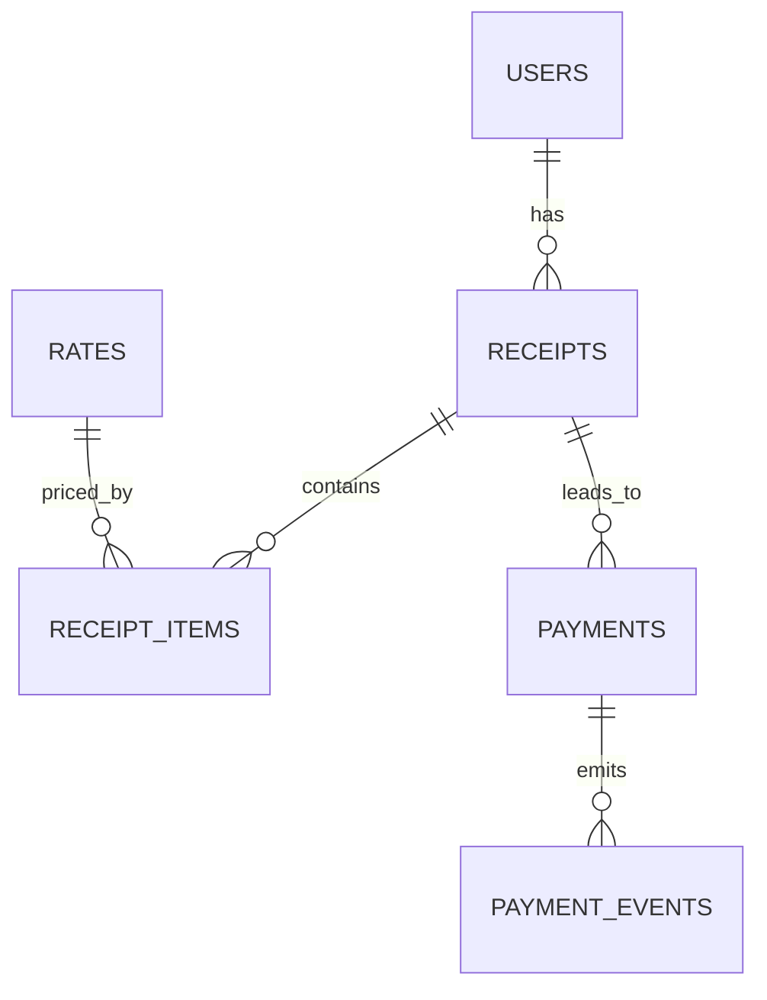

# Data Model

> Canonical entities, relationships, constraints, and lifecycle for the **HPC Billing Platform**. Includes ER and state diagrams (Mermaid) plus field-level notes you’ll use when writing queries, tests, and migrations.

---

## 1) Entity–Relationship (ER) overview



**Notes**

- A **Receipt** is a priced bundle of jobs for one user and a date window.
- Each **ReceiptItem** is one priced job; **`job_key` is globally unique** to prevent double billing across receipts.
- **Payments** are optional; they finalize receipts via **webhooks** (**PaymentEvents**) and idempotent application.
- **AuditLog** forms a hash chain for tamper‐evident auditing.
- **AuthThrottle** backs login throttling/lockout.

---

## 2) Status machines

### 2.1 Receipt status



- Transitions are logged into **AuditLog**.
- Moving from `paid` to `void` is guarded (admin-only) and should record method/tx_ref rationale.

### 2.2 Payment status



- Webhook payloads are persisted as **PaymentEvents** with `(provider, external_event_id)` **unique** for replay protection.
- On `succeeded`, compare **amount** and **currency** to the local **Payment** before marking the **Receipt** paid.

---

## 3) Keys, constraints, and indexes

- **Primary keys**

  - `users.username`, `rates.tier`, `receipts.id`, `payments.id`, `payment_events.id`, `audit_log.id`, `auth_throttle.id`.

- **Foreign keys**

  - `receipts.username → users.username`
  - `receipt_items.receipt_id → receipts.id`
  - `payments.receipt_id → receipts.id` (CASCADE recommended for orphan cleanup)
  - `payments.username → users.username`
  - `payment_events.payment_id → payments.id`

- **Uniqueness & idempotency**

  - `receipt_items.job_key` → **UNIQUE (global)** to prevent double billing.
  - `payment_events (provider, external_event_id)` → **UNIQUE** (idempotent webhook handling).
  - `auth_throttle (username, ip)` → **UNIQUE** index.

- **Checks (enforced in store layer or DB)**

  - `users.role ∈ {'admin','user'}`
  - `receipts.status ∈ {'draft','paid','void'}`
  - `payments.status ∈ {'pending','succeeded','failed'}`
  - `payments.currency` length 3 (ISO 4217).

- **Common indexes**

  - `receipts (username, created_at DESC)`
  - `receipts (status, created_at DESC)`
  - `payment_events (provider, external_event_id)` unique index
  - `receipt_items (receipt_id)` for load of a receipt
  - `audit_log (ts DESC)` for export

---

## 4) Canonical fields & derived values

- **`job_key`** (ReceiptItem)
  Canonicalized from Slurm JobID by dropping step/suffix parts (e.g., `12345.1` → `12345`). This is the **de‐duplication** key across all receipts.
- **Resource hours** (ReceiptItem)
  Derived during pricing:

  - `cpu_core_hours` from `TotalCPU`/`AllocCPUs` × elapsed normalization
  - `gpu_hours` parsed from `ReqTRES` (`gpu:X`)
  - `mem_gb_hours` parsed from `ReqTRES` memory spec

- **Costs**
  `cost = cpu_core_hours * rates.cpu + gpu_hours * rates.gpu + mem_gb_hours * rates.mem`
  Receipt `total` is the sum of item costs (rounded appropriately).

---

## 5) Table-by-table details

### 5.1 `users`

- **username** (`PK`), **password_hash**, **role** (`admin|user`), **created_at** (ISO 8601).
- Authentication uses salted hashes (Werkzeug). No PII beyond username.

### 5.2 `rates`

- **tier** (`PK`) in `{mu, gov, private}`.
- **cpu**, **gpu**, **mem** (float) with **updated_at** (ISO 8601).
- Admin updates are **non-retroactive** (used for new pricing).

### 5.3 `receipts`

- **id** (`PK`, auto), **username** (`FK`), **start**, **end**, **total** (decimal/NUMERIC), **status**, **paid_at**, **method**, **tx_ref**, **created_at**.
- `status` lifecycle per state machine above.

### 5.4 `receipt_items`

- **receipt_id** (`FK`), **job_key** (**UNIQUE**), **job_id_display**, resource hours, **cost**.
- Suggested composite primary key: `(receipt_id, job_key)` for locality; plus global `UNIQUE(job_key)` to block cross-receipt duplicates.

### 5.5 `payments`

- **id** (`PK`), **provider**, **receipt_id** (`FK`), **username** (`FK`), **status**, **currency** (3 letters), **amount_cents** (int), **external_payment_id**, **checkout_url**, **idempotency_key**, **created_at**, **updated_at**.
- Idempotency key recommended on **initiation** to avoid duplicate checkouts.

### 5.6 `payment_events`

- **id** (`PK`), **payment_id** (`FK`), **provider**, **external_event_id** (**UNIQUE with provider**), **event_type**, **signature_ok** (bool), **raw_payload** (text), **created_at**.

### 5.7 `auth_throttle`

- **id** (`PK`), **username**, **ip**, **window_start**, **fail_count**, **locked_until**.
- Unique index on `(username, ip)`.

### 5.8 `audit_log`

- **id** (`PK`), **ts**, **actor**, **ip**, **ua**, **method**, **path**, **action**, **target**, **status**, **extra**, **prev_hash**, **hash**.
- Append-only; **`hash` = H(prev_hash || record)\`** for tamper evidence.

---

## 6) Normalization & integrity

- **3NF**: Rates separated by tier; receipt and items split; payments and events split.
- **Idempotency**: Enforced at DB layer for `job_key` and `(provider, external_event_id)`.
- **Transactions**:

  - Receipt creation (header + items) → single transaction.
  - Payment finalization (mark payment + mark receipt paid + audit) → single transaction.

- **Deletion**: Prefer **voiding** receipts over hard deletes; rely on CASCADE only for dependent rows (e.g., receipt items) during admin cleanup.

---

## 7) Example queries (reference)

```sql
-- List latest receipts for a user
SELECT id, start, "end", total, status, created_at
FROM receipts
WHERE username = :u
ORDER BY id DESC
LIMIT 50;

-- Load a receipt with its items
SELECT ri.*
FROM receipt_items ri
JOIN receipts r ON r.id = ri.receipt_id
WHERE r.id = :rid
ORDER BY ri.job_id_display;

-- Check if a job has ever been billed
SELECT 1
FROM receipt_items
WHERE job_key = :jobkey;

-- Latest payment (for status page)
SELECT p.*
FROM payments p
WHERE p.receipt_id = :rid
ORDER BY p.id DESC
LIMIT 1;

-- Export audit
SELECT * FROM audit_log ORDER BY id DESC;
```

---

## 8) Retention & privacy

- **Users**: store only username and password hash; avoid PII.
- **Receipts/Items/Payments**: retain for financial compliance (institution policy).
- **Audit logs**: retain per security policy; exportable to CSV.
- **Payment events**: keep raw payloads for reconciliation; redact secrets where applicable.

---

## 9) Migration tips

- Create unique index on **`receipt_items(job_key)`** early to stop duplicate billing.
- Backfill `job_key` from historical `job_id_display` (apply the canonicalization rule).
- Add `(provider, external_event_id)` **unique** index before enabling real webhooks.
- If consolidating databases, migrate **users** first, then **rates**, then **receipts/items**, then **payments/events**, preserving IDs or mapping tables as needed.

---

## 10) Compact ER (for slide decks)



---
