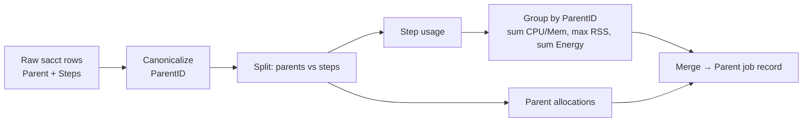
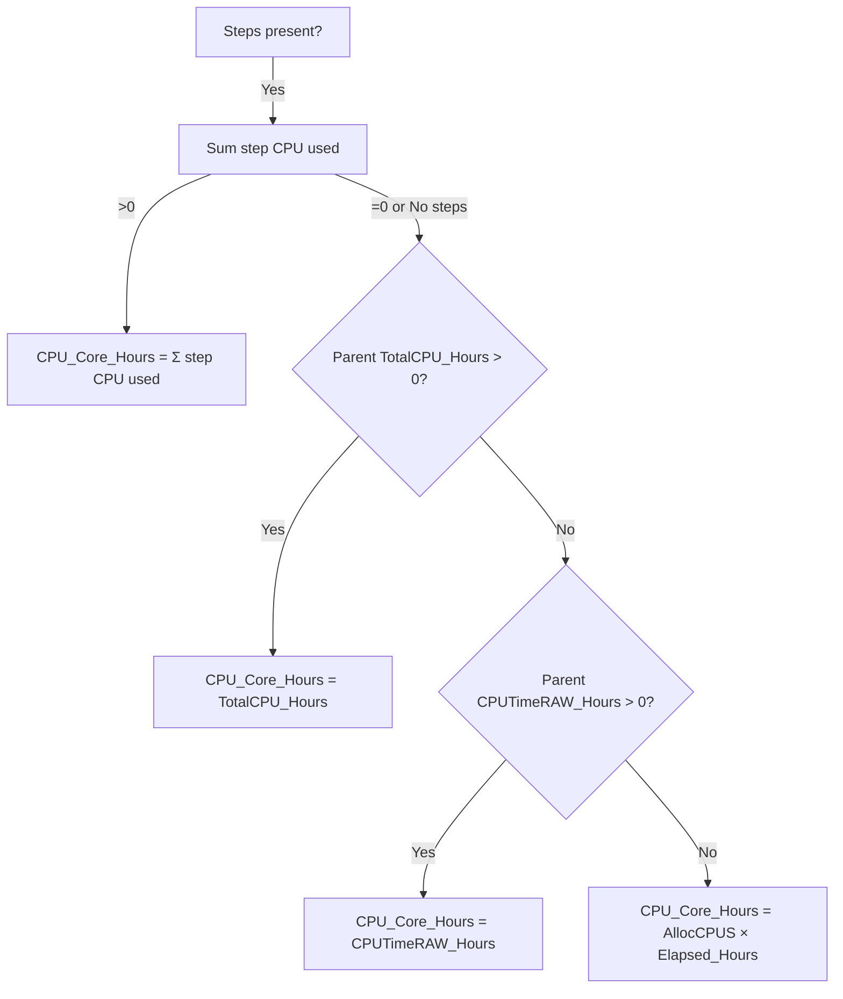
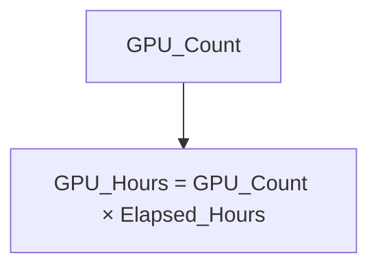
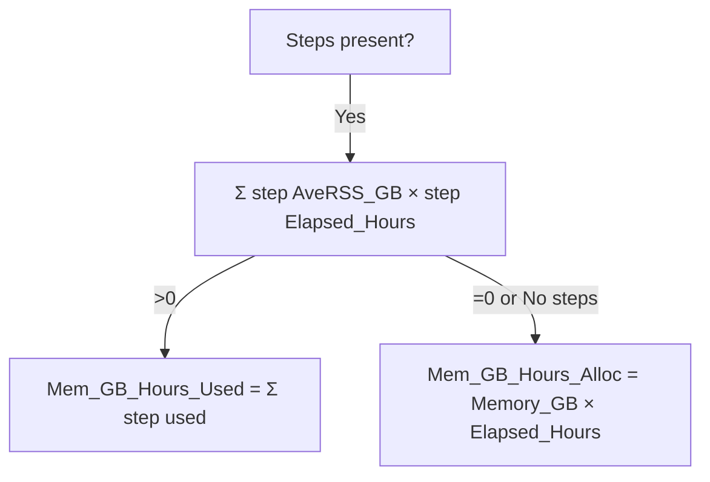

# Costing & Pricing Model

This chapter defines **what we charge**, **how we compute resource hours**, and **how tiers/rates are applied and locked**. It’s aligned with `services/billing.py`, `models/rates_store.py`, and tier‑override logic in `models/tiers_store.py`.

---

## 1) What is charged

We price **parent jobs** (not individual steps) using three resource dimensions:

- **CPU core‑hours**
- **GPU hours**
- **Memory GB‑hours** _("used" when steps are available; otherwise "allocated")_

A job’s **total cost** is:

```
Cost = (CPU_Core_Hours * rate_cpu)
     + (GPU_Hours      * rate_gpu)
     + (Mem_GB_Hours   * rate_mem)
```

Rates come from the **effective tier** (`mu|gov|private`) and are **snapshotted on the receipt** (so later rate changes don’t back‑edit issued invoices).

---

## 2) Slurm fields → internal measures

| Purpose            | Primary field(s)                      | Notes                                                                                                                    |
| ------------------ | ------------------------------------- | ------------------------------------------------------------------------------------------------------------------------ |
| Parent vs Step     | `JobID` → `ParentID`                  | `ParentID = canonical_job_id(JobID)` (strip suffixes like `.batch`, `.extern`, `.0`). All steps roll up to their parent. |
| Elapsed time       | `Elapsed`, `CPUTimeRAW`, `TotalCPU`   | Parsed to hours (`D‑HH:MM:SS(.fff)` accepted). `CPUTimeRAW` is seconds of CPU; `TotalCPU` is wallclock CPU utilization.  |
| Allocations        | `AllocTRES`, `ReqTRES`                | We **prefer `AllocTRES`** for each key; fallback to `ReqTRES` when missing. Keys: `cpu=`, `gres/gpu=`, `mem=`.           |
| Memory used        | `AveRSS`                              | Converted to GB; multiplied by step elapsed for step‑level usage.                                                        |
| Energy (analytics) | `ConsumedEnergyRaw`, `ConsumedEnergy` | Kept for metrics; **not billed** by default.                                                                             |

---

## 3) Handling steps, batches & parents

All step rows belonging to a parent job are aggregated by `ParentID`.



- **Batch / extern / step IDs** like `12345.batch`, `12345.extern`, `12345.0` collapse to `ParentID=12345`.
- The **parent record** becomes the single billable row. Step usage (if present) is used in the fallback formulas below.

---

## 4) Fallback formulas (deterministic cascade)

We compute **resource hours** with explicit cascades so results are stable across clusters and sacct quirks.

### 4.1 CPU core‑hours



- **Step CPU used** = per‑step `TotalCPU_Hours` (fallback: `CPUTimeRAW_Hours`).
- `TotalCPU_Hours` and `CPUTimeRAW_Hours` are parsed from Slurm fields (`TotalCPU`, `CPUTimeRAW`).

### 4.2 GPU hours (allocation‑based)



- **GPU_Count** extracted from `AllocTRES` (preferred) else `ReqTRES` key `gres/gpu=`.

### 4.3 Memory GB‑hours



- **AveRSS → GB**: supports `K/M/G/T` suffixes and raw KiB; converts to GB.
- **Memory_GB** parsed from `mem=` in `AllocTRES` (preferred) else `ReqTRES`.
- The **billed memory** column is `Mem_GB_Hours_Used` (falls back to `Mem_GB_Hours_Alloc` when step usage is absent).

### 4.4 Energy (not billed)

- We compute job‑level **Energy_kJ** = `Parent energy` if present else `Σ step energy` from `ConsumedEnergyRaw/ConsumedEnergy`.
- Exposed for analytics (e.g., `Energy_per_CPU_hour`), **not added to cost** unless explicitly enabled in a future version.

---

## 5) Tiers, overrides & rate locking

1. **Tier resolution**

   - If a **user override** exists in `user_tier_overrides`, use it.
   - Else apply the current classifier (heuristics on username/org tokens) → `mu|gov|private`.

2. **Rates**

   - Load tiered rates (CPU/GPU/MEM per hour).
   - In list/preview pages, rates come from the **current** table; on **receipt creation**, the chosen tier and per‑unit rates are **copied into the receipt header** (`pricing_tier`, `rate_cpu`, `rate_gpu`, `rate_mem`, `rates_locked_at`).

3. **Totals & taxes**

   - Line items sum to `subtotal`.
   - Taxes use env‑config (e.g., label/rate/inclusive), computing `tax_amount` and `total` deterministically.
   - All monetary values use **DECIMAL** in storage and are rounded to 2 dp for display/export.

---

## 6) Edge cases & safeguards

- **Zero duration/allocations**: cascades ensure a numeric result (may be 0). Jobs with all zeros simply contribute 0 cost.
- **Missing fields**: TRES and time parsers tolerate blanks and malformed values; fallbacks kick in.
- **Duplicate billing**: `job_key = canonical_job_id(JobID)` stored in `receipt_items` is **globally UNIQUE**; attempting to re‑bill a job fails atomically.
- **Status immutability**: once issued, a receipt’s rates/tier/tax snapshot stays fixed; global rate edits don’t back‑propagate.
- **Steps without parents**: ignored in billing (no parent to attach to).

---

## 7) Worked example

Assume a parent job with two steps, 4 CPUs allocated, 1 GPU, mem request 16 GB, elapsed 2.0 h.

- Step CPU used: `1.2 h` and `3.0 h` → Σ `4.2 h` → CPU_Core_Hours = `4.2` (since >0)
- GPU hours: `1 × 2.0 = 2.0 h`
- Step memory used: AveRSS ≈ `6 GB` and `8 GB` → `(6×2) + (8×2) = 28 GB·h` → Mem_GB_Hours_Used = `28`
- Tier rates (`gov`): `cpu=3.00`, `gpu=10.00`, `mem=1.00`

```
Cost = 4.2*3.00 + 2.0*10.00 + 28*1.00 = 12.6 + 20 + 28 = 60.6
```

Rounded to 2 dp → **฿60.60** prior to taxes.

---

## 8) Testable invariants

- If any item for a job exists in `receipt_items`, creating another receipt including that job must fail.
- Increasing a tier rate in `rates` **does not** change totals of an already‑issued receipt.
- With no steps and `TotalCPU_Hours=CPUTimeRAW_Hours=0`, CPU_Core_Hours falls back to `AllocCPUS × Elapsed_Hours`.
- With steps present and valid `AveRSS`, billed memory equals summed **used** memory GB‑hours.
- GPU hours are always allocation‑based (not step‑based) unless future versions add GPU step telemetry.

---

## 9) Extensibility

- **New resources** (e.g., energy kWh‑hours, local scratch GB‑days): add rate columns and extend the cascades; snapshot on receipts.
- **Multi‑cluster**: extend `job_key` to include a cluster namespace; maintain uniqueness and rollups per cluster.
- **Alternative tiers**: add to `rates` with check constraints; update UI selectors and classifier as needed.
