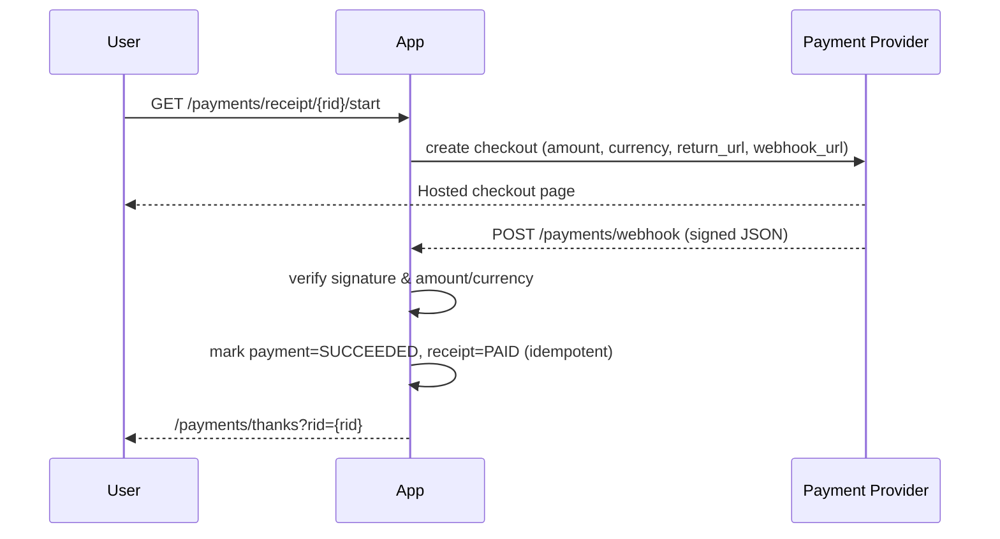

# API

> Public/admin endpoints of the **HPC Billing Platform**. This book documents what exists **today** (as-is), plus the minimal wiring needed to consume it safely (auth, CSRF, webhooks). JSON endpoints are marked; UI/CSV endpoints are listed for completeness.

!!! info "Live API Explorer (dev)"
[API Explorer](http://localhost:8081)

[Download the OpenAPI spec](api/openapi.yaml)

---

## Base URL & formats

- **Base URL (dev):** `http://localhost:8000`
- **Formats:**

  - JSON where noted (`Content-Type: application/json`)
  - CSV for export endpoints
  - HTML for UI routes (not a JSON API, but documented here so you know what’s available)

---

## Authentication & CSRF

- **Auth:** Cookie session via **Flask-Login**. Login at `POST /login` and logout at `POST /logout`.
- **CSRF:** All **session-based POST** routes require a **CSRF token**, except the **payment webhook** (explicitly exempt).

  - Send token as form field `csrf_token` (typical for form posts), or header `X-CSRFToken` when posting JSON/AJAX.
  - Token is rendered into HTML pages; to script it, fetch the page first and extract the token.

### Scripted login (cURL)

```bash
# 1) Get login page to capture cookie + CSRF token
curl -c cookies.txt -s http://localhost:8000/login \
| sed -n 's/.*name="csrf_token" value="\([^"]*\)".*/\1/p' > csrf.txt

# 2) Post credentials with CSRF
curl -s -b cookies.txt -c cookies.txt -X POST \
  -H "Content-Type: application/x-www-form-urlencoded" \
  --data-urlencode "username=alice" \
  --data-urlencode "password=alice" \
  --data-urlencode "csrf_token=$(cat csrf.txt)" \
  http://localhost:8000/login -o /dev/null -w "%{http_code}\n"
# Expect 302 redirect (success)
```

For **JSON/AJAX POST** (e.g., `POST /formula`, `POST /copilot/ask`), use the same cookie and set `X-CSRFToken: <token>`.

---

## Versioning & caching

- There is no API version prefix yet.
- `GET /formula` supports **ETag / If-None-Match** (returns **304** if unchanged).

---

## Error envelope (JSON endpoints)

Minimal and pragmatic:

```json
{ "error": "description string", "code": 400 }
```

(Only present on error responses.)

---

## Endpoints (catalog)

### Health

| Method | Path       | Auth | CSRF | Returns                                                                                   |
| -----: | ---------- | ---- | ---- | ----------------------------------------------------------------------------------------- |
|    GET | `/healthz` | none | —    | JSON `{status:"ok"}` when app is alive                                                    |
|    GET | `/readyz`  | none | —    | `200` with `{status:"ok"}` if DB OK; `500` with `{status:"error", "error":"…"}` otherwise |

#### Examples

```bash
curl http://localhost:8000/healthz
curl -i http://localhost:8000/readyz
```

---

### Pricing (Rates) API

| Method | Path       | Auth  | CSRF | Body                      | 2xx Response                          |
| -----: | ---------- | ----- | ---- | ------------------------- | ------------------------------------- |
|    GET | `/formula` | none  | —    | —                         | `200` JSON: tier rates, with `ETag`   |
|   POST | `/formula` | admin | ✔︎   | JSON `{type,cpu,gpu,mem}` | `200` JSON `{ok:true, updated:{...}}` |

**GET /formula**
Query: `?type=mu|gov|private` (default `mu`)
Response:

```json
{
  "type": "mu",
  "unit": "per-hour",
  "rates": { "cpu": 1.0, "gpu": 5.0, "mem": 0.5 },
  "currency": "THB"
}
```

**ETag usage**

```bash
ETAG=$(curl -sI 'http://localhost:8000/formula?type=mu' | sed -n 's/^ETag: \(.*\)/\1/p')
curl -s -H "If-None-Match: $ETAG" 'http://localhost:8000/formula?type=mu' -i  # -> 304 if unchanged
```

**POST /formula** (admin only)

```bash
TOKEN=$(cat csrf.txt)  # see login flow above
curl -s -b cookies.txt -X POST http://localhost:8000/formula \
  -H "Content-Type: application/json" \
  -H "X-CSRFToken: $TOKEN" \
  -d '{"type":"mu","cpu":2.5,"gpu":12.0,"mem":0.9}'
```

Errors:

- `400` unknown type or non-numeric rates
- `401/403` if not authenticated / not admin

---

### User (self-service UI + CSV)

> These are **HTML/CSV** endpoints (not JSON) but are listed for automation or scraping use cases.

| Method | Path                 | Auth | CSRF | Purpose                                                                                      |
| -----: | -------------------- | ---- | ---- | -------------------------------------------------------------------------------------------- |
|    GET | `/me`                | user | —    | Usage page. Query: `before=YYYY-MM-DD` (defaults to today), `view=detail\|aggregate\|billed` |
|    GET | `/me.csv`            | user | —    | CSV export of usage. Query: `start=YYYY-MM-DD`, `end=YYYY-MM-DD` (defaults last 7 days)      |
|   POST | `/me/receipt`        | user | ✔︎   | Create a receipt from **unbilled** jobs up to `before=YYYY-MM-DD`                            |
|    GET | `/me/receipts`       | user | —    | List my receipts (HTML)                                                                      |
|    GET | `/me/receipts/<rid>` | user | —    | View a receipt (HTML)                                                                        |

Typical scripted CSV pull:

```bash
curl -b cookies.txt 'http://localhost:8000/me.csv?start=2025-09-01&end=2025-09-13' -o my_usage.csv
```

Create a receipt (server re-fetches & filters out already-billed jobs):

```bash
TOKEN=$(cat csrf.txt)
curl -b cookies.txt -X POST http://localhost:8000/me/receipt \
  -H "Content-Type: application/x-www-form-urlencoded" \
  --data-urlencode "before=2025-09-13" \
  --data-urlencode "csrf_token=$TOKEN" -L
```

---

### Admin (console + CSV)

> Admin UI routes; primarily HTML forms/pages with CSV helpers.

| Method | Path                         | Auth  | CSRF | Purpose                                                                                                                          |     |            |
| -----: | ---------------------------- | ----- | ---- | -------------------------------------------------------------------------------------------------------------------------------- | --- | ---------- |
|    GET | `/admin`                     | admin | —    | Admin console. Query: `section=rates\|usage\|billing\|myusage\|dashboard\|tiers`, plus `before`, `view`, `type=mu\|gov\|private` |     |            |
|   POST | `/admin`                     | admin | ✔︎   | Update rates via form fields: `type,cpu,gpu,mem`                                                                                 |     |            |
|   POST | `/admin/tiers`               | admin | ✔︎   | **Save user tier overrides** (form posts \`tier\_<username>=mu                                                                   | gov | private\`) |
|   POST | `/admin/receipts/<rid>/paid` | admin | ✔︎   | Mark a receipt “paid” (manual reconciliation)                                                                                    |     |            |
|    GET | `/admin/paid.csv`            | admin | —    | Export paid receipts (CSV)                                                                                                       |     |            |
|    GET | `/admin/my.csv`              | admin | —    | Export **admin’s own** usage (CSV)                                                                                               |     |            |
|    GET | `/admin/audit`               | admin | —    | Recent audit events (HTML)                                                                                                       |     |            |
|    GET | `/admin/audit.csv`           | admin | —    | Audit export (CSV)                                                                                                               |     |            |

Mark a receipt paid (manual):

```bash
TOKEN=$(cat csrf.txt)
curl -b cookies.txt -X POST "http://localhost:8000/admin/receipts/123/paid" \
  -H "X-CSRFToken: $TOKEN" -L
```

---

### Copilot (Docs assistant)

> In-app assistant that answers questions using embedded Markdown docs (RAG over `/docs/*.md`) and **Ollama** for chat/embeddings.

| Method | Path                 | Auth         | CSRF | Purpose                                                                |
| -----: | -------------------- | ------------ | ---- | ---------------------------------------------------------------------- |
|   POST | `/copilot/ask`       | user session | ✔︎   | Ask a question about the app/docs. Returns short HTML + cited sources. |
|   POST | `/copilot/reindex`   | admin (rec.) | ✔︎   | Force rebuild of the doc index (useful after docs change).             |
|    GET | `/copilot/widget.js` | any          | —    | Embed script for the floating “Docs Copilot” help button/panel.        |

**Request (ask):**

```http
POST /copilot/ask
Content-Type: application/json
X-CSRFToken: <token>
Cookie: session=...

{ "q": "How do I mark a receipt paid?" }
```

**Response (ask):**

```json
{
  "answer_html": "<p>From the Admin &gt; Billing page ...</p>",
  "sources": [
    {
      "file": "book-5-handbook.md",
      "anchor": "3-4-mark-a-receipt-paid-manual",
      "title": "3.4 Mark a receipt “paid” (manual)",
      "score": 0.73
    }
  ],
  "from": "copilot"
}
```

**Notes**

- Per-IP **rate limit** (default `12` requests/min). Over limit → `{"answer_html":"Rate limit exceeded...","sources":[]}`.
- If similarity to docs is too low, returns `"I don't know."`.
- If `COPILOT_ENABLED=false`, returns **503** with `"Copilot disabled."`.

**Widget snippet (already hosted at `/copilot/widget.js`):**

```html
<script src="/copilot/widget.js" defer></script>
```

To make AJAX requests pass CSRF in your pages, include the token (e.g., inject into a meta tag and read it on fetch) and set `X-CSRFToken`.

---

### Payments

| Method | Path                            | Auth | CSRF       | Purpose                                                                                        |
| -----: | ------------------------------- | ---- | ---------- | ---------------------------------------------------------------------------------------------- |
|    GET | `/payments/receipt/<rid>/start` | user | —          | Create a payment intent and **redirect** to provider (hosted checkout)                         |
|    GET | `/payments/thanks`              | user | —          | Post-payment landing page (shows current status if `?rid=` is given)                           |
|    GET | `/payments/simulate` (dev)      | user | —          | Simulate a successful webhook using dummy provider (signs and posts to `/payments/webhook`)    |
|   POST | `/payments/webhook`             | none | **Exempt** | **Provider calls only**. Verifies signature & amount/currency; idempotent on external event id |

**Statuses**
Local `payments.status` can be: **`pending`**, **`succeeded`**, **`failed`**, **`canceled`** (provider-driven). A verified success also marks the linked **receipt** as **paid**.

#### Webhook (providers)

- **Signature header:** Provider-specific.

  - Dummy provider (dev): `X-DUMMY-SIGNATURE: HMAC_SHA256(secret, raw_body)`
  - Real providers: see adapter; header name and scheme may differ.

- **Idempotency:** `(provider, external_event_id)` is unique; replays are ignored safely.
- **On success:** App marks `payments.status="succeeded"` and `receipts.status="paid"`.

**Simulate success (dummy)**

```bash
# Assumes you used /payments/receipt/<rid>/start already
curl -b cookies.txt \
  'http://localhost:8000/payments/simulate?rid=123&external_payment_id=dev_123&amount_cents=1000&currency=THB' \
  -L
```

**Direct webhook post (dev)**

```bash
SECRET="dev" # PAYMENT_WEBHOOK_SECRET
BODY='{"event_type":"payment.succeeded","external_payment_id":"dev_123","amount_cents":1000,"currency":"THB"}'
SIG=$(python - <<'PY'
import hmac,hashlib,os
s=os.environ.get("SECRET","dev").encode()
b=os.environ["BODY"].encode()
print(hmac.new(s,b,hashlib.sha256).hexdigest())
PY
)
curl -X POST http://localhost:8000/payments/webhook \
  -H "Content-Type: application/json" \
  -H "X-DUMMY-SIGNATURE: $SIG" \
  -d "$BODY"
```

---

### Internationalization

| Method | Path        | Auth | CSRF | Purpose                                                    |
| -----: | ----------- | ---- | ---- | ---------------------------------------------------------- |
|   POST | `/i18n/set` | any  | ✔︎   | Set UI language cookie (`lang=en\|th`), then redirect back |

```bash
TOKEN=$(cat csrf.txt)
curl -b cookies.txt -X POST http://localhost:8000/i18n/set \
  -H "Content-Type: application/x-www-form-urlencoded" \
  --data-urlencode "lang=th" --data-urlencode "csrf_token=$TOKEN" -L
```

---

## Payments flow (sequence)



---

## Notes & guardrails

- **JSON API surface is intentionally small.** Most routes are UI today. For automation, prefer:

  - `GET /formula` (JSON)
  - `POST /formula` (admin JSON)
  - CSV exports (`/me.csv`, `/admin/*.csv`)
  - Webhooks (`/payments/webhook`)
  - Copilot (`POST /copilot/ask`) for doc Q\&A (with CSRF + session)

- **Security:** keep webhook secrets out of the repo; run behind HTTPS; ensure CSRF on all session POSTs.
- **Idempotency:** payment events are safe to replay; receipt items are globally de-duplicated by **job key** to prevent double billing.
- **Copilot:** per-IP rate-limited; answers only from the docs context and include source citations; returns “I don’t know.” when unsure.
