# Flows

> End-to-end flows for users, admins, payments, ingestion, Copilot, and ops.

---

## Conventions

* **Actors:** User (member), Admin, App (Flask), DB (PostgreSQL), Slurm (`slurmrestd`/`sacct`), Provider (payment gateway), Prometheus, **Ollama** (embeddings/chat), **Docs** (Markdown on disk).
* **CSRF:** All session POSTs include `csrf_token` (form field) or `X-CSRFToken` header (AJAX/JSON).
* **No “void” path** covered here (intentionally excluded for now).

---

## 1) Sign-in with throttling

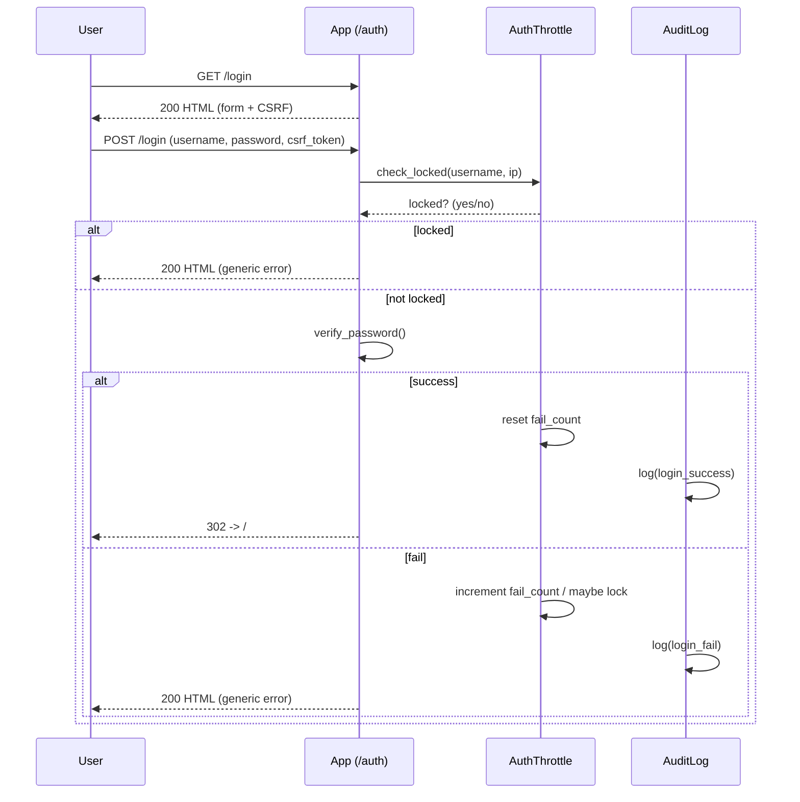

**Notes**

* Neutral error messages avoid leaking whether a username exists.
* Lockout windows and counters are per `(username, ip)`.

---

## 2) Usage ingestion (Slurm → App)

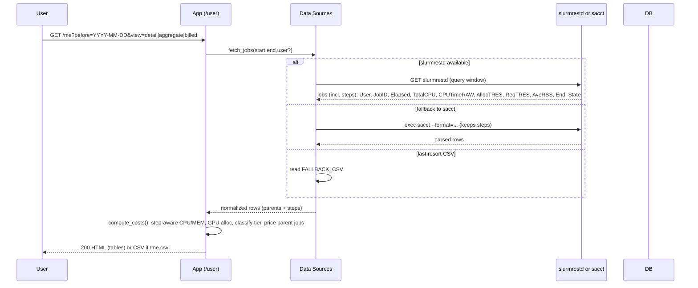

**Notes**

* Rows are normalized to a common schema regardless of source.
* Pricing is deterministic and re-computed on demand for display.

**Costing precedence (step-aware):**

* **CPU**: Σ `TotalCPU` (steps) → `CPUTimeRAW/3600` → `AllocCPUS × Elapsed`
* **MEM**: Σ `AveRSS(GB) × Elapsed` (steps) → `mem_from_TRES × Elapsed`
* **GPU**: `AllocGPU × Elapsed` (fallback `ReqGPU × Elapsed`)
* **Tier**: derived by classifier, with **per-user override** if present (see §5).

---

## 3) Create a receipt (unbilled jobs)

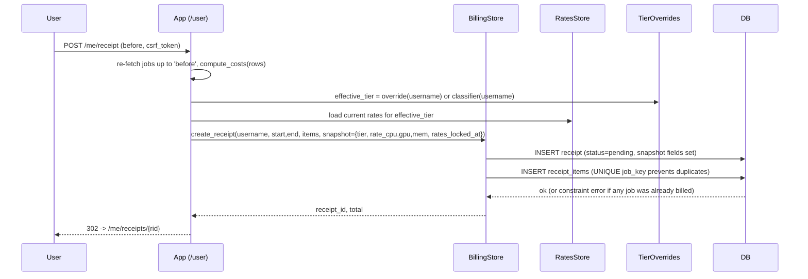

**Notes**

* **De-duplication:** a canonical `job_key` is **globally unique**; attempts to re-bill fail atomically.
* **Rates snapshot:** receipt stores `pricing_tier`, `rate_cpu/gpu/mem`, `rates_locked_at` to preserve historical totals.

---

## 4) Copilot (Docs assistant)

### 4.1 Ask

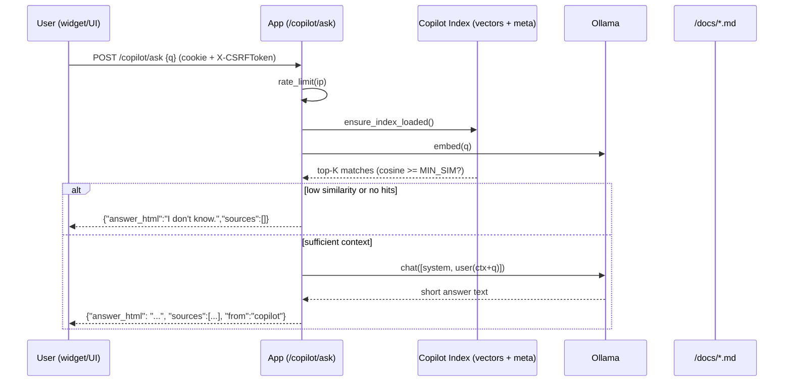

### 4.2 Reindex (admin/ops)

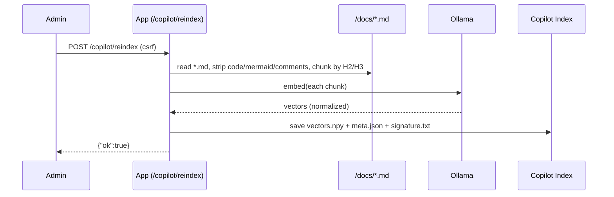

**Notes**

* If `COPILOT_ENABLED=false`, `/copilot/ask` returns **503** with `"Copilot disabled."`.
* Sources include file and anchor; answers are intentionally brief.

---

## 5) User Tier Overrides (admin)

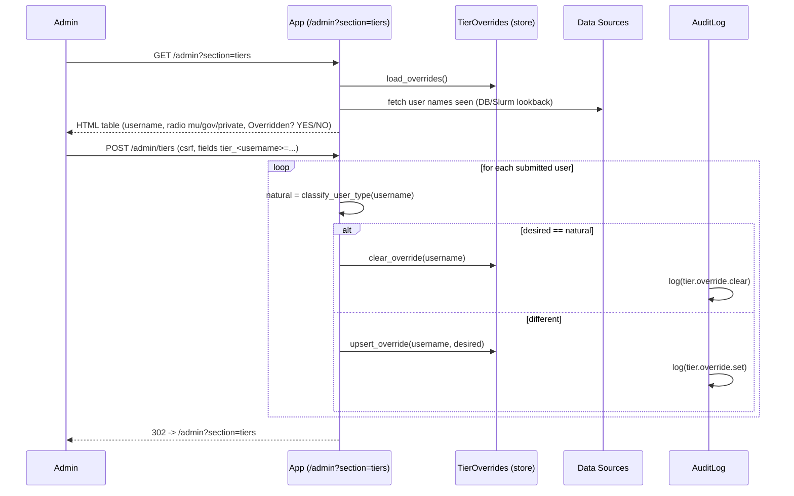

**Effect**

* Future pricing & receipts for that user use **effective tier = override or natural** (whichever applies). Snapshot is written on receipt creation (§3).

---

## 6) Payments

### 6.1 Manual reconciliation (admin marks paid)

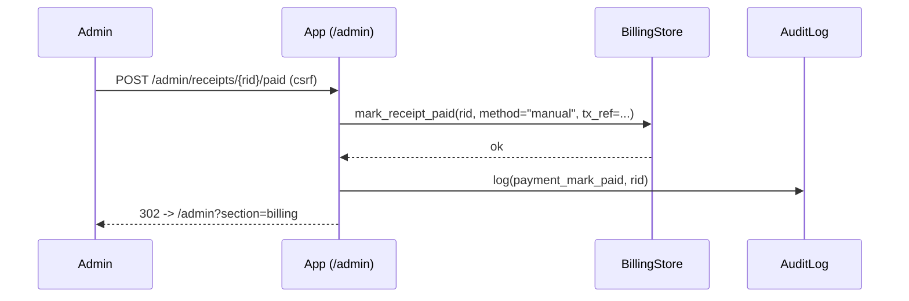

### 6.2 Hosted checkout + webhook (online)

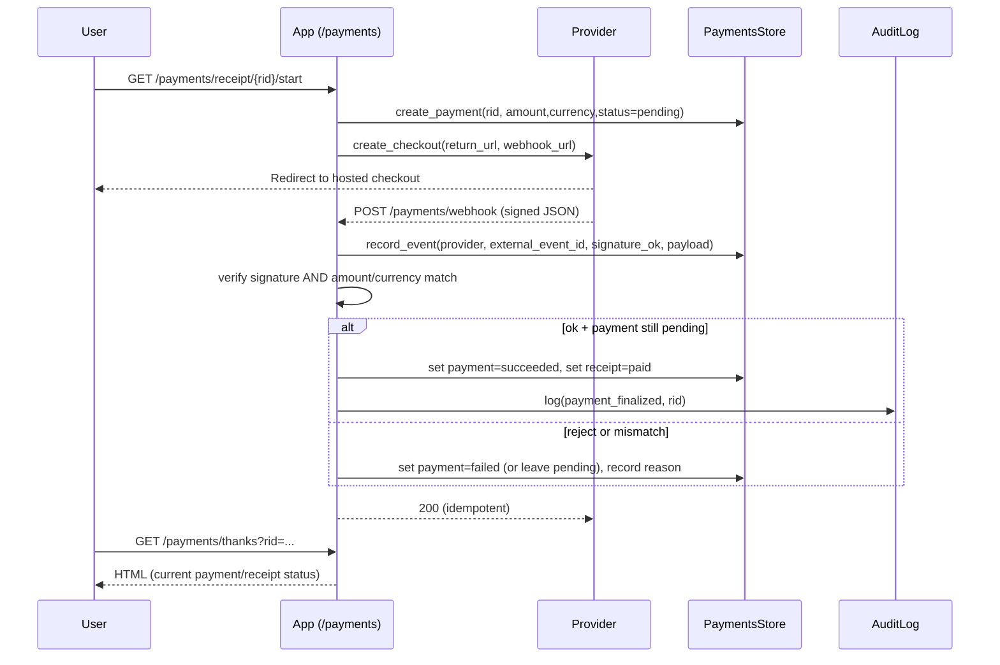

### 6.3 Cancel/Fail path (provider-driven)

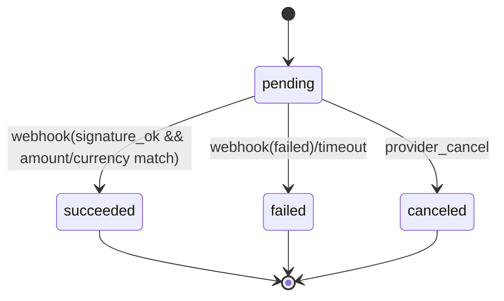

**Notes**

* **Idempotency:** `(provider, external_event_id)` unique prevents double-apply.
* **Security:** signature + amount/currency must match the local payment row.

---

## 7) Rates management (admin + API)

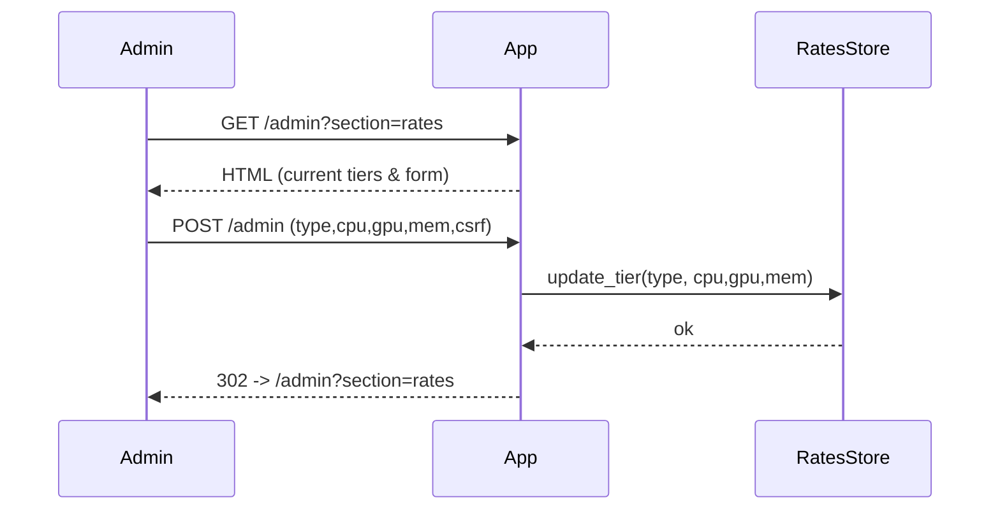

**Machine API**

* `GET /formula` returns JSON and an **ETag**.
* `POST /formula` (admin) updates a tier. Clients can cache with `If-None-Match`.

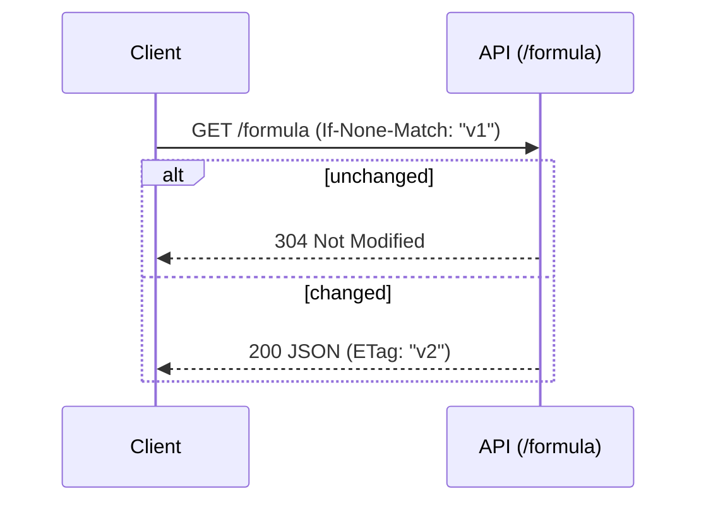

---

## 8) CSV exports

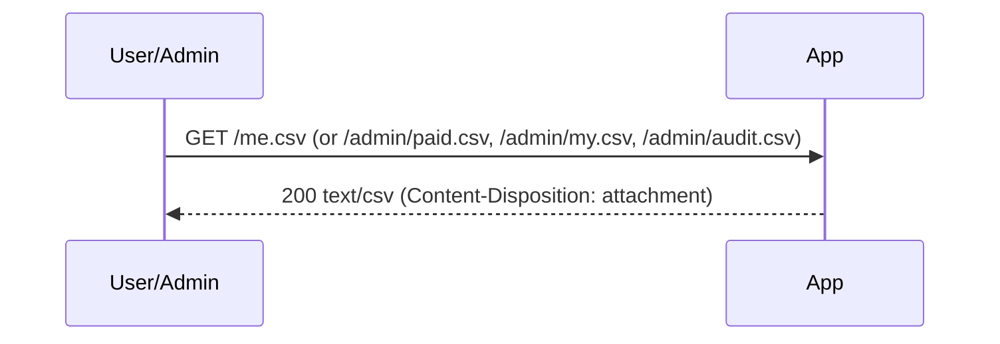

**Notes**

* Filters via query params (e.g., `start/end` for `/me.csv`).
* CSVs are generated on demand from live data.

---

## 9) Internationalization

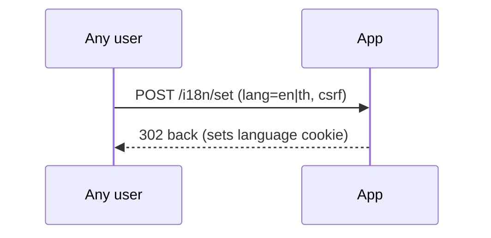

---

## 10) Observability & ops

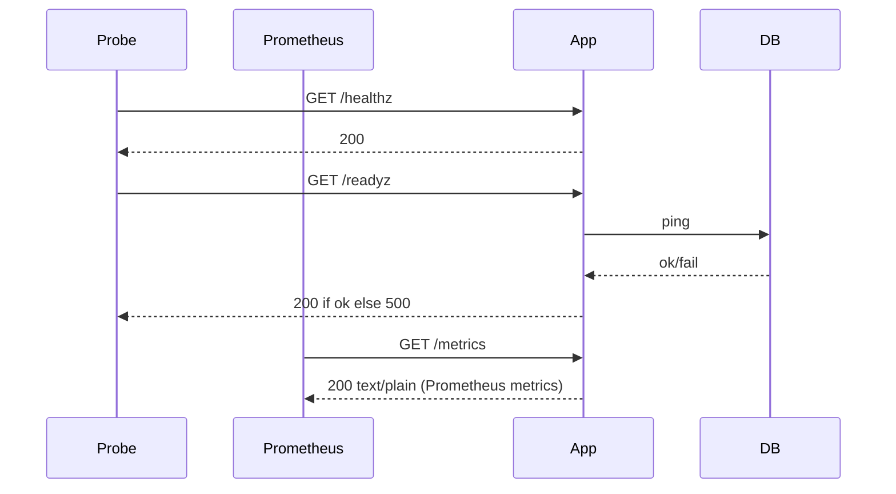

**Notes**

* `/healthz` = process up; `/readyz` = DB connectivity OK.
* Metrics include request counts/latency and domain counters (auth/billing/payments).

---

## 11) Auditing (hash chain)

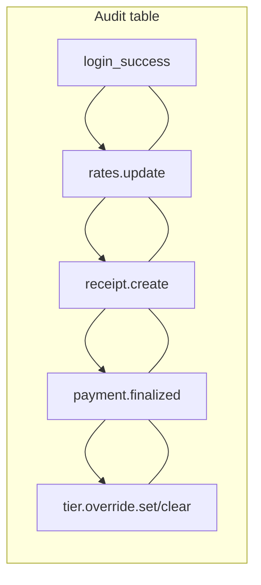

* Each record stores `prev_hash` and `hash = H(prev_hash || record)`.
* Export via `/admin/audit.csv` for reviews.

---

## 12) Failure modes & guarantees

* **Double billing:** blocked by `UNIQUE(job_key)`; the whole receipt creation fails atomically if any duplicate appears.
* **Webhook replay:** ignored by unique `(provider, external_event_id)`; events are stored and re-applying is safe.
* **CSRF missing/invalid:** POST is rejected with 400/403; UI pages always embed a token.
* **Auth lockout:** repeated login failures trigger a temporary lock per `(username, ip)`.
* **Slurm unavailable:** automatic fallback order: `slurmrestd → sacct → CSV` (for demos). If all fail, the page shows a friendly message; CSV exports can still work if prior data exists.
* **DB unhealthy:** `/readyz` returns 500; load balancer can pull the instance from rotation.
* **Copilot rate limit:** exceeds per-IP bucket → `"Rate limit exceeded..."` response; similarity below threshold → `"I don't know."`.
* **Tier overrides:** choosing the same tier as the natural classifier **removes** the override; effective tier is resolved at pricing time and snapshotted on the receipt.

---

## 13) Demo mode (dev)

* **Users:** seeded demo users in development for quick login.
* **Data:** `FALLBACK_CSV` allows “offline” demos when Slurm is not reachable.
* **Payments:** `/payments/simulate` triggers a signed, local webhook event to exercise the success path without a real gateway.
* **Copilot:** enable Ollama locally; docs are read from the repo’s `/docs` folder.

---

## 14) Flow checklist (QA)

* [ ] Login form includes CSRF and shows neutral errors; lockout works.
* [ ] Usage page renders with detail/aggregate/billed views; costing is step-aware.
* [ ] Receipt creation filters already-billed jobs; **pricing snapshot** is written.
* [ ] **Tier overrides** page lists users, saves/clears overrides, and logs audit.
* [ ] Admin can update rates; `GET /formula` reflects changes and ETag updates.
* [ ] Hosted checkout redirects; webhook finalizes only on signature + amount/currency match; canceled/failed states display correctly.
* [ ] Copilot answers with sources; rate limiting and “I don’t know.” behavior verified; reindex works.
* [ ] CSV exports download with expected columns.
* [ ] `/healthz`, `/readyz`, `/metrics` behave as documented.
* [ ] Audit CSV contains key actions in order with a consistent hash chain.
