# Flows

> End-to-end flows for users, admins, payments, ingestion, and ops.

---

## Conventions

- **Actors:** User (member), Admin, App (Flask), DB (PostgreSQL), Slurm (slurmrestd/`sacct`), Provider (payment gateway), Prometheus.
- **CSRF:** All session POSTs include `csrf_token` (form field) or `X-CSRFToken` header.
- **No “void” path** covered here (intentionally excluded for now).

---

## 1) Sign-in with throttling

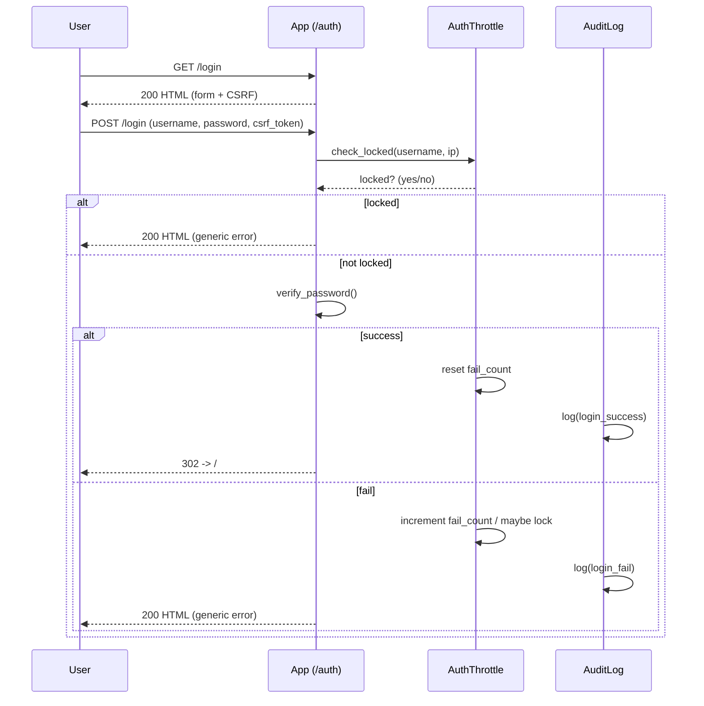

**Notes**

- Neutral error messages avoid leaking whether a username exists.
- Lockout windows and counters are per `(username, ip)`.

---

## 2) Usage ingestion (Slurm → App)

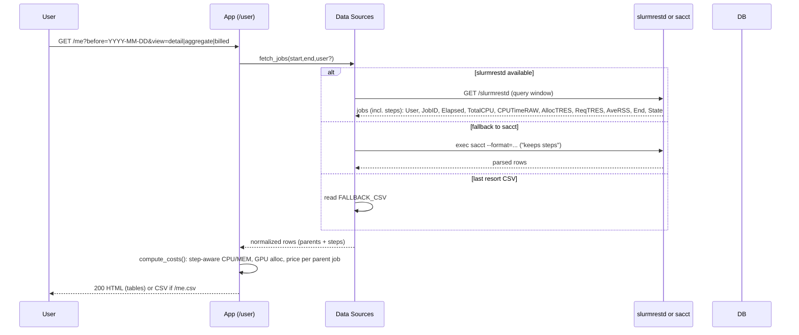

**Notes**

- Rows are normalized to a common schema regardless of source.
- Pricing is deterministic and re-computed on demand for display.

**Costing precedence (step-aware):**

- **CPU**: Σ `TotalCPU` (steps) → `CPUTimeRAW/3600` → `AllocCPUS × Elapsed`
- **MEM**: Σ `AveRSS(GB) × Elapsed` (steps) → `mem_from_TRES × Elapsed`
- **GPU**: `AllocGPU × Elapsed` (fallback `ReqGPU × Elapsed`)

---

## 3) Create a receipt (unbilled jobs)

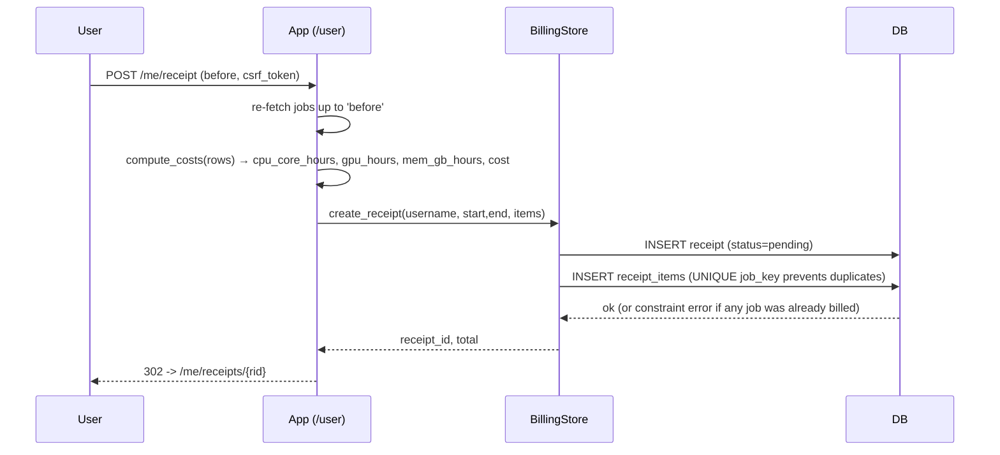

**Notes**

- **De-duplication:** a canonical `job_key` is **globally unique**; attempts to re-bill fail atomically.
- A receipt is immutable once created (except payment status).

---

## 4) Payments

### 4.1 Manual reconciliation (admin marks paid)

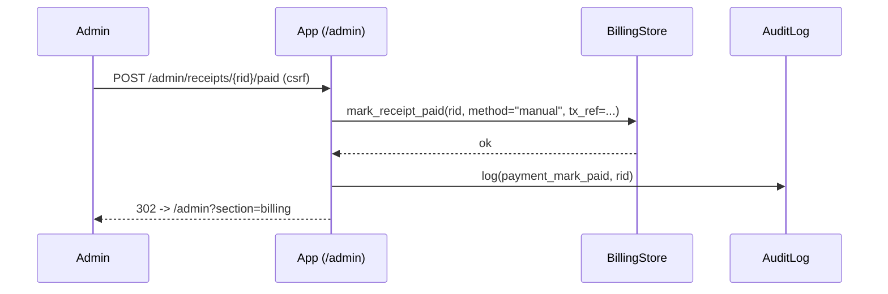

### 4.2 Hosted checkout + webhook (online)

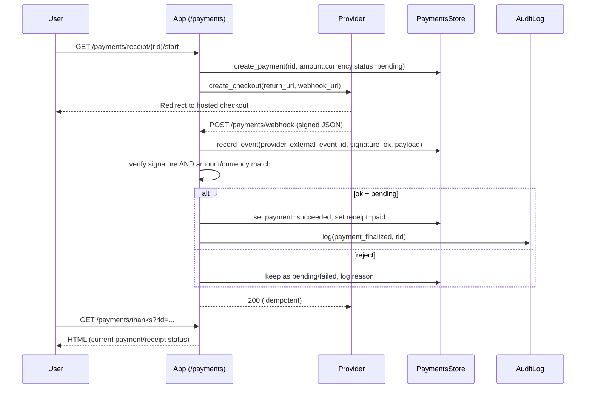

**Notes**

- **Idempotency:** `(provider, external_event_id)` unique prevents double-apply.
- **Security:** signature + amount/currency must match the local payment row.

---

## 5) Rates management (admin + API)

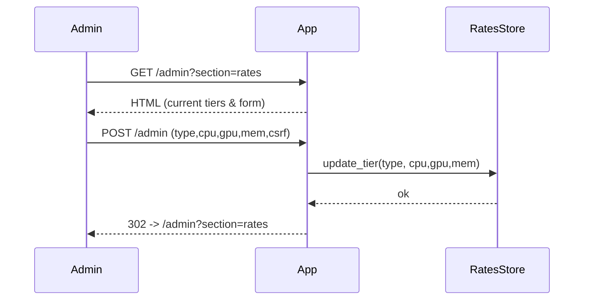

**Machine API**

- `GET /formula` returns JSON and an **ETag**.
- `POST /formula` (admin) updates a tier.
  Clients can cache with `If-None-Match`.

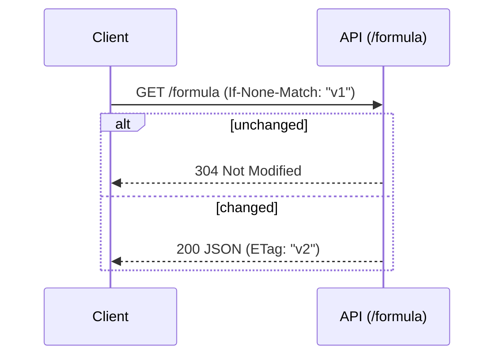

---

## 6) CSV exports

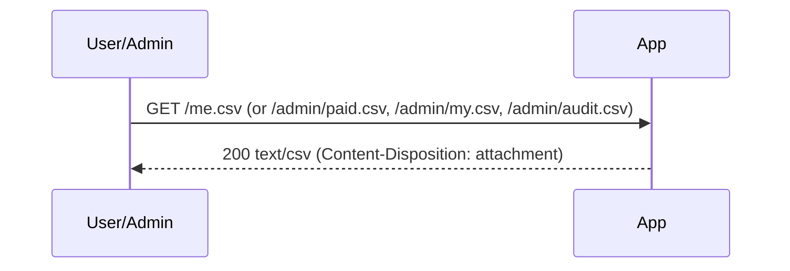

**Notes**

- Filters via query params (e.g., `start/end` for `/me.csv`).
- CSVs are generated on demand from the DB.

---

## 7) Internationalization

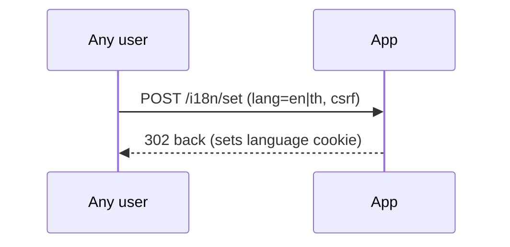

---

## 8) Observability & ops

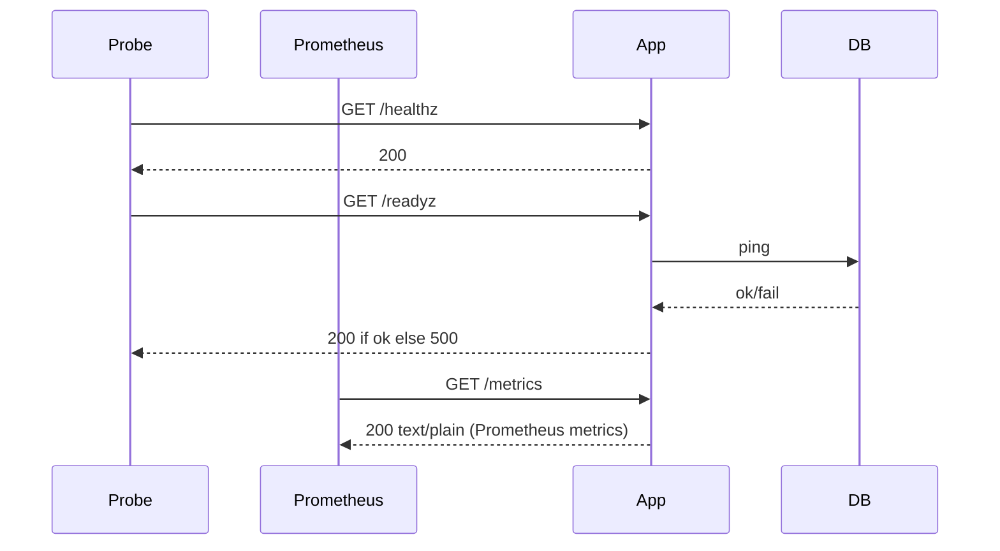

**Notes**

- `/healthz` = process up; `/readyz` = DB connectivity OK.
- Metrics include request counts/latency and domain counters (auth/billing/payments).

---

## 9) Auditing (hash chain)

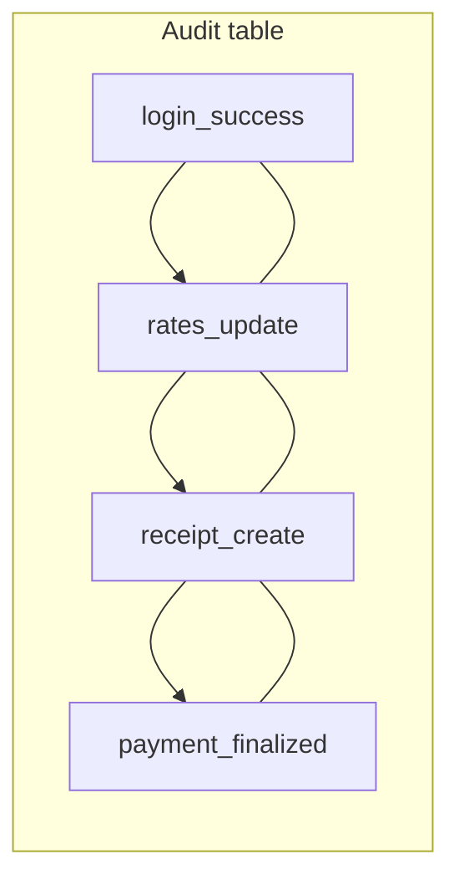

- Each record stores `prev_hash` and `hash = H(prev_hash || record)`.
- Export via `/admin/audit.csv` for reviews.

---

## 10) Failure modes & guarantees

- **Double billing:** blocked by `UNIQUE(job_key)`; the whole receipt creation fails atomically if any duplicate appears.
- **Webhook replay:** ignored by unique `(provider, external_event_id)`; events are stored and re-applying is safe.
- **CSRF missing/invalid:** POST is rejected with 400/403; UI pages always embed a token.
- **Auth lockout:** repeated login failures trigger a temporary lock per `(username, ip)`.
- **Slurm unavailable:** automatic fallback order: `slurmrestd → sacct → CSV` (for demos). If all fail, the page shows a friendly message; CSV exports can still work if DB has prior data.
- **DB unhealthy:** `/readyz` turns 500; load balancer can pull the instance from rotation.

---

## 11) Demo mode (dev)

- **Users:** seeded demo users in development for quick login.
- **Data:** `FALLBACK_CSV` allows “offline” demos when Slurm is not reachable.
- **Payments:** `/payments/simulate` triggers a signed, local webhook event to exercise the success path without a real gateway.

---

## 12) Flow checklist (QA)

- [ ] Login form includes CSRF and shows neutral errors.
- [ ] Usage page renders with detail/aggregate/billed views.
- [ ] Receipt creation filters already-billed jobs and is transactional.
- [ ] Admin can update rates; GET `/formula` reflects changes and ETag updates.
- [ ] Hosted checkout redirects; webhook finalizes only on signature + amount/currency match.
- [ ] CSV exports download with expected columns.
- [ ] `/healthz`, `/readyz`, `/metrics` behave as documented.
- [ ] Audit CSV contains key actions in order with consistent hash chain.
