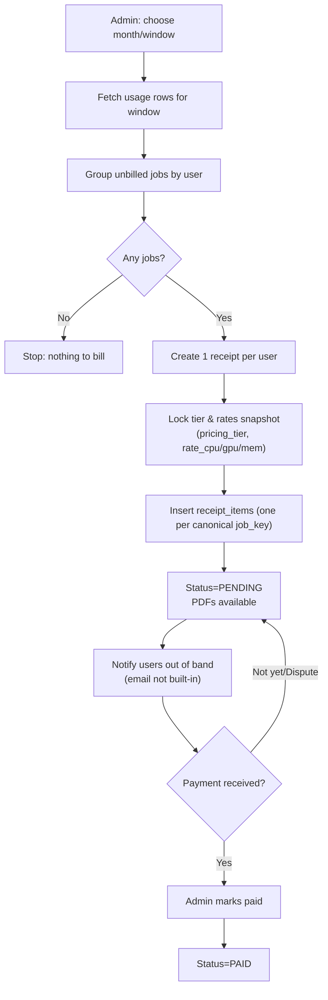
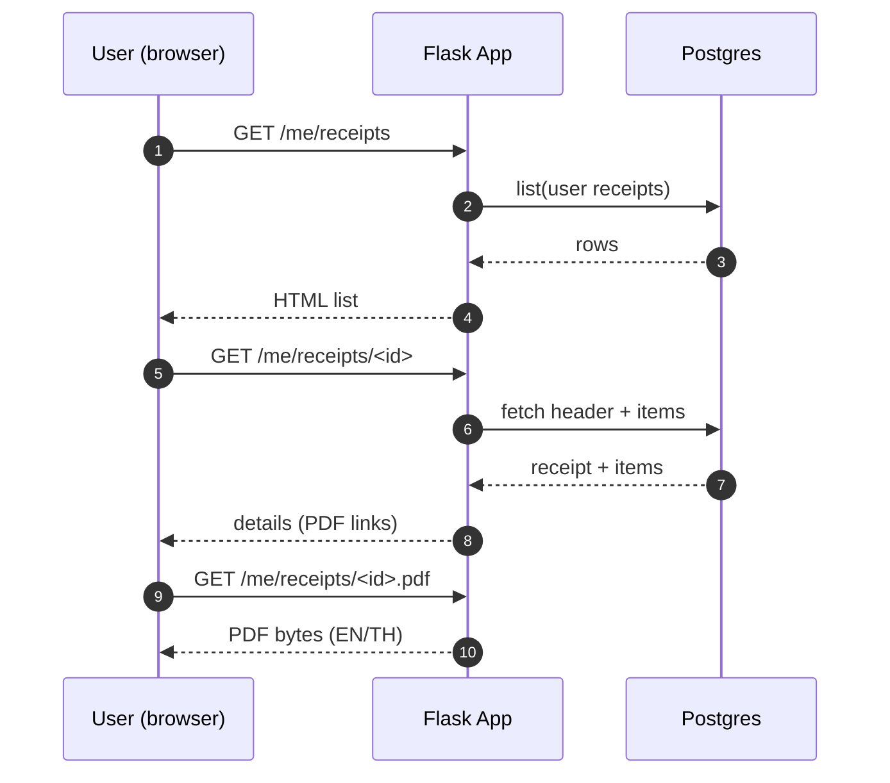
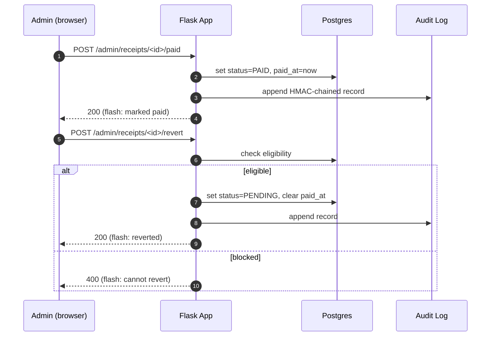

# Usage & Billing Flows (No Online Payments)

This page shows the **end‑to‑end flows** for monthly billing **without** online payments. Admins generate invoices (receipts) in batch; users view their invoices; admins mark paid or revert when appropriate.

---

## 1) Monthly billing run (Admin)

**Revert eligibility**: a Paid receipt can be reverted to Pending **only if** there is no external payment link and no downstream locks (period closed / exported / sent flags). All actions are **audited**.

---

## 2) User views invoices

---

## 3) Admin marks paid / reverts

---

## 4) Accounting mapping (status → journal)

- **Accrual (service month)**: Dr **1150 Contract Asset** / Cr **4000 Service Revenue** (net of VAT). Applied on **period close** for the service window.
- **Issue invoice**: Dr **1100 Accounts Receivable** (gross) / Cr **1150 Contract Asset** (net) / Cr **2100 VAT Output** (VAT). Triggered when receipt is **issued**.
- **Payment**: Dr **1000 Cash/Bank** / Cr **1100 Accounts Receivable**. Triggered when **marked paid**.

> The **Derived Journal** view is a preview; **Posted GL** is authoritative after posting. Reverts affect subsequent postings (e.g., reversing or adjusting entries) according to period state.

---

## 5) Guardrails & invariants

- **No double billing**: `job_key` is globally unique across `receipt_items`.
- **Rate immutability**: receipts hold a copy of tier rates; later changes don’t back‑edit totals.
- **Auditability**: create/paid/revert actions write HMAC‑chained audit entries; chain can be verified.
- **No online payments**: checkout/webhook routes are disabled; marking paid is manual and audited.

---

## 6) Where to find this in the UI

- Admin: **Billing** and **My Usage** sections; buttons for _Create month_, _Mark paid_, _Revert_.
- User: **My Receipts** list and detail pages with PDF links (EN/TH).
