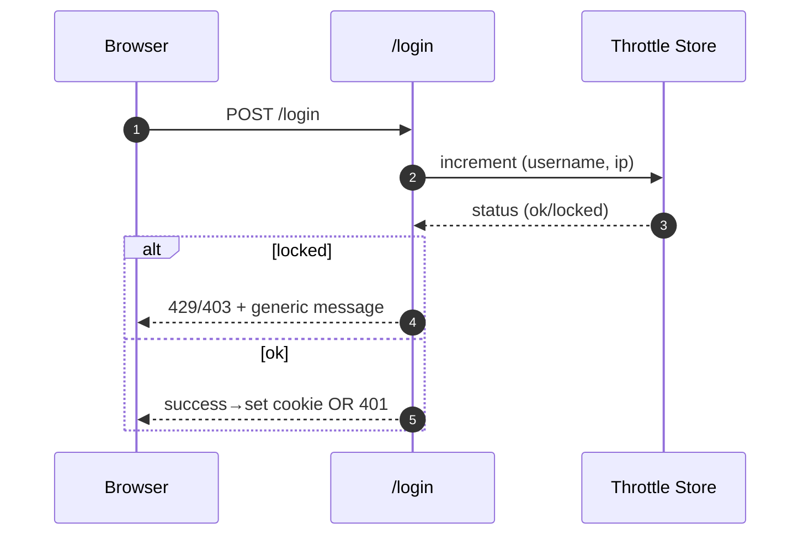
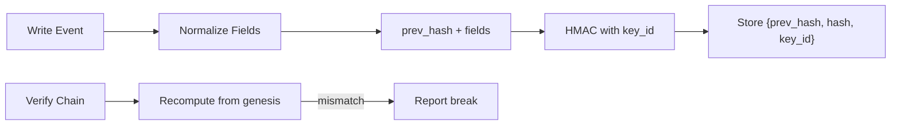

# Security & Audit

This chapter documents the app’s security model, controls, and hardening guidance. It maps directly to code paths (auth, CSRF, throttle), the audit HMAC chain, and deployment practices.

> Scope: web app & API, database, PDFs, metrics, exports. Out of scope: scheduler security, OS hardening of Slurm nodes, and enterprise SSO (future work).

---

## 1) Threat model (quick view)

**Assets**: rates & invoices, GL exports, audit trail, user accounts, private dashboards.

**Trust boundaries**:

- Browser ↔ App (session cookies, CSRF tokens)
- App ↔ Postgres (DB creds)
- App ↔ Slurm data sources (sacct/slurmrestd)
- App ↔ Dev tools (Adminer, Swagger, MkDocs, Ollama) — **dev‑only**

**Top risks**: credential stuffing, CSRF on state‑changing routes, privilege misuse, tampering with audit trail, export/package spoofing, XSS/templating bugs, SSRF via PDF asset fetch.

---

## 2) Authentication, session, RBAC

- **Local accounts** (`users_db.py`): username + salted password hash.
- **Session**: Flask cookies; set `Secure`, `HttpOnly`, `SameSite` in prod.
- **RBAC**: `user` vs `admin` via decorators; all admin routes require `admin_required`.
- **Logout**: invalidates session.

### Login throttling / lockout

- Per `(username, ip)` counters with sliding window; locks after threshold; unlocks after timeout.
- All lock/unlock attempts are **audited** and **metered** in metrics.

---

## 3) CSRF & state‑changing routes

- CSRF is enforced across **session‑backed POSTs** (forms & JSON) except explicitly exempt tool endpoints (e.g., `/copilot/ask`) and health/metrics.
- Use the templated CSRF token in forms; for JSON POSTs include header `X-CSRFToken`.

---

## 4) Audit log (tamper‑evident)

- Each audit record stores: timestamp, actor, action, target, status, request metadata, `prev_hash`, `hash`, and `key_id`.
- **Canonicalization**: a stable subset of fields is serialized; `hash = HMAC(key_id, prev_hash || fields)`.
- **Key rotation**: active key set by `AUDIT_HMAC_KEY_ID`; historic keys provided via `AUDIT_HMAC_KEYRING` for verification.
- **Verification**: `/admin/audit.verify.json` recomputes the chain, reports first break (if any).
- **Privacy toggles**: `AUDIT_ANONYMIZE_IP`, `AUDIT_STORE_RAW_UA` control IP hashing and UA storage.

---

## 5) Exports integrity

- **Formal GL ZIP** includes CSV(s), a JSON manifest (content hashes, batch IDs), and an **HMAC signature** with `key_id`.
- Consumers can verify integrity offline using the shared key.
- Integrity ≠ confidentiality: if required, encrypt the ZIP out‑of‑band (e.g., PGP) before distribution.

---

## 6) PDFs & HTML templates

- Renderer: **WeasyPrint**. System packages (cairo, pango, gdk‑pixbuf, fonts) ship in the image.
- **Do not** embed remote `http(s)` assets in PDFs; keep all CSS/fonts/images local to avoid SSRF.
- Templates use auto‑escaping; avoid `|safe` unless content is vetted.
- Thai/English templates render with installed fonts.

---

## 7) Data handling

- **PII minimum**: usernames only by default; optional payment tables exclude PAN/CVV.
- **Monetary precision**: DECIMAL/NUMERIC throughout; 2 dp in display/export.
- **Uniqueness guard**: job `job_key` is globally unique to prevent double billing.

---

## 8) Configuration (security‑related env)

| Var                                                                             | Meaning                                            |
| ------------------------------------------------------------------------------- | -------------------------------------------------- |
| `FLASK_SECRET_KEY`                                                              | Session signing; rotate when compromised.          |
| `APP_ENV`                                                                       | `development` or `production`; toggles debug, etc. |
| `DATABASE_URL`                                                                  | DB credentials / SSL params.                       |
| `AUTH_THROTTLE_MAX_FAILS`, `AUTH_THROTTLE_WINDOW_SEC`, `AUTH_THROTTLE_LOCK_SEC` | Brute‑force controls.                              |
| `AUDIT_HMAC_SECRET`, `AUDIT_HMAC_KEY_ID`, `AUDIT_HMAC_KEYRING`                  | Audit chain keying & rotation.                     |
| `AUDIT_ANONYMIZE_IP`, `AUDIT_STORE_RAW_UA`                                      | Telemetry privacy knobs.                           |
| `METRICS_ENABLED`                                                               | Expose `/metrics`.                                 |

> Keep dev tools (Adminer, Swagger, MkDocs, Ollama) **off** or gated in production.

---

## 9) HTTP headers & TLS (recommended)

Set via reverse proxy (nginx/Caddy):

- `Strict-Transport-Security: max-age=63072000; includeSubDomains; preload`
- `Content-Security-Policy` (tighten to self/static; disallow inline unless hashed)
- `X-Frame-Options: DENY`
- `X-Content-Type-Options: nosniff`
- `Referrer-Policy: no-referrer`
- `Permissions-Policy` (disable unneeded APIs)
- Enforce TLS 1.2+; redirect HTTP→HTTPS.

---

## 10) Docker & deployment hardening

- **Run as non‑root** user in the container; mount read‑only where possible.
- Restrict container egress if you do not need internet access (especially for PDF rendering).
- Keep **Adminer/Swagger/MkDocs/Ollama** internal; never expose to the internet without auth.
- Use a managed Postgres with backups and TLS.
- Secrets via environment/secret manager; avoid baking into images.

---

## 11) Metrics & monitoring

- `/metrics` exposes a dedicated Prometheus registry; counters and histograms are pre‑warmed.
- Suggested alerts: high 5xx rate, surge in login failures/locks, readiness flapping, export signature failures.

---

## 12) Known limitations

- No SSO/IdP integration (local accounts only).
- No per‑endpoint rate limiting beyond login throttle and Copilot rate cap.
- No at‑rest DB encryption handled by the app; rely on DB/storage layers.

---

## 13) Security checklist (ops)

- [ ] `APP_ENV=production` and debug **off**
- [ ] Strong `FLASK_SECRET_KEY`
- [ ] Session cookies: `Secure`, `HttpOnly`, `SameSite=Lax/Strict`
- [ ] Adminer/Swagger/MkDocs/Ollama not publicly exposed
- [ ] DB over TLS; least‑privilege DB user
- [ ] CSRF tokens present on forms/JSON POSTs
- [ ] Auth throttle env tuned; monitor lock metrics
- [ ] Audit HMAC keys provisioned; verify chain succeeds
- [ ] PDF templates use only local assets
- [ ] GL ZIP signature verified downstream
- [ ] Backups tested; exports stored with integrity metadata

---

## 14) Incident response (playbook outline)

1. **Contain**: rotate app secret(s), switch `AUDIT_HMAC_KEY_ID`, revoke compromised creds.
2. **Identify**: query audit trail; run `/admin/audit.verify.json` to check integrity.
3. **Eradicate**: patch containers, rotate DB creds, reissue images.
4. **Recover**: restore from backups if needed; re‑export signed GL for the affected period.
5. **Lessons**: tune throttle, CSP, alerts; review access scope.
