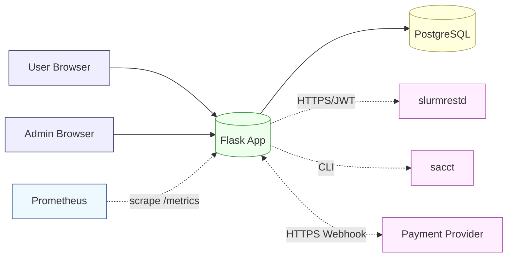
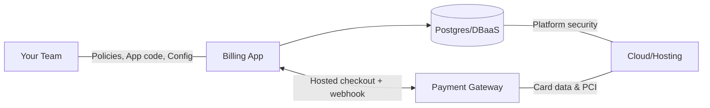

# Security

> How we protect the HPC Billing Platform across auth, data, payments, webhooks, and operations. This book is practical: it names the controls we already have, shows the risks they mitigate, and gives exact hardening steps for dev → prod.

---

## 1) Security model at a glance

- **AuthN / AuthZ**

  - Local users (`admin` / `user`) with password hashes.
  - Session cookies via Flask-Login; **RBAC** with `admin_required`.
  - **Login throttling** per `(username, IP)` with temporary lockouts.

- **Request integrity**

  - **CSRF** protection on all session POSTs; **payments webhook is CSRF-exempt** by design.
  - **Idempotency** for payments via unique `(provider, external_event_id)`.

- **Data integrity**

  - SQLAlchemy ORM (parameterized queries).
  - **Unique `job_key`** across all receipts prevents double-billing.
  - **Audit log** is hash-chained (tamper-evident).

- **Supply & runtime**

  - Dockerized; Adminer is **dev-only**.
  - Prometheus `/metrics` and `/readyz` for ops (gate/limit in prod).

- **Transport / secrets**

  - Expect **TLS everywhere** (reverse proxy for app; TLS/JWT to `slurmrestd`).
  - Secrets via environment/secret store; `.env` for dev only.

---

## 2) Trust zones & data flows



**Boundary rules**

- Browsers ↔ App: HTTPS only; secure cookies; CSRF on session POSTs.
- App ↔ DB: private network; DB user with least privileges.
- App ↔ Slurm: prefer `slurmrestd` over CLI; require TLS + token.
- Provider ↔ App: inbound webhook with signature verification + idempotency.

---

## 3) Authentication & sessions

### Passwords

- Store salted, adaptive password hashes (Werkzeug/Bcrypt/Argon2—configured by the app).
- Never log passwords; mask in error paths.

### Sessions (cookies)

- Set cookie flags in **prod**:

  - `Secure` (HTTPS only), `HttpOnly`, `SameSite=Lax` (or `Strict` if feasible).

- Recommended Flask config (via env or proxy headers):

  - `SESSION_COOKIE_SECURE=1`, `SESSION_COOKIE_HTTPONLY=1`, `SESSION_COOKIE_SAMESITE=Lax`
  - `PREFERRED_URL_SCHEME=https`

### Login throttling

- Counter per `(username, IP)` with `locked_until`.
- Neutral login errors (do not reveal whether the username exists).
- Log **start**, **fail**, **success**, **lock** events to the audit log.

---

## 4) CSRF, XSS, and output encoding

- **CSRF**: enabled globally. All POSTs from browsers must carry a CSRF token (form field or `X-CSRFToken` header for JSON).
  **Exception:** `/payments/webhook` (machine-to-machine).
- **XSS**:

  - Jinja auto-escaping for HTML templates.
  - Avoid rendering untrusted HTML. If absolutely needed, sanitize first.

- **CSP** _(via reverse proxy—recommended)_:

  - Start with report-only, then enforce:

    ```
    Content-Security-Policy: default-src 'self'; img-src 'self' data:; frame-ancestors 'none';
    ```

- **Clickjacking**: `X-Frame-Options: DENY` (or CSP `frame-ancestors 'none'`).
- **Referrer leakage**: `Referrer-Policy: same-origin`.
- **HSTS**: `Strict-Transport-Security: max-age=31536000; includeSubDomains; preload` (once HTTPS is permanent).

---

## 5) Authorization (RBAC)

- **Roles**: `user`, `admin`.
- **Route guards**:

  - Admin pages and rate updates require `admin_required`.
  - User-scoped pages (receipts, usage) require login and server-side username checks.

- **IDOR**: never trust client `username` parameters; use the logged-in identity from the session.

---

## 6) Payments security

### Threats & controls

- **Webhook spoofing** → verify **signature** with provider secret.
- **Under/over-payment** → require **amount + currency** to match local `Payment` row.
- **Replay** → enforce **unique `(provider, external_event_id)`**; replays become no-ops.
- **TOCTOU** → updates wrapped in a transaction: set `payments.status = succeeded` **and** `receipts.status = paid` together.
- **Webhook CSRF** → route is CSRF-exempt but authenticated by signature; respond `200` idempotently.

**Operational tips**

- Keep **PAYMENT_WEBHOOK_SECRET** out of the repo; set via env/secret store.
- Use a dedicated webhook endpoint key per environment (dev/staging/prod).
- Log all webhook attempts with signature verdict (but never log the secret).

---

## 7) Usage ingestion security (Slurm)

- Prefer **`slurmrestd` over `sacct`**:

  - Run `slurmrestd` behind TLS with authentication (e.g., JWT or mutual TLS).
  - Allow only the minimal scopes/endpoints needed for accounting reads.

- If using `sacct` CLI:

  - Do not accept user-controlled arguments directly.
  - Sanitize/whitelist flags; bound date windows server-side.

- **CSV fallback** (dev/demo):

  - Mount as **read-only** (`:ro`) and pin absolute path via env.
  - Treat CSV as untrusted input; parser must be tolerant to malformed rows.

---

## 8) Data integrity & auditing

### Double-billing prevention

- `receipt_items.job_key` is **globally UNIQUE**; receipt creation fails atomically if any job is already billed.

### Audit log (hash-chain)

- Each record contains: `prev_hash`, and `hash = H(prev_hash || record)`.
- Events to log at minimum: login events, rate updates, receipt creation, payment finalization, throttle locks.
- Export available as CSV; verify chain in offline checks.

**Chain verification (pseudo-code)**

```python
prev = "0000"
for row in rows_ordered_by_id:
    assert row.prev_hash == prev
    prev = sha256(prev + serialize(row_wo_hashes)).hexdigest()
    assert row.hash == prev
```

---

## 9) Database & migration security

- **Least privilege** DB user for the app:

  - Only `SELECT/INSERT/UPDATE/DELETE` on app schemas; no `CREATE EXTENSION` or `SUPERUSER`.

- **Indexes & constraints**:

  - Unique: `receipt_items(job_key)`, `payment_events(provider, external_event_id)`.
  - Enum/checks: enforce valid statuses (`pending/paid/...`) and roles (`admin/user`).

- **Backups & restore**:

  - Regular encrypted backups; test restores.
  - Document RPO/RTO expectations (e.g., RPO ≤ 24h, RTO ≤ 2h).

---

## 10) Secrets management

**Dev**

- `.env` (ignored in VCS) to store local secrets.
- Mount CSV and other fixtures read-only.

**Prod**

- Use an **orchestrator secret store** (Docker/Swarm/K8s/Cloud KMS).
- Minimum set of secrets:

  - `FLASK_SECRET_KEY` (session/CSRF)
  - `DATABASE_URL` (contains DB password)
  - `ADMIN_PASSWORD` (first-run seeding only)
  - `PAYMENT_WEBHOOK_SECRET`
  - `SLURMRESTD_URL` + its auth token/certs

**Never**

- Commit secrets, tokens, or production `.env`.
- Log secrets or raw webhook bodies with secrets.

---

## 11) Network & deployment hardening

### Reverse proxy (nginx) example

```nginx
server {
  listen 443 ssl http2;
  server_name billing.example.org;

  # TLS, OCSP, HSTS …
  add_header Strict-Transport-Security "max-age=31536000; includeSubDomains" always;
  add_header X-Frame-Options DENY;
  add_header X-Content-Type-Options nosniff;
  add_header Referrer-Policy same-origin;
  add_header Content-Security-Policy "default-src 'self'; img-src 'self' data:; frame-ancestors 'none'";

  location / {
    proxy_pass http://hpc:8000;
    proxy_set_header Host $host;
    proxy_set_header X-Forwarded-Proto https;
  }
}
```

### Service exposure

- **Adminer**: run only in **dev**; never expose publicly.
- **/metrics**: scrape from a private network or protect with network policy/basic auth.
- **/readyz**: internal probes only (or at least rate-limit + low info responses).

---

## 12) Dependency & container security

- **Pin versions** in `requirements.txt` / image tags.
- Scanners:

  - Python: `pip-audit` or `safety`
  - Containers: `trivy image <your-image>`

- Base image updates:

  - Rebuild regularly on base updates.

- Runtime:

  - Run as non-root in containers (set `USER`).
  - Read-only filesystem where feasible, write tmp & logs to mounted volumes.
  - Drop Linux capabilities not needed.

---

## 13) Logging & privacy

- **Request logs**: method, path, status, latency; avoid logging PII or full bodies.
- **Payment logs**: keep event types and IDs; no card data is handled by us.
- **PII**: system stores only usernames and usage/receipt metadata—**no card numbers**.
- See **Book 11 (Privacy)** for retention and subject-access details.

---

## 14) Security testing plan

**Automated**

```bash
# SAST
bandit -r .

# Dependency audit
pip-audit
# or
safety check

# Container
trivy image your-registry/your-app:tag

# DAST (baseline scan)
docker run --rm -t owasp/zap2docker-stable zap-baseline.py -t https://your-host -r zap.html
```

**Manual**

- CSRF check: POST without token → rejected.
- Throttle check: >N bad logins → lock; unlock after window.
- Payments:

  - Wrong signature → ignored.
  - Correct signature + wrong amount → ignored.
  - Replay same event id → ignored.

- Job re-billing: try to bill same job twice → fails atomically.

---

## 15) OWASP Top-10 mapping (summary)

| Risk                        | Mitigation                                                                     |
| --------------------------- | ------------------------------------------------------------------------------ |
| A01 Broken Access Control   | `admin_required`, user-scoped checks, no IDOR, server-side authorization       |
| A02 Cryptographic Failures  | HTTPS everywhere, secure cookies, HSTS, hashed passwords, TLS to `slurmrestd`  |
| A03 Injection               | SQLAlchemy parameters; no shelling out with user input; sanitize CSV           |
| A04 Insecure Design         | Unique `job_key`, webhook idempotency, CSRF, throttling, audit chain           |
| A05 Security Misconfig      | Reverse proxy headers, CSP/XFO, secret store, Adminer dev-only                 |
| A06 Vulnerable Components   | `pip-audit`/`safety`, pinned images, `trivy`                                   |
| A07 ID & Auth Failures      | Throttling/lockouts, neutral errors, session hardening                         |
| A08 Software/Data Integrity | Hash-chained audit log; signed webhooks; ETag for clients                      |
| A09 Security Logging        | Structured logs; audit CSV; chain verification                                 |
| A10 SSRF                    | No generic SSRF; outbound requests are to fixed providers/Slurm endpoints only |

---

## 16) Compliance & Control Mapping

> This section outlines which common frameworks are relevant, what we currently meet, and where responsibilities are shared with providers (DBaaS, payment gateway, hosting). It’s guidance, not legal advice.

### Relevant frameworks:

- **ISO/IEC 27001** (security management program) – organization-wide.
- **SOC 2** (Trust Service Criteria: Security/Availability/Confidentiality) – org/service level.
- **CIS Critical Security Controls** – technical hardening baseline.
- **OWASP ASVS** – secure web app requirements (we already map many controls).
- **PCI DSS** – only if handling card data. We do **not** handle PANs; gateway hosted checkout ⇒ likely **SAQ-A** posture.
- **Privacy**: **PDPA (Thailand)** / **GDPR (EU)** / **CCPA/CPRA (California)** depending on users/stakeholders.

> University context: consider **FERPA** alignment if student data ever appears (today we only store usernames and usage metadata).

### Shared responsibility (at a glance)



- **You**: application security, authentication/authorization, webhook validation, backups (if self-host DB), incident response, privacy notices.
- **Gateway**: PCI DSS controls, cardholder data environment.
- **Cloud/Host**: physical security, hypervisor, managed services SLAs.

### Control mapping (starter)

| Area           | Control                                           | Our implementation                                      | Framework tags                        |
| -------------- | ------------------------------------------------- | ------------------------------------------------------- | ------------------------------------- |
| Access         | RBAC (admin/user), least privilege DB user        | `admin_required`, scoped queries; non-superuser DB role | ISO 27001 A.9, SOC2 CC6, CIS 6        |
| Auth           | Brute-force throttling & lockout                  | per `(username, IP)` counters + lock window             | ASVS 2.2.4, CIS 16                    |
| Session        | Secure cookies, CSRF everywhere (except webhooks) | `HttpOnly`, `SameSite`, CSRF tokens                     | ASVS 3.4/3.5, SOC2 CC6                |
| Data integrity | No double billing                                 | `UNIQUE(job_key)` constraint                            | SOC2 CC7, CIS 4                       |
| Audit          | Tamper-evident hash-chain log                     | `prev_hash` + `hash`                                    | ISO A.12.4, SOC2 CC7                  |
| Payments       | Signed webhooks + idempotency                     | Signature verify; `(provider,event_id)` unique          | PCI DSS 10/11 (gateway), SOC2 CC6/CC7 |
| Transport      | TLS termination & security headers                | Reverse proxy (HSTS, CSP, XFO)                          | ASVS 14, CIS 13                       |
| Privacy        | Data minimization                                 | Username + usage only; no PAN/PII                       | PDPA/GDPR (Art.5)                     |

### PCI DSS note (gateway model)

- We **do not** capture/transmit/store cardholder data; payments use **hosted checkout**.
- Target posture: **PCI DSS SAQ-A** (gateway handles the CDE).
- Required on our side: secure integrations, change control, incident response, and protecting any payment-related logs/tokens.

### PDPA/GDPR alignment (lightweight)

- **Data inventory**: usernames, usage records, receipts, audit events.
- **Lawful basis**: legitimate interests/contract (institution policy).
- **Notices**: short privacy notice on login page.
- **Retention**: financial records per university policy; define retention for audit logs.
- **Rights handling**: contact and process for access/deletion (where applicable).

### Evidence to keep (for audits)

- Reverse proxy config with security headers (screenshot or file).
- DB role grants and `\d+` of key tables (show constraints).
- Backup logs + a **restore drill record**.
- Webhook signature verification code path + sample signed payload (redacted).
- Change log for rate updates (admin UI) and audit CSV exports.

### Minimal compliance roadmap

1. **Policies**: 1–2 page Security Policy + Incident Response + Backup/Restore SOP.
2. **Headers/TLS**: enforce HSTS, CSP, XFO at the proxy in prod.
3. **Backups**: nightly `pg_dump` + documented restore drill (quarterly).
4. **Privacy**: add a simple Privacy Notice; document retention periods.
5. **Vulnerability mgmt**: add `pip-audit`/`trivy` to CI; fix highs.
6. **Access reviews**: quarterly admin account review & DB role review.
7. **PCI posture**: confirm SAQ-A with gateway; store their AOC.

## Optional: ASVS quick checklist (excerpt)

- [ ] Verify CSRF protection on all state-changing requests.
- [ ] Verify session cookies set `Secure`, `HttpOnly`, `SameSite`.
- [ ] Verify authentication limits repeated failures and logs events.
- [ ] Verify all authZ enforced server-side; no IDOR.
- [ ] Verify all integrations (Slurm, gateway) use TLS and validate certs.

---

## 17) Production checklist

- [ ] Reverse proxy with TLS, HSTS, CSP, security headers.
- [ ] `SESSION_COOKIE_*` hardened; `FLASK_SECRET_KEY` set.
- [ ] Database user least-privilege; encrypted backups; tested restore.
- [ ] `PAYMENT_WEBHOOK_SECRET` set; webhook URL restricted by IP or rate-limit.
- [ ] Slurm integration via **TLS**; tokens/certs rotated.
- [ ] Adminer **not** deployed; `/metrics` gated.
- [ ] Bandit/pip-audit/Trivy clean; base images up to date.
- [ ] Monitoring on `/healthz`, `/readyz`; alerts on failures.
- [ ] Audit export procedure documented; chain verification script run in CI (optional).
- [ ] Incident response contact & log retention defined.

---
