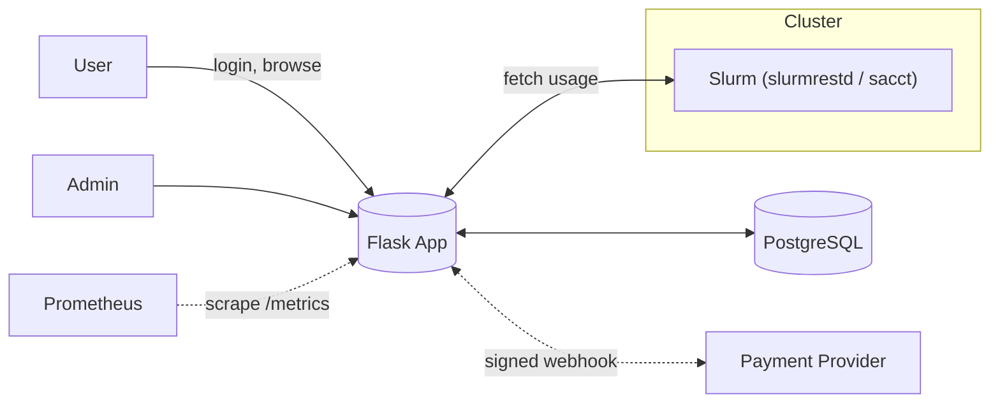

# Privacy

> What personal data the **HPC Billing Platform** handles, why we process it, where it flows, how long we keep it, and how to fulfill user requests (GDPR/PDPA-aligned). This page is written for engineers, admins, and compliance.

---

## 1) Scope & roles

- **This application** processes lab/cluster usage data and minimal identity to generate billing records and (optionally) reconcile payments.
- **Controller** (typical): your institution / HPC center.
- **Processors**:

  - **Payment provider** (if enabled): independent processor/controller for payment data.
  - **Hosting/DB** (if managed externally).

- **Not processed:** payment card numbers or bank credentials (handled only by the provider).

---

## 2) Data we handle (by category)

| Category              | Fields (examples)                                                                            | Source         | Purpose                        | Lawful basis\*                  | Typical retention         |
| --------------------- | -------------------------------------------------------------------------------------------- | -------------- | ------------------------------ | ------------------------------- | ------------------------- |
| **Account**           | `username`, `password_hash`, `role`, `created_at`                                            | User / Admin   | Authentication, access control | Contract / Legitimate interests | While account active + 1y |
| **Usage**             | `User`, `JobID`, `Elapsed`, `TotalCPU`, `ReqTRES`, `End`, `State`                            | Slurm          | Show historical usage; pricing | Legitimate interests            | 2–7y (per finance policy) |
| **Billing**           | `receipt(id, username, start, end, total, status, paid_at)` + items (`job_key`, hours, cost) | App            | Invoicing/accountability       | Legal obligation / LI           | 5–10y (finance retention) |
| **Payments**          | `provider`, `currency`, `amount_cents`, `external_payment_id`, `status`                      | App + Provider | Reconciliation                 | Contract / Legal obligation     | 5–10y                     |
| **Payment events**    | `external_event_id`, `event_type`, `signature_ok`, `raw_payload` (redacted)                  | Provider       | Audit & idempotency            | Legal obligation / LI           | 2–5y                      |
| **Audit log**         | `ts`, `actor`, `ip`, `ua`, `method`, `path`, `action`, `status`, `hash`                      | App            | Security & traceability        | Legal obligation / LI           | 1–2y                      |
| **Security throttle** | `username`, `ip`, `window_start`, `fail_count`, `locked_until`                               | App            | Brute-force protection         | Legitimate interests            | 30–90d                    |
| **Preferences**       | `lang` cookie                                                                                | User           | UI language                    | Legitimate interests            | 1y                        |

\* Choose basis to match your policy/regime (e.g., GDPR Art. 6(1)(b)/(c)/(f), Thailand PDPA Sec. 24 legit interests/contract/legal obligations).

**We do not store:** card PAN/CVV, bank credentials, addresses, phone numbers—unless you decide to extend the schema.

---

## 3) Data flow (high level)

- Slurm provides **usage** (job metadata & counters) → App computes **costs** → **Receipts**.
- Payments are finalized **only** via **signed webhooks**; we persist minimal identifiers and provider event metadata.

---

## 4) Data minimization & safeguards

- Keep **user identity minimal**: username only (no names/emails unless truly required).
- Ingestion: request only the fields needed for pricing; do **not** store job command lines.
- **Raw webhook payloads**: store as text **after redaction** (strip PII/secrets if a provider sends them).
- **Audit log** is hash-chained to detect tampering.
- **Access control**: admin views gated by `admin` role; users see only their data.
- **CSRF** on all session POSTs; login throttling blocks credential stuffing.

---

## 5) Cookies & local storage

| Name         | Type                | Purpose      | Expiry         | Notes                        |
| ------------ | ------------------- | ------------ | -------------- | ---------------------------- |
| `session`    | Cookie (Strict/Lax) | Auth session | Session/Config | `Secure`, `HttpOnly` in prod |
| `csrf_token` | Cookie/hidden field | CSRF defense | Session        | Not readable by 3rd parties  |
| `lang`       | Cookie              | UI language  | 1 year         | Non-tracking preference      |

No analytics or cross-site tracking cookies by default.

---

## 6) Retention & deletion

- **Receipts/Payments**: retain per finance/tax policy (commonly **5–10 years**).
- **Audit logs**: **1–2 years** (security operations), then purge.
- **Throttle records**: **30–90 days** rolling.
- **Accounts**: deactivate on departure; delete after retention window unless records must be preserved (replace username with an **opaque id** in future if policy allows pseudonymization).
- **Backups**: same retention as production or as per IT policy; ensure encrypted at rest.

> If deletion conflicts with legal obligations (e.g., invoices), prefer **anonymization** over hard delete.

---

## 7) International transfers

- Where is DB hosted? Document region (e.g., on-prem TH / EU cloud).
- **Payment provider** may process data outside your region; ensure appropriate safeguards (DPA, SCCs or PDPA adequacy).
- Limit webhook payload persistence to what you need for reconciliation.

---

## 8) Data subject rights (how-to)

Supported rights (typical under GDPR/PDPA):

| Right                     | How we fulfill                                                                    | Owner         |
| ------------------------- | --------------------------------------------------------------------------------- | ------------- |
| **Access (SAR)**          | Export usage (`/me.csv`), receipts, payment metadata, audit records for that user | Admin/IT      |
| **Rectification**         | Update username only via admin policy (rare); no personal profile stored          | Admin         |
| **Erasure**               | Deactivate account; anonymize username in historical records if policy permits    | Admin + Legal |
| **Restriction/Objection** | Limit processing to billing compliance only                                       | Admin         |
| **Portability**           | Provide CSV/JSON exports                                                          | Admin/IT      |

### SAR runbook (template)

1. Verify requester identity via institutional process.
2. Query DB for:

   - `users` row for username.
   - Usage rows for requested window.
   - Receipts & items, payments & events.
   - Audit entries where `actor=username`.

3. Produce a ZIP: `usage.csv`, `receipts.csv`, `receipt_items.csv`, `payments.csv`, `payment_events.csv`, `audit.csv`, plus a readme.
4. Redact secrets (webhook signatures).
5. Deliver securely (institution channel). Log the fulfillment in audit.

---

## 9) Third parties & contracts

- **Payment provider**: ensure a **DPA** and webhook signing secret; confirm **no card data** traverses this app.
- **Managed DB/Hosting**: DPA or equivalent.
- **Slurm**: typically internal system; document operator and data sharing agreement inside the institution.

---

## 10) Security controls that protect privacy

- **Transport security**: HTTPS externally; TLS/JWT to `slurmrestd`.
- **Session hardening**: `Secure`, `HttpOnly`, `SameSite`.
- **RBAC** and user scoping on all data views.
- **Idempotent/signed webhooks**; reject mismatched amount/currency.
- **Least privilege DB user**; indices prevent accidental wide scans.
- **Logging discipline**: no credentials, secrets, or PII in logs.
- **Backups**: encrypted at rest; access limited; restores tested.

(See Book 06 — Security — for full details.)

---

## 11) DPIA mini-checklist

- [ ] Purpose specific and documented (billing and reconciliation).
- [ ] Data minimized (username only; job metrics).
- [ ] High-risk data? **No** (no special categories; no financial PAN).
- [ ] Processors under contract/DPA.
- [ ] International transfers assessed and safeguarded.
- [ ] Retention limits configured and enforced.
- [ ] SAR & deletion processes tested.
- [ ] Security measures proportionate (CSRF, RBAC, signed webhooks, audit chain).

---

## 12) Engineer playbook (do / don’t)

**Do**

- Use parameterized queries only.
- Redact sensitive fields from webhook payloads before saving.
- Add migrations that **don’t** introduce PII without a review.
- Keep Adminer/dev tools **off** in production.

**Don’t**

- Log request bodies for login or payments.
- Store email, full names, addresses, or PAN unless policy explicitly requires and is reviewed.
- Expose `/metrics` or Swagger UI publicly without protections.

---

## 13) User-facing privacy notice (starter text)

> We process your cluster usage and a minimal login identifier to generate receipts for compute resources. If you choose to pay online, payment processing is handled by our payment provider; we do not store card details. We keep billing and payment records as required by institutional policy. You can request a copy of your data or raise concerns via \[IT Service Desk/contact]. Cookies are limited to session security and your language preference.

(Adapt wording to your institution; add contact/email.)

---

## 14) Implementation checklist

- [ ] Confirm **no extra PII** is collected in templates or forms.
- [ ] Ensure webhook payloads are **redacted** on save.
- [ ] Configure cookie flags in prod.
- [ ] Document DB/hosting regions; add DPA references.
- [ ] Set and document retention jobs (cron or manual).
- [ ] Add SAR export script/notebook (optional convenience).
- [ ] Publish the user-facing privacy notice on the login page footer.

---
