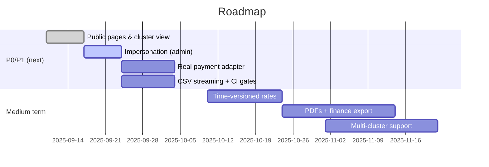
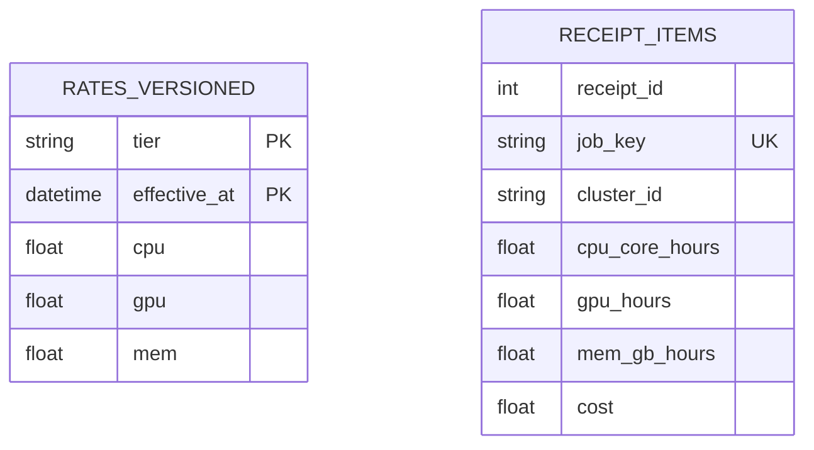

# What’s Next (Roadmap & Open Questions)

> A pragmatic roadmap for the HPC Billing Platform. This is not a promise—it’s a prioritized plan that keeps us honest about value, risk, and effort.

---

## 1) Goalposts

- **R1 (“usable now”)**: receipts without double-billing, admin rate edits, manual/online payments, CSV exports, ops playbooks.
- **R2 (“operator friendly”)**: public read-only views, basic cluster status, impersonation, stronger tests/metrics, one real payment adapter.
- **R3 (“finance-grade”)**: time-versioned rates, tax/PO fields, PDFs, export to finance systems, multi-cluster.

---

## 2) Near-term backlog (P0/P1)

| Item                                                    | Why                                             | Touch points                                            |
| ------------------------------------------------------- | ----------------------------------------------- | ------------------------------------------------------- |
| **Public pages** (`/public/pricing`, `/public/cluster`) | Transparency; reduce “how much?” emails         | `public.py`, `slurm_rest.py`, templates                 |
| **Cluster (nodes/GPU) view** in Admin                   | Ops visibility                                  | `slurm_rest.py`, `admin.py`                             |
| **Admin “impersonate user”** (view-as with audit)       | Faster support; reproduce issues                | `admin.py`, `auth.py`, banner partial, `audit_store.py` |
| **Self-signup (config-gated)** + optional approval      | Remove hardcoded users in dev; scale onboarding | `auth.py`, `users_db.py`, add `is_active`               |
| **OpenAPI parity for HTML/CSV** (non-blocking)          | Docs mirror routes; easier automation           | `docs/api/openapi.yaml`, **04 API**                     |
| **CSV streaming** for large exports                     | Lower memory; faster TTFB                       | `user.my_usage_csv`, `admin.*csv`                       |
| **Real provider adapter (Stripe or Omise)**             | Move beyond dummy; prod readiness               | `payments.py`, `registry.py`, env secrets               |
| **Alembic migrations**                                  | Safe schema evolution                           | new `migrations/`, `base.py`                            |
| **CI gates** (coverage/complexity)                      | Keep quality from regressing                    | `.github/workflows`, **13 metrics**                     |
| **Security headers at proxy**                           | Baseline hardening                              | **07 deployment**, proxy config                         |

---

## 3) Medium-term

- **Rates with effective dates** (history): `rates (tier, cpu,gpu,mem, effective_at)`; pricing picks the correct version for the job period.
- **Invoices/PDFs** (optional): render from receipt + header fields (tax id, PO, cost center).
- **Finance export**: nightly CSV/SFTP or API to accounting (mapping table).
- **Multi-cluster support**: add `cluster_id` to receipt items; multiple slurmrestd endpoints.
- **Email notifications** (queued): receipt ready, payment settled.
- **Role extensions**: project/PI accounts; admin scoped to departments.
- **Performance**: cache Slurm reads per `(user, window)` with TTL; paginate heavy tables.

---

## 4) Long-term / research

- **Budgets/quotas** with alerts.
- **Usage anomaly detection** (simple z-scores first).
- **Chargeback dashboards** for departments/projects.
- **Pluggable auth** (SAML/OIDC) if required by org policy.

---

## 5) Updated diagrams (timeline)



_(Dates are placeholders—adjust in the repo to your calendar.)_

---

## 6) Tech debt to retire

- **Consolidate stores**: align naming (`*_store.py`) and move pure pricing logic to a single module.
- **Payments**: tighten idempotency at DB level if not already (`UNIQUE(provider, external_event_id)` with partial index).
- **Config**: centralize env parsing; fail fast on missing secrets (webhook, DB).
- **Templates**: shared layout and components for admin/user to reduce duplication.

---

## 7) Observability upgrades

- Add labels to HTTP metrics: `endpoint` should be the **route name** (not raw path).
- Emit counters for **receipt status transitions** and **webhook signature failures**.
- Alert on: readyz failures, 5xx >2%, zero webhooks in expected hours, rising login failures.

---

## 8) Security upgrades

- Enforce CSP/HSTS/XFO in reverse proxy (already documented).
- mTLS or JWT to `slurmrestd`.
- CSRF audit (ensure all session POSTs except webhook are covered).
- Optionally add **admin MFA** (TOTP) if policy requires.

---

## 9) Data model evolutions (sketch)



Pricing chooses the **latest** rate with `effective_at <= job_end`. Keep current `RATES` as a view or cache.

---

## 10) ADRs (lightweight decisions)

Create `docs/adrs/` and record key choices:

- **ADR-001**: “Webhook must match amount+currency before success.”
- **ADR-002**: “Dedicated Prometheus registry (no default collectors).”
- **ADR-003**: “Rates are time-versioned; pricing uses job end time.”

Template:

```md
# ADR-00X: Title

Date: YYYY-MM-DD

## Context

…

## Decision

…

## Consequences

…
```

---

## 11) Test plan expansion (high value first)

- Payments webhook: bad signature / amount mismatch / replay (should be idempotent).
- Receipt creation: duplicate `job_key` rejection; totals add up; empty windows.
- Throttling: lock starts/stops; neutral errors.
- Rates API: ETag/304 behavior, admin POST CSRF.

Target: **≥70% line**, **≥50% branch**; diff-coverage **≥60%** (see Book 13).

---

## 12) Docs to update when features land

| Feature                     | Books to touch                                                   |
| --------------------------- | ---------------------------------------------------------------- |
| Public pages & cluster view | **02 Architecture**, **04 API**, **05 Flows**, **07 Deployment** |
| Impersonation               | **05 Flows**, **06 Security**, **08 Ops**                        |
| Real payment adapter        | **04 API**, **06 Security**, **08 Ops**                          |
| Time-versioned rates        | **03 Data Model**, **05 Flows**, **10 Performance**              |
| Finance export/PDF          | **04 API**, **08 Ops**, **11 Privacy**                           |

---

## 13) Definition of Done (per feature)

- Unit tests + CI green (coverage/complexity gates pass)
- Docs updated (books listed above)
- Metrics added (if user-facing/critical)
- Security reviewed (CSRF, authz, secrets)
- Rollback plan noted if DB changes

---

## 14) Open questions

- Do we need **department/project billing** now or later?
- Which **payment provider** do we standardize first (Stripe/Omise/PayPal)?
- Is email a must-have for R2, or can we ship without it?

---
