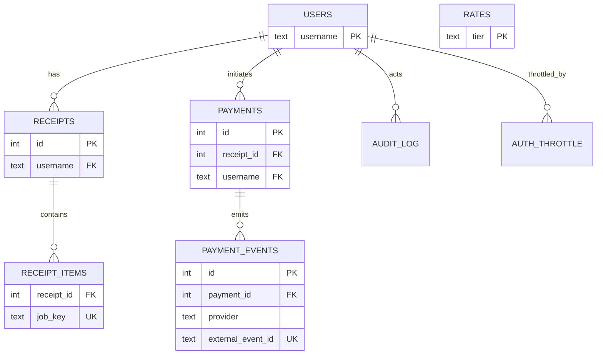

# Data Dictionary & Glossary

> Canonical reference for tables, columns, enums, keys, and invariants used by the HPC Billing Platform. Use this when writing reports, debugging, or evolving the schema.

---

## 0) Conventions

- Types are **PostgreSQL-ish** (actual SQLAlchemy models map 1:1).
- `PK` = primary key, `FK` = foreign key, `UQ` = unique.
- Timestamps are UTC unless otherwise noted.
- **KPI**: Key Performance Indicator, a quantifiable measure of performance over time for a specific objective.

---

## 1) Core entities

### 1.1 `users`

| Column                   | Type          | Notes                                  |
| ------------------------ | ------------- | -------------------------------------- |
| `username`               | `text`        | **PK**. Login identifier; minimal PII. |
| `password_hash`          | `text`        | Strong hash; never store plaintext.    |
| `role`                   | `text`        | Enum: `user` \| `admin`.               |
| `created_at`             | `timestamptz` | Default `now()`.                       |
| _(optional)_ `is_active` | `bool`        | If you enable admin-approval signups.  |

**Indexes**: `PK(username)`

---

### 1.2 `rates`

Current tiered pricing used at **the time of receipt creation**.

| Column       | Type            | Notes                                 |
| ------------ | --------------- | ------------------------------------- |
| `tier`       | `text`          | **PK**. Enum: `mu`, `gov`, `private`. |
| `cpu`        | `numeric(12,6)` | Price per CPU core-hour.              |
| `gpu`        | `numeric(12,6)` | Price per GPU-hour.                   |
| `mem`        | `numeric(12,6)` | Price per GB-hour.                    |
| `updated_at` | `timestamptz`   | For cache/ETag.                       |

**Indexes**: `PK(tier)`

> If/when you version rates by time, introduce `rates_versioned(tier, effective_at)` with `PK(tier,effective_at)`.

---

### 1.3 `receipts`

Header rows for priced bundles of jobs.

| Column            | Type            | Notes                                              |
| ----------------- | --------------- | -------------------------------------------------- |
| `id`              | `serial`        | **PK**.                                            |
| `username`        | `text`          | **FK** → `users.username`.                         |
| `start`           | `date`          | Usage window start (inclusive).                    |
| `end`             | `date`          | Usage window end (inclusive).                      |
| `total`           | `numeric(14,2)` | Sum of items’ `cost`.                              |
| `pricing_tier`    | `text`          | Snapshot of tier at creation (mu / gov / private). |
| `rate_cpu`        | `numeric(12,6)` | Snapshot: THB per CPU core-hour.                   |
| `rate_gpu`        | `numeric(12,6)` | Snapshot: THB per GPU-hour.                        |
| `rate_mem`        | `numeric(12,6)` | Snapshot: THB per GB-hour.                         |
| `rates_locked_at` | `timestamptz`   | When the above rates were snapped.                 |
| `status`          | `text`          | Enum: `pending` \| `paid`.                         |
| `method`          | `text`          | Free text (e.g., `online`, `manual`).              |
| `tx_ref`          | `text`          | Provider reference or note.                        |
| `paid_at`         | `timestamptz`   | Null until settled.                                |
| `created_at`      | `timestamptz`   | Default `now()`.                                   |

**Indexes**:

- `IDX_receipts_user_date(username, created_at desc)`
- `IDX_receipts_status_date(status, created_at desc)`

**Lifecycle**: `pending → paid` (no public void in current UI).

> **Rationale**: locking tier and per-unit rates at creation time guarantees historical immutability even if rates change later.

---

### 1.4 `receipt_items`

Line items (one row per job). This table **enforces no double billing**.

| Column           | Type            | Notes                                                                               |
| ---------------- | --------------- | ----------------------------------------------------------------------------------- |
| `receipt_id`     | `int`           | **FK** → `receipts.id`.                                                             |
| `job_key`        | `text`          | **UQ**. Canonical unique job identifier (cluster+job id+user+end time, or similar). |
| `job_id_display` | `text`          | Human-friendly job id (as shown in UI).                                             |
| `cpu_core_hours` | `numeric(14,4)` | Derived.                                                                            |
| `gpu_hours`      | `numeric(14,4)` | Derived.                                                                            |
| `mem_gb_hours`   | `numeric(14,4)` | Derived.                                                                            |
| `cost`           | `numeric(14,2)` | Priced using current `rates` at creation.                                           |

**Indexes**:

- `UQ(job_key)`
- `IDX_items_receipt(receipt_id)`

**Invariant**: Insert of any duplicate `job_key` fails → entire receipt creation transaction is rolled back.

---

### 1.5 `payments`

One per checkout attempt for a receipt.

| Column                | Type          | Notes                                                     |
| --------------------- | ------------- | --------------------------------------------------------- |
| `id`                  | `serial`      | **PK**.                                                   |
| `receipt_id`          | `int`         | **FK** → `receipts.id`.                                   |
| `username`            | `text`        | **FK** → `users.username` (owner).                        |
| `provider`            | `text`        | e.g., `dummy`, `stripe`, `omise`.                         |
| `status`              | `text`        | Enum: `pending` \| `succeeded` \| `failed` \| `canceled`. |
| `currency`            | `text(3)`     | ISO code, e.g., `THB`.                                    |
| `amount_cents`        | `int`         | Expected amount.                                          |
| `external_payment_id` | `text`        | Provider payment/intent id (unique per provider).         |
| `checkout_url`        | `text`        | Hosted checkout URL (if applicable).                      |
| `idempotency_key`     | `text`        | Optional; dedupe checkout initiations.                    |
| `created_at`          | `timestamptz` | Timestamp.                                                |
| `updated_at`          | `timestamptz` | Timestamp.                                                |

**Indexes**:

- `IDX_payments_receipt(receipt_id)`
- `IDX_payments_user(username)`

---

### 1.6 `payment_events`

All webhook calls for a payment. Powers idempotency.

| Column              | Type              | Notes                                                          |
| ------------------- | ----------------- | -------------------------------------------------------------- |
| `id`                | `serial`          | **PK**.                                                        |
| `payment_id`        | `int`             | **FK** → `payments.id`.                                        |
| `provider`          | `text`            | Redundant for convenience.                                     |
| `external_event_id` | `text`            | **UQ with provider**; the id the provider uses for this event. |
| `event_type`        | `text`            | e.g., `payment.succeeded`.                                     |
| `signature_ok`      | `bool`            | Set after verification.                                        |
| `raw_payload`       | `jsonb` or `text` | Consider storing redacted JSON.                                |
| `received_at`       | `timestamptz`     | Default `now()`.                                               |

**Indexes**:

- `UQ(provider, external_event_id)`
- `IDX_events_payment(payment_id)`

**Invariant**: Duplicate (provider, external_event_id) is ignored → webhook handler is **idempotent**.

---

### 1.7 `audit_log`

Tamper-evident, append-only log of sensitive actions.

| Column      | Type          | Notes                                                 |     |                     |
| ----------- | ------------- | ----------------------------------------------------- | --- | ------------------- |
| `id`        | `serial`      | **PK**.                                               |     |                     |
| `ts`        | `timestamptz` | Default `now()`.                                      |     |                     |
| `actor`     | `text`        | Username or `system`.                                 |     |                     |
| `action`    | `text`        | e.g., `login_success`, `receipt_create`, `mark_paid`. |     |                     |
| `target`    | `text`        | Optional (receipt id, username, etc.).                |     |                     |
| `status`    | `text`        | Optional result.                                      |     |                     |
| `extra`     | `jsonb`       | Arbitrary structured data.                            |     |                     |
| `prev_hash` | `text`        | Hash from previous row.                               |     |                     |
| `hash`      | `text`        | Hash(prev_hash                                        |     | canonicalized_row). |

**Indexes**: `IDX_audit_ts(ts desc)`

**Invariant**: a broken hash chain indicates tampering.

---

### 1.8 `auth_throttle`

Per `(username, ip)` counters to rate-limit logins.

| Column         | Type             | Notes                            |
| -------------- | ---------------- | -------------------------------- |
| `id`           | `serial`         | **PK**.                          |
| `username`     | `text`           | Throttled subject.               |
| `ip`           | `inet` or `text` | Source IP.                       |
| `window_start` | `timestamptz`    | Current rolling window.          |
| `fail_count`   | `int`            | Attempts in window.              |
| `locked_until` | `timestamptz`    | If set → deny logins until then. |

**Indexes**: `UQ(username, ip)` (or at least composite index)

---

## 2) Enums & controlled vocab

- `users.role` → `{ user, admin }`
- `receipts.status` → `{ pending, paid, void }` _(“void” reserved; not exposed in current UI)_.
- `payments.status` → `{ pending, succeeded, failed, canceled }`.
- `rates.tier` → `{ mu, gov, private }`
- `payments.currency` → ISO 4217 (e.g., `THB`)

> Enforce as DB CHECK constraints or via application validation.

---

## 3) Relationships (ER view)



---

## 4) Business rules enforced by the schema

1. **No double billing**: `receipt_items.job_key` is unique globally.
2. **Webhook idempotency**: `(provider, external_event_id)` is unique.
3. **Atomic transitions**: payment success **and** receipt paid must happen in the same DB transaction.
4. **Minimal PII**: foreign keys use `username`; no emails/phones stored.
5. **Audit integrity**: hash chain must be contiguous; store both `prev_hash` and `hash`.
6. **Pricing immutability**: `receipts.{pricing_tier, rate_cpu, rate_gpu, rate_mem, rates_locked_at}` snapshot ensures totals don’t change when `rates` do.

---

## 5) Reference queries (copy/paste)

**A. List user’s latest receipts**

```sql
SELECT id, start, "end", total, status, paid_at
FROM receipts
WHERE username = $1
ORDER BY id DESC
LIMIT 50;
```

**B. Show line items for a receipt**

```sql
SELECT job_id_display, cpu_core_hours, gpu_hours, mem_gb_hours, cost
FROM receipt_items
WHERE receipt_id = $1
ORDER BY job_id_display;
```

**C. Paid receipts with payment info**

```sql
SELECT r.id, r.username, r.total, r.paid_at, p.provider, p.status, p.external_payment_id
FROM receipts r
LEFT JOIN payments p ON p.receipt_id = r.id
WHERE r.status = 'paid'
ORDER BY r.paid_at DESC NULLS LAST, r.id DESC;
```

**D. Webhook replay detector (should return 0 rows in steady state)**

```sql
SELECT provider, external_event_id, COUNT(*)
FROM payment_events
GROUP BY provider, external_event_id
HAVING COUNT(*) > 1;
```

**E. Jobs already billed (for UI “grey out”)**

```sql
SELECT job_key FROM receipt_items WHERE job_key = ANY($1::text[]);
```

**F. Audit tail**

```sql
SELECT ts, actor, action, target, status
FROM audit_log
ORDER BY id DESC
LIMIT 200;
```

**G. Latest **succeeded** or **canceled** payment per receipt**

```sql
SELECT DISTINCT ON (receipt_id)
  receipt_id, id, status, provider, external_payment_id, updated_at
FROM payments
WHERE receipt_id = $1
ORDER BY receipt_id, updated_at DESC, id DESC;
```

**H. Receipts paid in the last 30 days:**

```sql
SELECT id, username, total, paid_at
FROM receipts
WHERE status = 'paid' AND paid_at >= now() - interval '30 days'
ORDER BY paid_at DESC;
```

---

## 6) Suggested views (optional)

```sql
CREATE VIEW paid_receipts_v AS
SELECT r.id, r.username, r.start, r."end", r.total, r.paid_at,
       COALESCE(p.provider,'') AS provider, COALESCE(p.external_payment_id,'') AS ext_id
FROM receipts r
LEFT JOIN payments p ON p.receipt_id = r.id
WHERE r.status = 'paid';
```

```sql
CREATE VIEW payment_health_v AS
SELECT p.id AS payment_id, r.id AS receipt_id, p.status, e.event_type,
       SUM(CASE WHEN e.signature_ok THEN 1 ELSE 0 END) AS signed_events,
       COUNT(*) AS total_events
FROM payments p
JOIN receipts r ON r.id = p.receipt_id
LEFT JOIN payment_events e ON e.payment_id = p.id
GROUP BY p.id, r.id, p.status, e.event_type;
```

---

## 7) Migrations & evolution hints

- **Add columns** with sane defaults; backfill in one migration, then enforce NOT NULL.
- **Rate versioning**: introduce `rates_versioned`, leave `rates` as a single-row-per-tier cache or view.
- **Multi-cluster**: add `cluster_id` to `receipt_items` (and into `job_key` derivation).
- **Soft delete**: prefer status columns over hard deletes in finance tables.

---

## 8) Table → module “where to look”

| Table                        | Primary modules that touch it                           |
| ---------------------------- | ------------------------------------------------------- |
| `users`                      | `users_db.py`, `auth.py`                                |
| `rates`                      | `rates_store.py`, `api.py`, `admin.py`                  |
| `receipts`, `receipt_items`  | `billing_store.py`, `billing.py`, `user.py`, `admin.py` |
| `payments`, `payment_events` | `payments_store.py`, `payments.py`, `registry.py`       |
| `audit_log`                  | `audit_store.py` (called from admin/user/payments/auth) |
| `auth_throttle`              | `security_throttle.py`, `auth.py`                       |

---

## 9) Data retention (defaults; align to policy)

- `receipts`, `receipt_items`, `payments`, `payment_events`: **5–10 years** (finance).
- `audit_log`: **1–2 years**.
- `auth_throttle`: **30–90 days** rolling.
- `rates`: indefinite (operational records).

(See **Book 11 — Privacy** for details.)

---

## 10) Validation checklist (for reports/ETL)

- Join cardinalities: `receipts 1..* receipt_items`, `payments 1..* payment_events`.
- Never sum `receipt_items.cost` across **multiple receipts** for a user without time bounds.
- Use `paid_receipts_v` for finance totals, not `pending`.
- Ensure currency is consistent if you ever add multi-currency.

---
