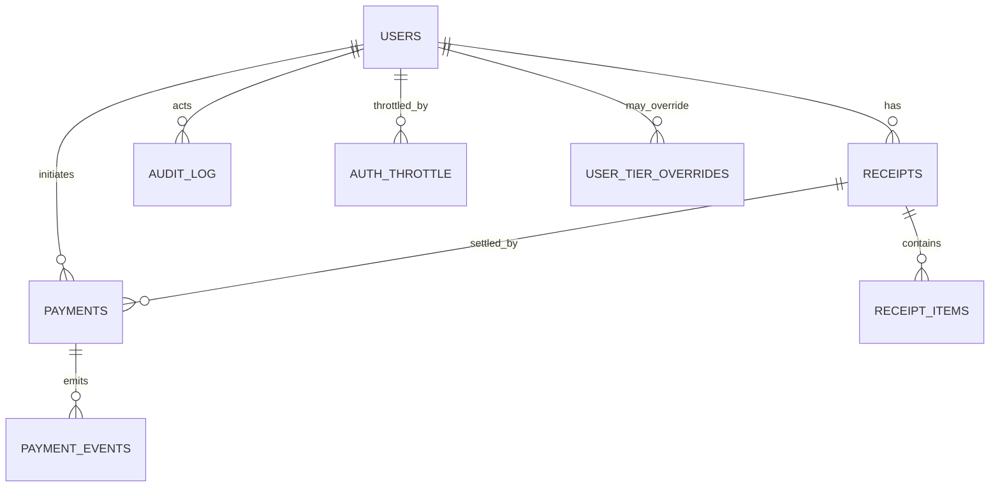

# Data Dictionary & Glossary

> Canonical reference for tables, columns, enums, keys, and invariants used by the **HPC Billing Platform**. Use this when writing reports, debugging, or evolving the schema.

---

## 0) Conventions

- DB: **PostgreSQL** (via SQLAlchemy).
- Types are **PostgreSQL-ish** and map 1:1 to our models where noted.
- `PK` = primary key, `FK` = foreign key, `UQ` = unique.
- Timestamps are UTC unless stated. Where we store a `timestamp` for a “date window”, treat it with **date-level semantics** (inclusive start/end).
- **KPI** = Key Performance Indicator.

---

## 1) Core entities

### 1.1 `users`

| Column          | Type          | Notes                                  |
| --------------- | ------------- | -------------------------------------- |
| `username`      | `text`        | **PK**. Login identifier; minimal PII. |
| `password_hash` | `text`        | Strong salted hash (Werkzeug/Argon2…). |
| `role`          | `text`        | Enum: `user` \| `admin`.               |
| `created_at`    | `timestamptz` | Default `now()`.                       |

**Indexes**: `PK(username)`
**Checks**: `role ∈ {user, admin}`

---

### 1.2 `rates`

Current tiered pricing used **at the time of receipt creation**.

| Column       | Type            | Notes                                 |
| ------------ | --------------- | ------------------------------------- |
| `tier`       | `text`          | **PK**. Enum: `mu`, `gov`, `private`. |
| `cpu`        | `numeric(12,6)` | Price per CPU core-hour.              |
| `gpu`        | `numeric(12,6)` | Price per GPU-hour.                   |
| `mem`        | `numeric(12,6)` | Price per GB-hour.                    |
| `updated_at` | `timestamptz`   | For cache/ETag.                       |

**Indexes**: `PK(tier)`

> When versioning rates by time, introduce `rates_versioned(tier, effective_at)` and keep `rates` as the latest snapshot.

---

### 1.3 `receipts`

Header rows for priced bundles of jobs (with pricing **snapshot**).

| Column            | Type            | Notes                                                                |
| ----------------- | --------------- | -------------------------------------------------------------------- |
| `id`              | `serial`        | **PK**.                                                              |
| `username`        | `text`          | **FK** → `users.username`.                                           |
| `start`           | `timestamp`     | Usage window start (**date semantics**, inclusive).                  |
| `end`             | `timestamp`     | Usage window end (**date semantics**, inclusive).                    |
| `total`           | `numeric(14,2)` | Sum of items’ `cost`.                                                |
| `pricing_tier`    | `text`          | Snapshot of tier at creation (`mu`/`gov`/`private`).                 |
| `rate_cpu`        | `numeric(12,6)` | Snapshot: THB per CPU core-hour.                                     |
| `rate_gpu`        | `numeric(12,6)` | Snapshot: THB per GPU-hour.                                          |
| `rate_mem`        | `numeric(12,6)` | Snapshot: THB per GB-hour.                                           |
| `rates_locked_at` | `timestamptz`   | When the above rates were snapped.                                   |
| `status`          | `text`          | Enum: `pending` \| `paid` \| `void` _(UI currently uses first two)_. |
| `method`          | `text`          | Free text (e.g., `online`, `manual`).                                |
| `tx_ref`          | `text`          | Provider reference or rationale.                                     |
| `paid_at`         | `timestamptz`   | Null until settled.                                                  |
| `created_at`      | `timestamptz`   | Default `now()`.                                                     |

**Indexes**

- `IDX_receipts_user_date (username, created_at DESC)`
- `IDX_receipts_status_date (status, created_at DESC)`

**Checks**

- `status ∈ {pending, paid, void}`
- `pricing_tier ∈ {mu, gov, private}`
- `total ≥ 0`

**Why a snapshot?** Guarantees historical reproducibility even if `rates` change later.

---

### 1.4 `receipt_items`

Line items (one row per **parent job**). Enforces **no double billing**.

| Column           | Type            | Notes                                                              |
| ---------------- | --------------- | ------------------------------------------------------------------ |
| `receipt_id`     | `int`           | **FK** → `receipts.id`.                                            |
| `job_key`        | `text`          | **UQ**. Canonical unique job identifier (parent key, not step id). |
| `job_id_display` | `text`          | Human-friendly JobID for UI.                                       |
| `cpu_core_hours` | `numeric(14,4)` | Derived.                                                           |
| `gpu_hours`      | `numeric(14,4)` | Derived.                                                           |
| `mem_gb_hours`   | `numeric(14,4)` | Derived.                                                           |
| `cost`           | `numeric(14,2)` | Priced via **receipt snapshot** (`rate_*`).                        |

**Keys/Indexes**

- `PK(receipt_id, job_key)` (locality)
- `UQ(job_key)` (global de-dup)
- `IDX_items_receipt (receipt_id)`

**Invariant**: Any duplicate `job_key` → insert error → the whole receipt creation tx **rolls back**.

---

### 1.5 `payments`

One per checkout attempt for a receipt.

| Column                | Type          | Notes                                                                 |
| --------------------- | ------------- | --------------------------------------------------------------------- |
| `id`                  | `serial`      | **PK**.                                                               |
| `provider`            | `text`        | e.g., `dummy`, `stripe`, `omise`.                                     |
| `receipt_id`          | `int`         | **FK** → `receipts.id` (CASCADE on delete).                           |
| `username`            | `text`        | **FK** → `users.username`.                                            |
| `status`              | `text`        | Enum: `pending` \| `succeeded` \| `failed` \| `canceled`.             |
| `currency`            | `text(3)`     | ISO code (e.g., `THB`).                                               |
| `amount_cents`        | `int`         | Expected amount (integer cents).                                      |
| `external_payment_id` | `text`        | Provider payment/intent id. **UQ** per DB row (provider-side unique). |
| `checkout_url`        | `text`        | Hosted checkout URL (if applicable).                                  |
| `idempotency_key`     | `text`        | Optional; dedupe checkout initiations (partial UQ recommended).       |
| `created_at`          | `timestamptz` | Timestamp.                                                            |
| `updated_at`          | `timestamptz` | Timestamp.                                                            |

**Indexes**

- `IDX_payments_receipt (receipt_id)`
- `IDX_payments_status (status)`
- `UQ(external_payment_id)`
- _(Recommended)_ partial UQ: `(provider, idempotency_key) WHERE idempotency_key IS NOT NULL`

**Checks**

- `amount_cents ≥ 0`
- `status ∈ {pending, succeeded, failed, canceled}`

---

### 1.6 `payment_events`

All webhook calls for a payment. Powers idempotency.

| Column              | Type          | Notes                                                                  |
| ------------------- | ------------- | ---------------------------------------------------------------------- |
| `id`                | `serial`      | **PK**.                                                                |
| `provider`          | `text`        | Stored redundantly for convenience.                                    |
| `external_event_id` | `text`        | **UQ with `provider`**; provider’s event id (replay guard).            |
| `payment_id`        | `int`         | **FK** → `payments.id` (nullable for early events / lookups).          |
| `event_type`        | `text`        | e.g., `payment.succeeded`.                                             |
| `raw`               | `text`        | Raw payload (redacted if needed).                                      |
| `signature_ok`      | `boolean*`    | Signature verdict. _Stored as `int` 0/1 with a DB CHECK in our model._ |
| `received_at`       | `timestamptz` | Default `now()`.                                                       |

**Indexes**

- `UQ(provider, external_event_id)`
- `IDX_events_payment (payment_id)`

**Invariant**: Duplicate `(provider, external_event_id)` is a safe no-op; webhook handler is **idempotent**.

---

### 1.7 `audit_log`

Tamper-evident, append-only log of sensitive actions.

| Column      | Type          | Notes                                                         |     |                                  |
| ----------- | ------------- | ------------------------------------------------------------- | --- | -------------------------------- |
| `id`        | `serial`      | **PK**.                                                       |     |                                  |
| `ts`        | `timestamptz` | Default `now()`.                                              |     |                                  |
| `actor`     | `text`        | Username or `system`.                                         |     |                                  |
| `ip`        | `text`        | Remote IP (as logged).                                        |     |                                  |
| `ua`        | `text`        | User-Agent (optional).                                        |     |                                  |
| `method`    | `text`        | HTTP verb (optional).                                         |     |                                  |
| `path`      | `text`        | Request path (optional).                                      |     |                                  |
| `action`    | `text`        | e.g., `login_success`, `receipt_create`, `payment_finalized`. |     |                                  |
| `target`    | `text`        | Optional (receipt id, username…).                             |     |                                  |
| `status`    | `int`         | Optional HTTP/status code.                                    |     |                                  |
| `extra`     | `jsonb`       | Arbitrary structured data.                                    |     |                                  |
| `prev_hash` | `text`        | Previous record’s hash.                                       |     |                                  |
| `hash`      | `text`        | \`H(prev_hash                                                 |     | canonical_row_without_hashes)\`. |

**Indexes**: `IDX_audit_ts (ts DESC)`
**Invariant**: a broken hash chain indicates tampering.

---

### 1.8 `auth_throttle`

Per `(username, ip)` counters to rate-limit logins.

| Column         | Type          | Notes                            |
| -------------- | ------------- | -------------------------------- |
| `id`           | `serial`      | **PK**.                          |
| `username`     | `text`        | Throttled subject.               |
| `ip`           | `text`        | Source IP (stringified).         |
| `window_start` | `timestamptz` | Current rolling window.          |
| `fail_count`   | `int`         | Attempts in window.              |
| `locked_until` | `timestamptz` | If set → deny logins until then. |

**Indexes**: `UQ(username, ip)`

---

### 1.9 `user_tier_overrides`

Per-user **effective tier** override (admin-managed).

| Column       | Type          | Notes                                  |
| ------------ | ------------- | -------------------------------------- |
| `username`   | `text`        | **PK**; user this override applies to. |
| `tier`       | `text`        | Enum: `mu` \| `gov` \| `private`.      |
| `updated_at` | `timestamptz` | Last change timestamp.                 |

**Checks**: `tier ∈ {mu, gov, private}`
**Behavior**: If admin selects the **same** tier as the natural classifier, the override row is **removed**. All set/clear actions are **audited**.

---

## 2) Enums & controlled vocab

- `users.role` → `{ user, admin }`
- `rates.tier` → `{ mu, gov, private }`
- `receipts.status` → `{ pending, paid, void }` _(UI exposes `pending/paid` today)_
- `payments.status` → `{ pending, succeeded, failed, canceled }`
- `payments.currency` → **ISO-4217** (e.g., `THB`)

> Enforce via DB CHECKs or application validation (we do both where practical).

---

## 3) Relationships (ER sketch)



Key uniqueness:

- `receipt_items.job_key` is **globally unique**.
- `(payment_events.provider, payment_events.external_event_id)` is **unique**.

---

## 4) Business rules enforced by the schema

1. **No double billing**: `receipt_items.job_key` is globally unique.
2. **Webhook idempotency**: `(provider, external_event_id)` unique.
3. **Atomic settle**: payment success **and** receipt paid happen in a single DB transaction.
4. **Minimal PII**: we store usernames; no emails/phones by default.
5. **Audit integrity**: `prev_hash` + `hash` must form a contiguous chain.
6. **Pricing immutability**: receipts carry `pricing_tier` and `rate_*` snapshot (`rates_locked_at`).

---

## 5) Reference queries (copy/paste)

**A. Latest receipts for a user**

```sql
SELECT id, start, "end", total, status, paid_at
FROM receipts
WHERE username = $1
ORDER BY id DESC
LIMIT 50;
```

**B. Line items for a receipt**

```sql
SELECT job_id_display, cpu_core_hours, gpu_hours, mem_gb_hours, cost
FROM receipt_items
WHERE receipt_id = $1
ORDER BY job_id_display;
```

**C. Paid receipts with most recent payment**

```sql
SELECT r.id, r.username, r.total, r.paid_at,
       p.provider, p.status, p.external_payment_id
FROM receipts r
LEFT JOIN LATERAL (
  SELECT provider, status, external_payment_id
  FROM payments p
  WHERE p.receipt_id = r.id
  ORDER BY p.updated_at DESC, p.id DESC
  LIMIT 1
) p ON TRUE
WHERE r.status = 'paid'
ORDER BY r.paid_at DESC NULLS LAST, r.id DESC;
```

**D. Webhook replay detector (should be empty)**

```sql
SELECT provider, external_event_id, COUNT(*)
FROM payment_events
GROUP BY provider, external_event_id
HAVING COUNT(*) > 1;
```

**E. Jobs already billed (for UI “grey out”)**

```sql
SELECT job_key FROM receipt_items WHERE job_key = ANY($1::text[]);
```

**F. Audit tail**

```sql
SELECT ts, actor, action, target, status
FROM audit_log
ORDER BY id DESC
LIMIT 200;
```

**G. Latest succeeded/failed/canceled payment per receipt**

```sql
SELECT DISTINCT ON (receipt_id)
  receipt_id, id, status, provider, external_payment_id, updated_at
FROM payments
WHERE receipt_id = $1
ORDER BY receipt_id, updated_at DESC, id DESC;
```

**H. Receipts paid in the last 30 days**

```sql
SELECT id, username, total, paid_at
FROM receipts
WHERE status = 'paid' AND paid_at >= now() - interval '30 days'
ORDER BY paid_at DESC;
```

---

## 6) Suggested views (optional)

```sql
CREATE VIEW paid_receipts_v AS
SELECT r.id, r.username, r.start, r."end", r.total, r.paid_at,
       COALESCE(p.provider,'') AS provider,
       COALESCE(p.external_payment_id,'') AS ext_id
FROM receipts r
LEFT JOIN LATERAL (
  SELECT provider, external_payment_id
  FROM payments
  WHERE receipt_id = r.id
  ORDER BY updated_at DESC, id DESC
  LIMIT 1
) p ON TRUE
WHERE r.status = 'paid';
```

```sql
CREATE VIEW payment_health_v AS
SELECT p.id AS payment_id, r.id AS receipt_id, p.status,
       SUM(CASE WHEN e.signature_ok THEN 1 ELSE 0 END) AS signed_events,
       COUNT(*) AS total_events
FROM payments p
JOIN receipts r ON r.id = p.receipt_id
LEFT JOIN payment_events e ON e.payment_id = p.id
GROUP BY p.id, r.id, p.status;
```

---

## 7) Migrations & evolution hints

- Add columns with defaults; backfill; then enforce `NOT NULL`.
- **Rates versioning**: add `rates_versioned` and keep `rates` as latest.
- **Multi-cluster**: add `cluster_id` to `receipt_items` (and into `job_key` derivation).
- **Soft delete**: prefer status fields over hard deletes in finance tables.
- **Idempotency**: add partial UQ on `(provider, idempotency_key)`.

---

## 8) Table → module map

| Table                        | Main modules that touch it                               |
| ---------------------------- | -------------------------------------------------------- |
| `users`                      | `users_db.py`, `auth.py`                                 |
| `rates`                      | `rates_store.py`, `api.py`, `admin.py`                   |
| `receipts`, `receipt_items`  | `billing_store.py`, `billing.py`, `user.py`, `admin.py`  |
| `payments`, `payment_events` | `payments_store.py`, `payments.py`, `registry.py`        |
| `audit_log`                  | `audit_store.py` (called from auth/admin/user/payments)  |
| `auth_throttle`              | `security_throttle.py`, `auth.py`                        |
| `user_tier_overrides`        | `tiers_store.py`, `admin.py` (tiers page + save handler) |

---

## 9) Data retention (defaults; align with policy)

- `receipts`, `receipt_items`, `payments`, `payment_events`: **5–10 years** (finance).
- `audit_log`: **1–2 years**.
- `auth_throttle`: **30–90 days** rolling.
- `rates`: indefinite (operational record).
- `user_tier_overrides`: keep changes in **audit_log**; the table itself is current state.

---

## 10) Validation checklist (for reports/ETL)

- Join cardinalities: `receipts 1..* receipt_items`, `payments 1..* payment_events`.
- Never sum `receipt_items.cost` across multiple receipts without a time bound.
- Use **paid receipts** for finance totals; don’t mix `pending`.
- Ensure `currency` consistency (single-currency today).
- Respect **snapshot**: recomputing costs from raw usage won’t match historical receipts after rate changes.

---

## 11) Files & caches (non-DB, Copilot)

- **Copilot index dir** (`COPILOT_INDEX_DIR`, default `./instance/copilot_index`):

  - `vectors.npy` (float32, L2-normalized)
  - `meta.json` (chunk metadata)
  - `signature.txt` (hash of docs tree; prevents unnecessary rebuilds)

- **Docs dir** (`COPILOT_DOCS_DIR`, default `./docs`): Markdown sources indexed for retrieval.

> These are runtime artifacts, not part of the database.

---

## 12) Glossary

- **JobKey** — Canonicalized parent JobID used for de-duplication (steps collapsed). Globally unique across all receipts.
- **Tier** — Pricing category: `mu`, `gov`, `private`.
- **Tier override** — Admin-set per-user tier that supersedes the natural classifier; choosing the same tier as natural **clears** the override.
- **Pricing snapshot** — Copy of tier and per-unit rates stored on a receipt at creation (`pricing_tier`, `rate_*`, `rates_locked_at`).
- **Parent vs Step** — Slurm parents (jobs) can have step rows; we roll steps up to the parent when computing usage.
- **ETag** — HTTP cache validator for `GET /formula` responses.
- **Payment event** — A single provider webhook call; deduped by `(provider, external_event_id)`.
- **Copilot** — In-app docs assistant backed by **Ollama**; answers strictly from indexed Markdown; rate-limited per IP.

---
