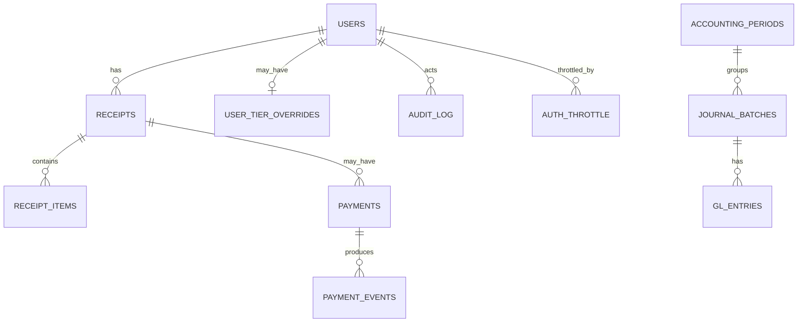

# Data Dictionary & Glossary

> Canonical reference for tables, columns, enums, keys, and invariants used by the **HPC Billing Platform**.

---

## 0) Conventions

* DB: **PostgreSQL** (SQLAlchemy ORM).
* Types are PostgreSQL‑ish; timestamps are **UTC** unless stated.
* `PK` = primary key, `FK` = foreign key, `UQ` = unique.
* "Date window" columns stored as timestamps are used with **date‑level semantics** (inclusive start/end).
* Monetary values use **DECIMAL/NUMERIC** in DB; UI rounds to 2 dp.

---

## 1) Core entities

### 1.1 `users`

| Column          | Type          | Notes                                  |
| --------------- | ------------- | -------------------------------------- |
| `username`      | `text`        | **PK**. Login identifier; minimal PII. |
| `password_hash` | `text`        | Strong salted hash.                    |
| `role`          | `text`        | Enum: `user` | `admin`.                |
| `created_at`    | `timestamptz` | Default `now()`.                       |

**Indexes**: `PK(username)`  •  **Checks**: `role ∈ {user, admin}`

---

### 1.2 `rates`

Current tiered pricing; **receipts snapshot** rates at creation.

| Column       | Type          | Notes                                 |
| ------------ | ------------- | ------------------------------------- |
| `tier`       | `text`        | **PK**. Enum: `mu`, `gov`, `private`. |
| `cpu`        | `numeric`     | Price per CPU core‑hour.              |
| `gpu`        | `numeric`     | Price per GPU‑hour.                   |
| `mem`        | `numeric`     | Price per GB‑hour.                    |
| `updated_at` | `timestamptz` | For cache/ETag.                       |

**Indexes**: `PK(tier)`

---

### 1.3 `user_tier_overrides`

Per‑user effective tier override (admin‑managed).

| Column       | Type          | Notes                           |
| ------------ | ------------- | ------------------------------- |
| `username`   | `text`        | **PK**; applies to this user.   |
| `tier`       | `text`        | Enum: `mu` | `gov` | `private`. |
| `updated_at` | `timestamptz` | Last change timestamp.          |

**Checks**: `tier ∈ {mu, gov, private}`  •  **Behavior**: Selecting the natural tier **removes** the override. Actions are **audited**.

---

### 1.4 `receipts`

Header rows for priced bundles of jobs; contains a **pricing & tax snapshot**.

| Column            | Type          | Notes                                                                     |
| ----------------- | ------------- | ------------------------------------------------------------------------- |
| `id`              | `serial`      | **PK**.                                                                   |
| `username`        | `text`        | **FK** → `users.username`.                                                |
| `start`           | `timestamp`   | Usage window start (**date semantics**, inclusive).                       |
| `end`             | `timestamp`   | Usage window end (**date semantics**, inclusive).                         |
| `currency`        | `text(3)`     | ISO‑4217 (e.g., `THB`).                                                   |
| `subtotal`        | `numeric`     | Sum of line item costs before tax.                                        |
| `tax_label`       | `text`        | e.g., `VAT`.                                                              |
| `tax_rate`        | `numeric`     | Percentage value (e.g., `7` = 7%).                                        |
| `tax_amount`      | `numeric`     | Computed.                                                                 |
| `tax_inclusive`   | `boolean`     | If true, `total = subtotal` and `tax_amount` is derived out of the total. |
| `total`           | `numeric`     | Grand total.                                                              |
| `status`          | `text`        | Enum: `pending` | `paid` | `void` *(UI uses first two)*.                  |
| `pricing_tier`    | `text`        | Snapshot tier: `mu` | `gov` | `private`.                                  |
| `rate_cpu`        | `numeric`     | Snapshot THB per CPU core‑hour.                                           |
| `rate_gpu`        | `numeric`     | Snapshot THB per GPU‑hour.                                                |
| `rate_mem`        | `numeric`     | Snapshot THB per GB‑hour.                                                 |
| `rates_locked_at` | `timestamptz` | When snapshot was taken.                                                  |
| `invoice_no`      | `text`        | Optional human invoice no. (unique if used).                              |
| `approved_by`     | `text`        | Optional approver.                                                        |
| `approved_at`     | `timestamptz` | Optional approval timestamp.                                              |
| `method`          | `text`        | Free text (e.g., `manual`).                                               |
| `tx_ref`          | `text`        | Reference / rationale.                                                    |
| `paid_at`         | `timestamptz` | Null until settled.                                                       |
| `created_at`      | `timestamptz` | Default `now()`.                                                          |

**Indexes**: `(username, created_at DESC)` • `(status, created_at DESC)`
**Checks**: `status ∈ {pending, paid, void}`, `pricing_tier ∈ {mu, gov, private}`, `total ≥ 0`

---

### 1.5 `receipt_items`

One row per **parent job** (steps rolled up). Enforces **no double billing**.

| Column           | Type      | Notes                                                          |
| ---------------- | --------- | -------------------------------------------------------------- |
| `receipt_id`     | `int`     | **FK** → `receipts.id`.                                        |
| `job_key`        | `text`    | **UQ**. Canonical unique job identifier (parent, not step id). |
| `job_id_display` | `text`    | Human‑friendly JobID.                                          |
| `cpu_core_hours` | `numeric` | Derived.                                                       |
| `gpu_hours`      | `numeric` | Derived.                                                       |
| `mem_gb_hours`   | `numeric` | Derived.                                                       |
| `cost`           | `numeric` | Priced via **receipt snapshot** (`rate_*`).                    |

**Keys/Indexes**: `PK(receipt_id, job_key)` • `UQ(job_key)` • `IDX(receipt_id)`
**Invariant**: Duplicate `job_key` causes receipt creation to **fail atomically**.

---

### 1.6 *(optional, disabled by default)* `payments`

Present for future online‑payment integrations; not used in the default stack.

| Column                | Type          | Notes                                                  |
| --------------------- | ------------- | ------------------------------------------------------ |
| `id`                  | `serial`      | **PK**.                                                |
| `provider`            | `text`        | e.g., `dummy`, `omise`.                                |
| `receipt_id`          | `int`         | **FK** → `receipts.id`.                                |
| `username`            | `text`        | **FK** → `users.username`.                             |
| `status`              | `text`        | Enum: `pending` | `succeeded` | `failed` | `canceled`. |
| `currency`            | `text(3)`     | ISO code.                                              |
| `amount_cents`        | `int`         | Integer cents.                                         |
| `external_payment_id` | `text`        | Provider payment id.                                   |
| `created_at`          | `timestamptz` | Timestamp.                                             |
| `updated_at`          | `timestamptz` | Timestamp.                                             |

**Indexes**: `(receipt_id)` • `(status)` • `UQ(external_payment_id)`
**Checks**: `amount_cents ≥ 0`

---

### 1.7 *(optional)* `payment_events`

Webhook calls for a payment; powers idempotency.

| Column              | Type          | Notes                                        |
| ------------------- | ------------- | -------------------------------------------- |
| `id`                | `serial`      | **PK**.                                      |
| `provider`          | `text`        | Redundant for convenience.                   |
| `external_event_id` | `text`        | **UQ with provider**; provider’s event id.   |
| `payment_id`        | `int`         | **FK** → `payments.id` (nullable initially). |
| `event_type`        | `text`        | e.g., `payment.succeeded`.                   |
| `signature_ok`      | `boolean`     | Signature verdict.                           |
| `raw`               | `jsonb`       | Raw payload (redacted if needed).            |
| `received_at`       | `timestamptz` | Default `now()`.                             |

**Indexes**: `UQ(provider, external_event_id)` • `(payment_id)`

---

### 1.8 `audit_log`

Tamper‑evident, append‑only log of sensitive actions; **HMAC‑chained**.

| Column           | Type          | Notes                                    |   |                    |
| ---------------- | ------------- | ---------------------------------------- | - | ------------------ |
| `id`             | `serial`      | **PK**.                                  |   |                    |
| `ts`             | `timestamptz` | Default `now()`.                         |   |                    |
| `actor`          | `text`        | Username or `system`.                    |   |                    |
| `action`         | `text`        | e.g., `login_success`, `receipt_create`. |   |                    |
| `status`         | `text`        | Optional status text/code.               |   |                    |
| `target_type`    | `text`        | e.g., `receipt`, `rates`, `user`.        |   |                    |
| `target_id`      | `text`        | ID in the target domain.                 |   |                    |
| `prev_hash`      | `text`        | Previous record’s hash.                  |   |                    |
| `hash`           | `text`        | HMAC(prev_hash                           |   | canonical_fields). |
| `key_id`         | `text`        | Which key signed this record.            |   |                    |
| `ip_fingerprint` | `text`        | May be anonymized (see env flags).       |   |                    |
| `ua_fingerprint` | `text`        | May be anonymized or omitted.            |   |                    |
| `request_id`     | `text`        | Correlates to request logs.              |   |                    |
| `extra`          | `jsonb`       | Whitelisted structured extras.           |   |                    |

**Indexes**: `(ts DESC)`  •  **Verification**: `/admin/audit.verify.json`

---

### 1.9 `auth_throttle`

Per `(username, ip)` counters to rate‑limit logins.

| Column         | Type          | Notes                   |
| -------------- | ------------- | ----------------------- |
| `username`     | `text`        | **PK part**.            |
| `ip`           | `text`        | **PK part**.            |
| `window_start` | `timestamptz` | Current rolling window. |
| `fail_count`   | `int`         | Attempts in window.     |
| `locked_until` | `timestamptz` | If set → deny logins.   |

**Keys**: `PK(username, ip)`

---

### 1.10 GL tables

| Table                | Key columns / purpose                                                        |       |         |       |                       |
| -------------------- | ---------------------------------------------------------------------------- | ----- | ------- | ----- | --------------------- |
| `accounting_periods` | `(period_year, period_month, status)` with `closed_at`, `closed_by`.         |       |         |       |                       |
| `journal_batches`    | `id`, `source`, `source_ref`, `kind(accrual                                  | issue | payment | close | reopen)`, `period_*`. |
| `gl_entries`         | `id`, `batch_id(FK)`, `date`, `ref`, `memo`, `account_*`, `debit`, `credit`. |       |         |       |                       |

---

## 2) Enums & controlled vocab

* `users.role` → `{ user, admin }`
* `rates.tier` → `{ mu, gov, private }`
* `receipts.status` → `{ pending, paid, void }`
* `payments.status` *(optional)* → `{ pending, succeeded, failed, canceled }`
* `payments.currency` → ISO‑4217 (e.g., `THB`)

---

## 3) Relationships (ER sketch)



**Key uniqueness**

* `receipt_items.job_key` is **globally unique**.
* `(payment_events.provider, payment_events.external_event_id)` is **unique**.

---

## 4) Business rules (schema‑enforced or invariant)

1. **No double billing**: `receipt_items.job_key` is globally unique.
2. **Pricing immutability**: receipts carry `pricing_tier` and `rate_*` snapshot.
3. **Audit integrity**: `prev_hash` + `hash` form a contiguous HMAC chain.
4. **Auth throttle**: accounts lock after too many failures in a window.
5. **Period control**: posted GL entries are immutable; close/reopen toggles period state via batches.
6. **Optional payments**: webhook idempotency via `(provider, external_event_id)` if enabled.

---

## 5) Reference queries

**A. Latest receipts for a user**

```sql
SELECT id, start, "end", total, status, paid_at
FROM receipts
WHERE username = $1
ORDER BY id DESC
LIMIT 50;
```

**B. Line items for a receipt**

```sql
SELECT job_id_display, cpu_core_hours, gpu_hours, mem_gb_hours, cost
FROM receipt_items
WHERE receipt_id = $1
ORDER BY job_id_display;
```

**C. Audit tail**

```sql
SELECT ts, actor, action, target_type, target_id, status
FROM audit_log
ORDER BY id DESC
LIMIT 200;
```

**D. Jobs already billed (for UI “grey out”)**

```sql
SELECT job_key FROM receipt_items WHERE job_key = ANY($1::text[]);
```

---

## 6) Suggested views (optional)

```sql
CREATE VIEW paid_receipts_v AS
SELECT r.id, r.username, r.start, r."end", r.total, r.paid_at
FROM receipts r
WHERE r.status = 'paid';
```

---

## 7) Migration & evolution hints

* Add columns with defaults; backfill; then enforce `NOT NULL`.
* **Rates versioning**: add `rates_versioned` and keep `rates` as latest.
* **Multi‑cluster**: namespace `job_key` and index appropriately.
* Prefer status fields over hard deletes in finance tables.

---

## 8) Table → module map

| Table                                                 | Main modules that touch it                              |
| ----------------------------------------------------- | ------------------------------------------------------- |
| `users`                                               | `users_db.py`, `auth.py`                                |
| `rates`                                               | `rates_store.py`, `api.py`, `admin.py`                  |
| `user_tier_overrides`                                 | `tiers_store.py`, `admin.py`                            |
| `receipts`, `receipt_items`                           | `billing_store.py`, `billing.py`, `user.py`, `admin.py` |
| `audit_log`                                           | `audit_store.py` (called from auth/admin/user)          |
| `auth_throttle`                                       | `security_throttle.py`, `auth.py`                       |
| `accounting_periods`, `journal_batches`, `gl_entries` | `gl.py`, `gl_posting.py`, `accounting.py`               |
| *(optional)* `payments`, `payment_events`             | `payments_*.py` (if enabled)                            |

---

## 9) Data retention (defaults; align with policy)

* `receipts`, `receipt_items`: **5–10 years** (finance).
* `audit_log`: **1–2 years**.
* `auth_throttle`: **30–90 days** rolling.
* `rates`: indefinite (operational record).
* `user_tier_overrides`: managed via audit history.
* *(Optional)* `payments`, `payment_events`: follow finance retention policy.

---

## 10) Validation checklist (for reports/ETL)

* Join cardinalities: `receipts 1..* receipt_items`.
* Use **paid receipts** for finance totals; don’t mix `pending`.
* Respect **snapshot**: recomputing from raw usage won’t match historical receipts after rate changes.
* Currency is single‑currency today; keep ISO‑4217 in exports.

---

## 11) Files & caches (non‑DB, Copilot)

* **Copilot index dir** (`COPILOT_INDEX_DIR`): vectors and metadata cache.
* **Docs dir** (`COPILOT_DOCS_DIR`): Markdown sources indexed for retrieval.

---

## 12) Glossary (terms)

* **JobKey** — Canonicalized parent JobID used for de‑duplication (steps collapsed). Globally unique across all receipts.
* **Effective tier** — Resolved pricing tier (`mu|gov|private`) after overrides.
* **Pricing snapshot** — Copy of tier and per‑unit rates stored on a receipt at creation (`pricing_tier`, `rate_*`, `rates_locked_at`).
* **Parent vs Step** — Slurm parents (jobs) can have step rows; steps roll up to the parent for billing.
* **ETag** — HTTP cache validator used by `GET /formula` for conditional requests.
* **Derived Journal** — On‑the‑fly view from receipts for any window (preview/not posted).
* **Posted GL** — Immutable entries written by posting batches (authoritative ledger).
* **Formal GL ZIP** — Export bundle with CSVs + manifest + HMAC signature.
* **Audit HMAC chain** — Hash chain `{prev_hash, hash, key_id}` proving log integrity.
* **Contract Asset** — Unbilled A/R used in over‑time revenue recognition.
* **VAT Output** — Liability for VAT on tax invoice issuance.
* **Copilot** — In‑app docs assistant backed by **Ollama** (optional; rate‑limited).
