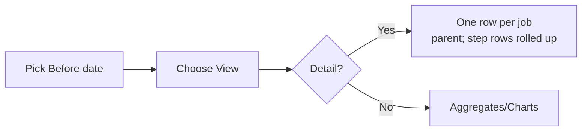
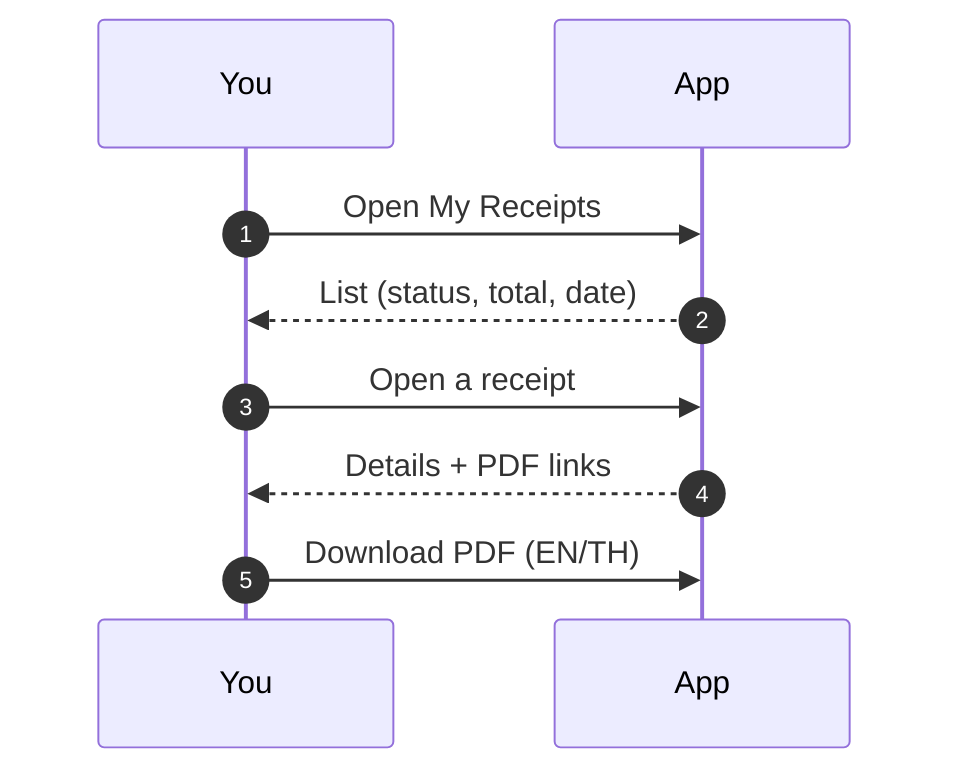

# User Guide

This guide is for **end users** (role=`user`). It covers signing in, viewing your usage, downloading CSVs, and accessing your invoices (receipts). Admin‑only features (rate editing, GL exports, month creation) are documented in the Admin Guide.

---

## 1) Sign in & language

1. Visit the app URL (ask your admin for the link).
2. Enter **username** and **password**.
3. Switch language at any time: **Menu → Language → English/ไทย** (persists in a cookie).
   PDFs are available in **EN** and **TH** layouts.

> If you see “too many attempts,” wait for the lockout window to expire and try again (security throttle).

---

## 2) Navigation

- **My Usage** – inspect jobs and costs, change view and period, export CSV.
- **My Receipts** – list of invoices generated for you; open details or download PDFs.
- **Help** – in‑app tips; optional **Copilot** chat bubble (if enabled by your admin).

---

## 3) My Usage

The **My Usage** page shows your Slurm jobs priced by the current rates. Use the controls at the top:

- **Before** (date): include all jobs **up to** this date (default: today).
- **View**:

  - **Detail** – one row per **parent job** (steps are rolled up).
  - **Aggregate** – grouped totals (e.g., by node/user/month).
  - **Billed** – only jobs already included in receipts.
  - **Trend** – daily/monthly charts.



### 3.1 Columns (Detail view)

- **Job** – canonical job ID (arrays/steps compacted to the parent ID).
- **Walltime** – elapsed time.
- **CPU core‑hours** – see _How costs are computed_ below.
- **GPU hours** – allocation‑based.
- **Mem GB‑hours** – step‑usage when available; else allocation.
- **Cost** – `CPU*rate_cpu + GPU*rate_gpu + Mem*rate_mem` at **current** rates (the **receipt** will lock rates at creation time).

### 3.2 Export CSV

Click **Export CSV** or visit:

```
/me.csv?before=YYYY-MM-DD
```

**Included columns**: job id (display), walltime, CPU core‑hours, GPU hours, Mem GB‑hours, cost, node, state, start/end times, and other useful Slurm fields.

> Tip: Set a past **Before** date to export a month’s worth of usage.

---

## 4) My Receipts (Invoices)

This page lists invoices created for you by an administrator during monthly billing.

- **Statuses**: `Pending` (not yet paid) or `Paid`.
- Click an invoice to view details (header + line items).
- Download **PDF**: English (`.pdf`) or Thai (`.th.pdf`).
- CSV/GL exports are maintained by admins; you do not need to submit anything.



> If a job you expect is **missing** from a receipt, check **My Usage** for that period first. Jobs appear on receipts only when an admin runs the monthly billing for that window.

---

## 5) How costs are computed (summary)

- **Parent vs Steps**: All step rows like `12345.batch` roll up to the parent job `12345`.
- **CPU core‑hours**: prefer **step CPU used** (sum of step `TotalCPU` hours). If absent, fall back to parent **TotalCPU** hours → **CPUTimeRAW** hours → **AllocCPUs × Elapsed**.
- **GPU hours**: **Alloc GPUs × Elapsed**.
- **Mem GB‑hours**: prefer summed **step AveRSS × step elapsed**; fall back to **allocated mem × elapsed**.
- **Rates**: set by your **effective tier** (e.g., MU/Gov/Private). Actual invoices **copy** the per‑unit rates at creation time so future changes don’t back‑edit totals.

---

## 6) Troubleshooting & FAQs

**No jobs showing?**

- Check the **Before** date (jobs after that date are excluded).
- Ask your admin if your cluster’s usage import ran for that period (the app can still open without Slurm).

**My CSV totals don’t match my invoice total. Why?**

- CSV uses **current** rates; invoices lock rates at creation time.
- CSV may include **unbilled** jobs; invoices include only the jobs chosen for that receipt.

**Can I create or edit my own invoice?**

- No. Admins create invoices in monthly batches. You can always view/download them.

**Why does my job show 0 GPU hours?**

- GPU hours are allocation‑based; if none were allocated, the value is 0 even if the job ran on a GPU‑capable node without requesting GPUs.

**Thai text not rendering in PDF?**

- Tell your admin; the server image must include Thai fonts (it does in the standard build).

---

## 7) Privacy

- The app stores **only your username** for core flows (no email/address by default).
- PDFs contain your username and job metadata required for billing.

---

## 8) Optional: Copilot (in‑app help)

If your admin enabled the Copilot bubble:

- Click the bubble (bottom‑right).
- Ask questions like “How do I read my invoice?” or “What does CPU core‑hours mean?”
- The assistant uses these docs as context and respects a per‑minute rate limit.

---

## 9) Supported browsers

Recent versions of Chrome, Firefox, and Edge are supported. If something looks off, try a hard refresh (Ctrl/Cmd+Shift+R) or a different browser.

---

## 10) Getting help

If numbers look off or you believe a job is missing from your invoice:

1. Note the **receipt number** and **date**.
2. Compare with **My Usage** for the same period.
3. Contact your cluster admin/finance contact with the details.
