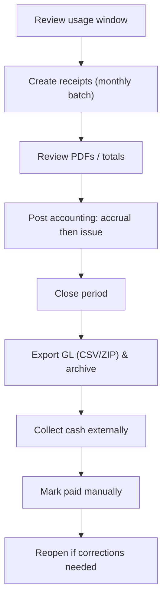
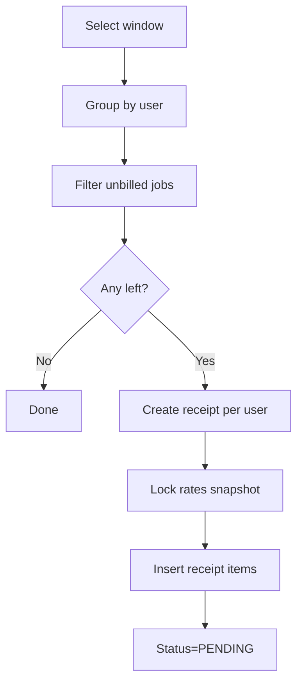
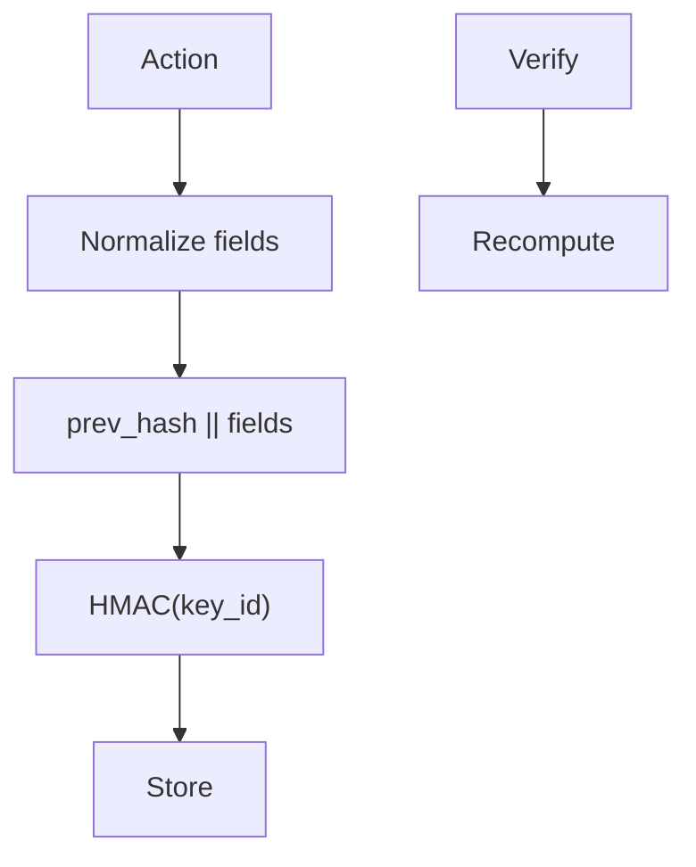

# Admin Guide

This guide covers everything an **admin/finance operator** does in the HPC Billing Platform: usage review, monthly invoice generation, tiers & rates, accounting periods and postings, exports, audit verification, and operational health. It reflects the **no‑online‑payment** configuration (mark paid is manual).

> Cross‑refs: [User Guide](17-usage.md), [Pricing Model](03b-pricing.md), [Accounting](03c-accounting.md), [Flows](05-flows.md), [Architecture](02-architecture.md).

---

## 1) Who this is for & prerequisites

- Role: `admin`. You’ll see **Dashboard, Usage, Billing, My Usage, Rates, Tiers, Audit, Ledger** sections.
- DB reachable (`/readyz` returns 200); you can sign in; Slurm or CSV fallback configured.
- Fonts installed for PDFs; tax settings reviewed if you issue VAT invoices.

---

## 2) Month‑end at a glance



> The app supports **Derived Journal** (preview) and **Posted GL** (authoritative). Closing a period locks posted entries; you can **reopen** if adjustments are required.

---

## 3) Admin dashboard and navigation

- **Dashboard**: KPIs (unbilled cost, receivables, recent jobs, top users/nodes, failures). Filtered charts for trend comparison.
- **Usage**: global view across users; same controls as user view but for **all** jobs.
- **Billing**: create monthly receipts, list/manage receipts, mark paid/revert, download PDFs/e‑tax.
- **My Usage**: your own jobs (handy for testing receipt flows).
- **Rates**: view/edit tier rates; API examples for `/formula`.
- **Tiers**: set per‑user tier overrides.
- **Audit**: view and **verify** the HMAC chain.
- **Ledger**: Derived vs Posted views; exports.

---

## 4) Usage review & data sources

- Primary source: **slurmrestd** (JSON) with auth.
- Fallback: `sacct` CLI.
- Last resort: **CSV** (read‑only mount) for demos.
- Parent/step rollups and pricing fallbacks are documented in [Pricing](03b-pricing.md).

**Tip**: Start with **Usage → Before = last day of the month** you plan to bill. Sanity‑check top users/nodes and failures on **Dashboard**.

---

## 5) Rates & tiers

### 5.1 Edit tier rates (UI)

1. Go to **Rates**.
2. Adjust per‑hour: **CPU**, **GPU**, **MEM** for tiers `mu|gov|private`.
3. Submit. Changes affect **future** previews; **issued receipts are unaffected** (they keep a rate snapshot).

### 5.2 API for rates (ETag)

```bash
# Read rates (with ETag)
curl -i http://localhost:8000/formula

# If you have an ETag from the previous call
curl -i -H 'If-None-Match: "<etag-value>"' http://localhost:8000/formula

# Update one tier (admin cookie + CSRF token required)
curl -X POST http://localhost:8000/formula \
  -H 'X-CSRFToken: <token>' \
  -H 'Cookie: session=<admin-session>' \
  -H 'Content-Type: application/json' \
  -d '{"tier":"gov","cpu":3.5,"gpu":10.0,"mem":1.0}'
```

### 5.3 Per‑user tier overrides

1. Go to **Tiers**.
2. Search username → set override `mu|gov|private`.
3. **Save**. The override is used for pricing **until removed**. Changes are **audited**.

> Removing an override reverts the user to the natural classifier. Existing receipts keep their locked tier.

---

## 6) Billing operations (no online payments)

### 6.1 Create monthly receipts (batch)

1. Go to **Billing**.
2. Pick the **month/window** (e.g., `2025‑09‑01 .. 2025‑09‑30`).
3. Click **Create month**.
4. The system groups **unbilled** jobs by user and creates **one receipt per user** for that window; empty users are skipped.
5. Resulting receipts start as **Pending** with PDFs available.



### 6.2 Create a personal test receipt

- **My Usage → Create receipt up to cut‑off** (useful for test runs).

### 6.3 View/download invoice PDFs

- Open any receipt → **Download PDF (EN/TH)**.

### 6.4 Mark paid (manual)

1. Open receipt → **Mark paid**.
2. Sets `status=PAID`, `paid_at=now`. Action is **audited**.

### 6.5 Revert to pending (eligibility)

- Allowed **only** if:

  - No external payment link exists (we don’t use online payments in this build), and
  - No downstream locks (e.g., **period closed**, **exported** or **sent** flags) block it.

- If eligible: **Revert** clears `paid_at` and returns `status=PENDING` (audited).

> **Error: duplicate job** — If creation fails, another receipt already contains the same `job_key`. Adjust the window or revert the earlier receipt (if policy allows) before retrying.

---

## 7) Accounting: journals, GL & periods

### 7.1 Derived Journal vs Posted GL

- **Derived Journal**: recomputed on demand for any window; mode **Preview (derived)** on the **Ledger** page.
- **Posted GL**: immutable entries created by posting batches; mode **Posted**.

### 7.2 Posting sequence


- **Accrual**: Dr **1150 Contract Asset** / Cr **4000 Service Revenue** (net of VAT) for the service month.
- **Issue**: Dr **1100 A/R** (gross) / Cr **1150** (net) / Cr **2100 VAT Output**.
- **Payment**: Dr **1000 Cash** / Cr **1100 A/R** when you **mark paid**.

### 7.3 Period close / reopen

- **Close** a period (YYYY/MM) after verifying the posted entries and exports.
- Closing prevents mutation of posted entries; **Reopen** to allow corrective postings (audited).

### 7.4 Ledger views & PDFs

- **Ledger** page shows both modes; CSV download buttons provided.
- **Ledger (TH) PDF** export is available for formal review.

---

## 8) Exports

### 8.1 GL CSV & convenience formats

- **Posted GL CSV**: `Admin → Ledger → Export posted GL (CSV)`.
- **Xero Sales / Bank CSV**: convenience endpoints if your finance team uses Xero.

### 8.2 Formal GL ZIP (manifest + HMAC)

- Generates a ZIP containing CSV files, a JSON **manifest** (file hashes, batch IDs, period), and an **HMAC signature** with `key_id`.
- Finance can verify offline with the shared key.

### 8.3 e‑Tax bundle (per receipt)

- Open a receipt → **e‑Tax JSON** and **e‑Tax ZIP** (unsigned). Coordinate with your e‑tax gateway for submission if required.

---

## 9) Audit & integrity

- Every admin action writes an **audit record** chained by HMAC: `{prev_hash, hash, key_id}`.
- **Verify chain** in **Audit**: runs recomputation from genesis and reports the first break (if any).
- **Rotate keys** by switching `AUDIT_HMAC_KEY_ID` and adding the previous key to `AUDIT_HMAC_KEYRING`.



---

## 10) Ops: health, metrics, alerts

- **/healthz**: process up.
- **/readyz**: DB reachable.
- **/metrics**: Prometheus text; includes pre‑warmed counters/histograms.

**Suggested alerts**

- High 5xx rate (server errors)
- Surge in login failures/locks
- Readiness flapping
- Failed export signature verifications

---

## 11) Security notes

- CSRF enforced on session POSTs; admin forms include tokens automatically.
- Login throttle/lockout per `(username, ip)`.
- Session cookies: `Secure`, `HttpOnly`, `SameSite`.
- Dev tools (Adminer/Swagger/MkDocs/Ollama) should remain internal.

---

## 12) PDFs & i18n

- **WeasyPrint** renders PDFs; ensure required system libs and Thai fonts are present in the container image.
- Invoice PDFs available in **EN** and **TH**; ledger PDF (TH) available in **Ledger**.

---

## 13) Troubleshooting

**Duplicate jobs on creation**

- Another receipt captured the same `job_key`. Locate and revert that receipt (if allowed) or adjust your window.

**WeasyPrint import/runtime errors**

- Ensure libs: `libcairo`, `pango`, `gdk-pixbuf`, fonts installed; rebuild the image if missing.

**/readyz returns 500**

- DB down or credentials invalid. Check container logs and `DATABASE_URL`.

**Totals differ between CSV and receipt**

- CSV uses **current rates**; receipts use **locked snapshot**.

**Thai text missing in PDFs**

- Confirm Thai fonts are installed in the image; use the standard Dockerfile.

---

## 14) Runbooks

### 14.1 Month‑end close

1. **Usage review** for the month; resolve anomalies.
2. **Create month** (batch receipts).
3. Spot‑check **PDFs** and totals for top users.
4. **Derive Journal** for service month; sanity‑check TB/P&L/BS.
5. **Post** accruals and issues.
6. **Close period** (YYYY/MM).
7. **Export** GL CSV and **Formal ZIP**; archive with signature.
8. **Distribute invoices** to users (out of band).
9. When cash arrives, **Mark paid** on receipts.
10. If necessary, **Reopen** a period and post corrections; re‑export.

### 14.2 Revert a mistakenly paid receipt

1. Open receipt → **Revert**.
2. If blocked, check: period closed? export flagged? external payment link?
   Remove the blocking condition per policy, or post an adjusting entry in the next period.

---

## 15) API & CLI cheat‑sheet

> Many admin actions are UI‑first, but these endpoints are useful for automation and checks.

- **Rates**: `GET /formula` (ETag), `POST /formula` (admin + CSRF)
- **Health**: `GET /healthz`, `GET /readyz`
- **Metrics**: `GET /metrics`
- **Audit verify**: `GET /admin/audit.verify.json`
- **Exports**: posted GL, Xero CSVs, e‑tax JSON/ZIP via `/admin/...` routes

```bash
# Verify audit chain
curl http://localhost:8000/admin/audit.verify.json | jq

# Health & readiness
curl -s -o /dev/null -w '%{http_code}\n' http://localhost:8000/healthz
curl -s -o /dev/null -w '%{http_code}\n' http://localhost:8000/readyz
```

---

## 16) Configuration checklist (ops)

- **Tax**: `BILLING_TAX_ENABLED`, `BILLING_TAX_LABEL`, `BILLING_TAX_RATE`, `BILLING_TAX_INCLUSIVE`.
- **Audit**: `AUDIT_HMAC_SECRET`, `AUDIT_HMAC_KEY_ID`, `AUDIT_HMAC_KEYRING`, `AUDIT_ANONYMIZE_IP`, `AUDIT_STORE_RAW_UA`.
- **Metrics**: `METRICS_ENABLED`.
- **Copilot (optional)**: `COPILOT_ENABLED`, embeddings/LLM model names, index directories.
- **Fallback**: `FALLBACK_CSV` for demos; Slurm REST/CLI for prod.

For a full list, see **Configuration Reference**.

---

## 17) Governance & records

- Keep **Formal GL ZIPs** and their signatures for each closed period.
- Archive **PDF invoices** and **CSV exports** under a period folder structure (e.g., `YYYY/MM/…`).
- Periodically **verify audit chain** and document results.

---

## 18) FAQ

**Can I edit a receipt line item?**
No. Receipts are derived from job usage; edit usage at the source or adjust via next month’s postings.

**Can I change a user’s tier retroactively?**
No. Only future pricing changes; existing receipts keep their snapshot.

**Do I need Slurm to be up to view data?**
No. The app can start without Slurm; historical data in the DB remains viewable. CSV fallback is available for demos.
