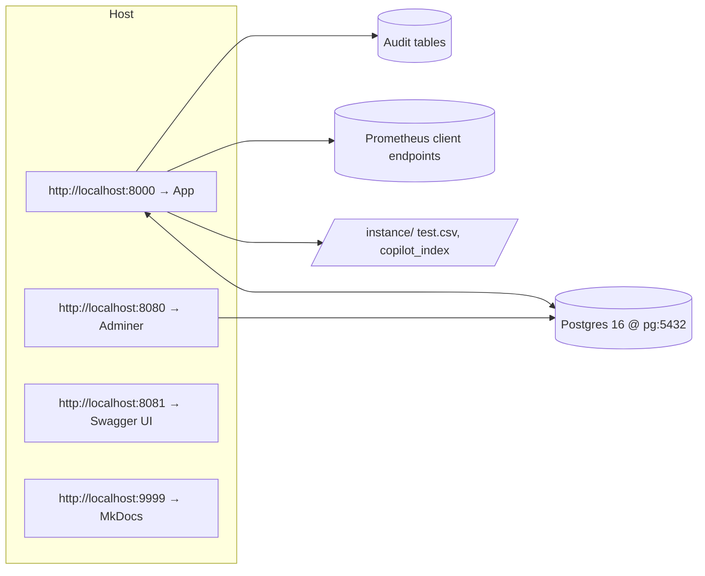

# Quickstart — Dev & Demo with Docker

This guide gets you running the **HPC Billing Platform** locally using Docker Compose with Postgres, Adminer, Swagger UI, and MkDocs.

> **Who is this for?** Reviewers, admins, and developers who want a working demo (with optional demo users and sample CSV ingestion).

---

## Prerequisites

- Docker Desktop (or Docker Engine) 24+
- Docker Compose v2 plugin
- ~2–4 GB free RAM
- Open ports on your host:

  - App **8000**, Adminer **8080**, Swagger **8081**, Postgres **5433**, Docs **9999**

> **Windows tip:** If a port is “forbidden/blocked,” inspect reserved ranges: `netsh int ipv4 show excludedportrange protocol=tcp`. Either free the port or change the host mapping in `docker-compose.yml`.

---

## What’s included

The Compose stack defines these services (some optional):



**Key ports (host → container):**

- `5433 → 5432` Postgres (`pg`)
- `8000 → 8000` Flask app (`hpc`)
- `8080 → 8080` Adminer (`adminer`)
- `8081 → 8080` Swagger UI (`swagger`)
- `9999 → 9999` MkDocs (`mkdocs`)

---

## First run

1. **Clone or unzip** the project, then in the project root:

   ```bash
   docker compose up --build -d
   ```

2. **Wait for readiness** (the app exposes health endpoints):

   - Liveness: [http://localhost:8000/healthz](http://localhost:8000/healthz)
   - Readiness: [http://localhost:8000/readyz](http://localhost:8000/readyz)

3. **Open the services:**

   - App UI: [http://localhost:8000](http://localhost:8000)
   - Adminer (DB console): [http://localhost:8080](http://localhost:8080)
   - Swagger UI: [http://localhost:8081](http://localhost:8081)
   - MkDocs site: [http://localhost:9999](http://localhost:9999)

> **Notes**
>
> - The app talks to Postgres at the Docker DNS name `pg` (not `localhost`).
> - DB data persists in the `pgdata` Docker volume.

---

## Admin bootstrap & demo users

On first boot the app can **seed an admin** and **demo accounts** based on environment variables set in `docker-compose.yml`:

- `ADMIN_PASSWORD`: if set and user `admin` doesn’t exist, the app creates it as an **admin**.
- `SEED_DEMO_USERS=1` and `APP_ENV=development`: parses `DEMO_USERS` and creates users on startup.
- `DEMO_USERS` format: `username:password[:role]` entries separated by commas. Role defaults to `user`.

**Example:**

```env
ADMIN_PASSWORD=rosebud
APP_ENV=development
SEED_DEMO_USERS=1
DEMO_USERS=gable:gable:user,alice:alice:user,bob:bob:admin
```

Then log in at [http://localhost:8000](http://localhost:8000) with `admin / ADMIN_PASSWORD`.

> For production, remove demo seeding and set a strong `FLASK_SECRET_KEY`.

---

## Ingest sources (demo vs real)

You can demo the system without a live Slurm cluster using a **CSV fallback**.

- Place your CSV at `./instance/test.csv` (mounted into the container).
- Set/keep `FALLBACK_CSV=/app/instance/test.csv`.
- The UI allows selecting time windows to bill; job rows should include CPU/GPU/Mem usage fields.

When connected to a cluster, ingestion can read from:

- `sacct` (CLI) inside the container
- `slurmrestd` (HTTP REST)

> See the **Data Sources** chapter for expected columns and configuration options.

---

## URLs & endpoints

- **UI**

  - Home, usage tables, receipts, admin dashboards
  - Health: `/healthz`, `/readyz`

- **API**

  - See Swagger UI at [http://localhost:8081](http://localhost:8081) (serves `/spec/openapi.yaml`)

- **Docs**

  - MkDocs (this site) at [http://localhost:9999](http://localhost:9999)

- **Database** (Adminer):

  - System: _PostgreSQL_
  - Server: `pg`
  - Username: `hpc_user`
  - Password: `muict`
  - Database: `hpc_app`

> The application itself uses a dedicated app user (e.g., `app_rw`) managed by the DB init scripts.

---

## Common operations

- **Follow logs**

  ```bash
  docker compose logs -f hpc
  docker compose logs -f pg
  ```

- **Restart the app**

  ```bash
  docker compose restart hpc
  ```

- **Open a shell inside the app**

  ```bash
  docker compose exec hpc bash
  ```

- **Reset everything (⚠️ destroys data)**

  ```bash
  docker compose down -v
  ```

---

## Troubleshooting

**Port already in use / forbidden on Windows**

- Change the _host_ port mapping in `docker-compose.yml` (left side of `host:container`).
- Or stop the conflicting service. To inspect:

  ```bash
  # Linux/macOS
  lsof -i :5433
  # Windows PowerShell
  netstat -ano | findstr :5433
  ```

- On Windows, check reserved ranges:

  ```powershell
  netsh int ipv4 show excludedportrange protocol=tcp
  ```

**Database isn’t ready**

- The app’s `/readyz` waits for a DB connection. Ensure `pg` is healthy and the network name `pg` resolves from the app container.

**PDF fonts / Thai layout**

- All WeasyPrint deps and common fonts are baked into the app image. No host installs required.

**Swagger spec not found**

- Ensure `./docs/api/openapi.yaml` exists and the Swagger service mounts `./docs/api:/spec:ro`.

---

## Security for demos vs production

- **Demos**: keep it local, use strong `ADMIN_PASSWORD`, and a non‑guessable `FLASK_SECRET_KEY`.
- **Production**: supply secrets via environment or a secrets manager, run behind HTTPS and a reverse proxy, and disable demo seeding.

---

## Next

Head to **Guides → Admin Guide** to set rates, create receipts, export GL/e‑Tax, and review the audit chain. Or explore **Concepts → Architecture** to understand components in depth.
