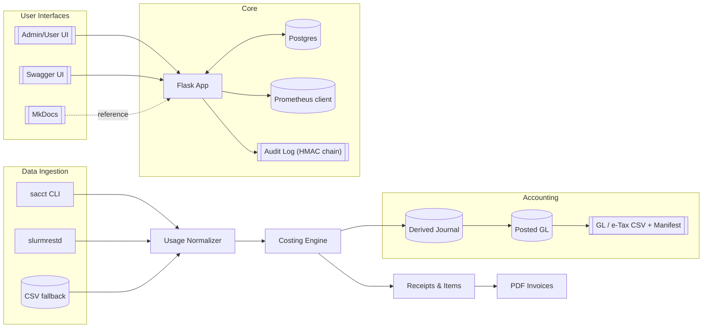
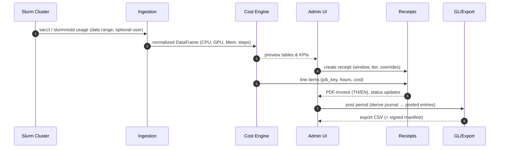

# HPC Billing Platform — Overview

Welcome! This site documents a Flask‑based platform for **measuring, pricing, billing, and accounting** for HPC/AI workloads (via Slurm). It’s designed for university and research clusters that need transparent cost recovery and simple financial exports.

---

## What the platform does

**Ingest → Rate → Bill → Export**, with audit and ops guardrails:

- **Usage ingestion**

  - Pulls job usage from Slurm via `sacct` (CLI) and/or **slurmrestd** (REST). A CSV fallback is supported for demos.
  - Normalizes job/step data, resolves parent/child steps, and computes derived metrics (CPU‑core‑hours, GPU‑hours, Mem‑GB‑hours, energy if present).

- **Pricing & costing**

  - Tiered rates (e.g., MU/Gov/Private) with admin‑editable formulas.
  - Optional per‑user/project overrides.
  - Deterministic cost engine for reproducibility.

- **Billing & receipting**

  - Generate receipts from selected usage windows; attach line‑items per job.
  - Produce **print‑ready PDFs** (WeasyPrint), including Thai/English layouts.
  - Track receipt status (pending → issued → paid/void).

- **Admin UI & dashboards**

  - One place to adjust rates, explore usage tables, manage invoices, and review audit logs.
  - KPI dashboards (e.g., unbilled, receivables, recent jobs, top users/nodes, failure reasons) with month filters.

- **Accounting & exports**

  - Derive a double‑entry **journal** (preview vs posted modes).
  - Post to a lightweight GL model and **export CSV** for finance/ERP (with signed manifest and HMAC integrity chain).

- **APIs**

  - Read/write endpoints for pricing formulas and admin tasks; Swagger UI served with the stack.

- **Security, audit, and ops**

  - Role‑based access (admin/user), CSRF protection, and login throttling/lockout.
  - **Tamper‑evident audit log** (HMAC chain) for critical actions.
  - Prometheus metrics for health, throughput, and events.

- **Internationalization (i18n)**

  - Flask‑Babel ready; English/Thai strings shipped for core UI.

- **Optional LLM Copilot**

  - An on‑prem helper (Ollama) can answer how‑to questions using these docs as context.

> **Who is it for?**
>
> - Cluster admins who need transparent cost recovery.
> - Finance teams who want clean exports, not a new ERP.
> - Researchers who need clear, itemized bills.

---

## Architecture at a glance

---

## End‑to‑end flow

---

## Major features (checklist)

- **Data sources**: sacct, slurmrestd, and CSV demo mode.
- **Costing**: tiered rates; CPU/GPU/Mem hour pricing; per‑user/project overrides.
- **Billing**: receipts with job‑level items; draft/issue/paid/void lifecycle; PDF export.
- **Dashboards**: costs, top users/nodes, error codes, monthly trend comparisons.
- **Accounting**: derived journal, posted GL, CSV exports + manifest/HMAC.
- **APIs**: pricing formula GET/POST, admin ops.
- **Security**: RBAC, CSRF, auth throttle/lockout; audit HMAC chain.
- **Observability**: Prometheus metrics; structured app logs.
- **i18n**: English/Thai.
- **Docs & Live Preview**: MkDocs (Material), Mermaid diagrams.

---

## What’s in / out of scope

**In scope**

- Pricing and billing logic tied to Slurm usage.
- Lightweight accounting exports (CSV/manifest) for downstream systems.
- Operational tooling (audit, metrics, dashboards).

**Out of scope**

- Full ERP or tax e‑filing portals.
- Payment gateways and receivables automation (basic models exist; gateways are not enabled by default).

---

## Next steps

- **Quickstart**: run the Docker Compose demo and explore the admin pages.
- **Guides**: see Admin Guide for rates, invoices, and accounting close.
- **API**: use the Swagger UI for programmatic integration.

> Tip: If you’re reviewing for the first time, start with **Quickstart → Dev & Demo (Docker)**, then read **Concepts → Architecture** and **Guides → Admin Guide**.
