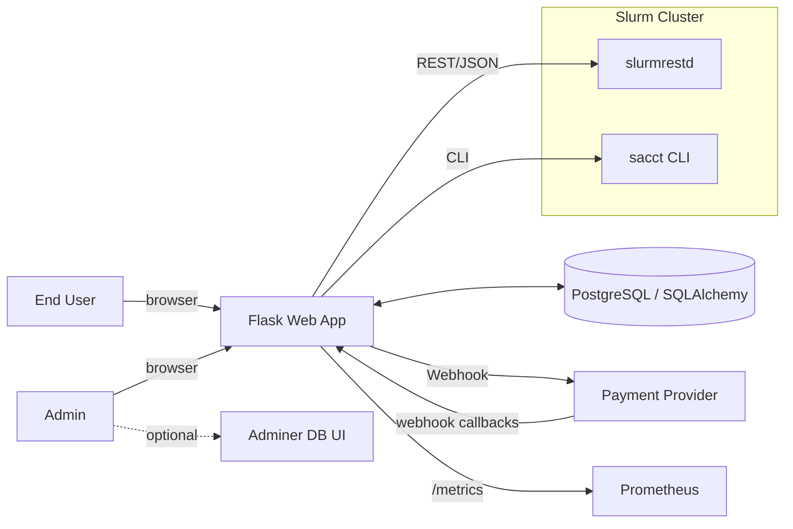
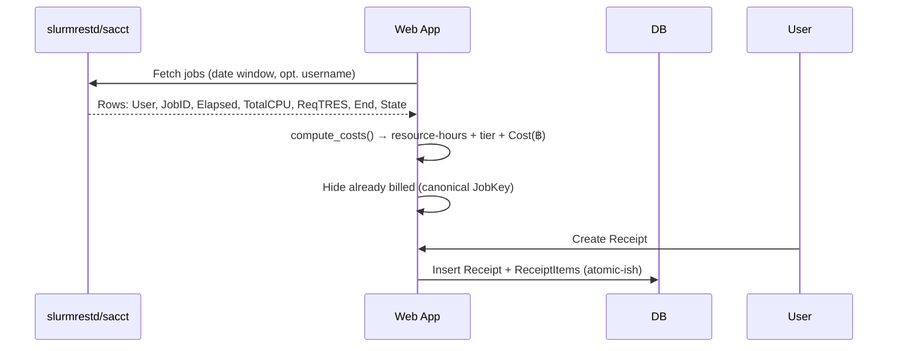
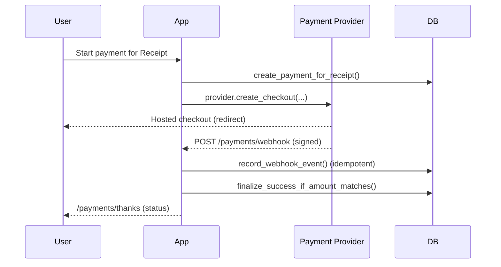

# Overview

> High-level introduction to the **HPC Billing Platform**: what it does, who it’s for, and how the pieces fit together.

!!! abstract "What this platform is"
A Flask-based web app that **pulls Slurm job usage**, **prices it** (tiered CPU/GPU/MEM hour rates), **issues receipts**, and (optionally) **collects payments via pluggable providers**. It exposes simple UI pages for users and admins, a minimal API for rates, health/ready checks for ops, and Prometheus metrics for observability.&#x20;

---

## Goals & non-goals

- **Goals**

  - Import Slurm usage (via `slurmrestd`, `sacct`, or CSV fallback).&#x20;
  - Compute costs with a simple, explainable formula and tiered pricing.&#x20;
  - Let users generate **receipts** for unbilled jobs; let admins view/mark receipts paid.&#x20;
  - Optionally take **online payments** via adapters (Stripe/Omise/…); verify by **webhook** before marking receipts paid.&#x20;
  - Log **auditable, tamper-evident** actions; expose **metrics**; support **health** and **readiness** checks. &#x20;

- **Non-goals**

  - Deep Slurm administration, quota management, or scheduler control.
  - Complex accounting policy; this app intentionally keeps pricing simple and transparent.&#x20;

---

## Who uses this?

- **End users**: view their historical usage, create receipts, optionally pay online.&#x20;
- **Admins/Finance**: adjust rates, view all users’ usage/aggregates, manage receipts and audit trail.&#x20;
- **Ops**: deploy and monitor the app, DB, and integrations (Slurm REST/CLI; payment provider).&#x20;

---

## Quick feature tour

- **Usage ingestion with fallbacks**: try `slurmrestd` → fall back to `sacct` → fall back to `test.csv`. Returns a uniform DataFrame (`User, JobID, Elapsed, TotalCPU, ReqTRES, End, State`).&#x20;
- **Cost engine**: parses `Elapsed`, `TotalCPU`, `ReqTRES` into resource-hours and applies tiered rates (`mu|gov|private`).&#x20;
- **Receipts**: create from unbilled jobs (server filters out duplicates by canonical JobID).&#x20;
- **Admin UI**: rates editor, usage (detail/aggregate), billing queue, audit export.&#x20;
- **Payments**: provider adapters, success via webhook only (amount & currency must match). &#x20;
- **Security**: CSRF, login throttling/lockout, role-based access. &#x20;
- **Observability**: Prometheus `/metrics` plus structured request logging. &#x20;
- **Ops endpoints**: `/healthz` (liveness), `/readyz` (DB readiness).&#x20;

---

## System context (C4-ish)



- Primary ingestion is **`slurmrestd`**; if unavailable, **`sacct`**; CSV is last resort for demos.&#x20;
- Payments flow through provider-hosted checkout → **provider webhook** → app finalization (idempotent).&#x20;
- **Adminer** runs alongside for DB inspection in dev.&#x20;

---

## Runtime architecture

**Flask app** with blueprints: `auth`, `user`, `admin`, `api`, `payments`. CSRF enabled globally; **payments webhook** is CSRF-exempt by design. i18n via Flask-Babel (`en`, `th`).&#x20;

- **Auth & roles**: local users DB (`admin|user`), login throttling/lockout, `admin_required` gate. &#x20;
- **User area**: usage (detail/aggregate), CSV export, receipt creation.&#x20;
- **Admin area**: rate management, all-users tables, billing, audit viewer/CSV.&#x20;
- **Rates API**: `GET /formula`, `POST /formula` (admin). ETag support on GET.&#x20;
- **Ops**: `/healthz`, `/readyz`, `/metrics`. &#x20;

---

## Key flows (high level)

### 1) Usage → Receipt



- Fallback chain + uniform columns.&#x20;
- Cost engine fields and tier classification.&#x20;
- Duplicate prevention via `receipt_items.job_key` uniqueness.&#x20;

### 2) Payment (optional)



- Success requires **amount & currency** match against local Payment row; then Receipt marked paid.&#x20;
- Webhook persisted with **unique (provider, external_event_id)** and signature status.&#x20;

---

## Data model (bird’s-eye)

Main tables (SQLAlchemy models):

- `users(username, password_hash, role, created_at)` with role constraint.&#x20;
- `rates(tier, cpu, gpu, mem, updated_at)` seeded defaults on first load.&#x20;
- `receipts(id, username, start, end, total, status, paid_at, method, tx_ref)` with status constraint.&#x20;
- `receipt_items(receipt_id, job_key, job_id_display, …)` with **PK(receipt_id, job_key)** and **`UNIQUE(job_key)`** (prevents double-billing).&#x20;
- `payments(id, provider, receipt_id, username, status, currency, amount_cents, external_payment_id, …)` with checks + indexes.&#x20;
- `payment_events(id, provider, external_event_id, payment_id, event_type, raw, signature_ok, received_at)` with **UNIQUE(provider, external_event_id)**.&#x20;
- `audit_log(..., prev_hash, hash, extra)` forming a **hash chain**.&#x20;
- `auth_throttle(username, ip, window_start, fail_count, locked_until)` with **UNIQUE(user,ip)** index.&#x20;

---

## Configuration (env)

Key `.env` knobs (dev defaults shown):

| Key                                                                  | Purpose                                                 |
| -------------------------------------------------------------------- | ------------------------------------------------------- |
| `DATABASE_URL`                                                       | SQLAlchemy DB URL (Postgres recommended).               |
| `ADMIN_PASSWORD`                                                     | Seeds an `admin` user on first run.                     |
| `FLASK_SECRET_KEY`                                                   | Required in production for sessions/CSRF.               |
| `APP_ENV`                                                            | `development`/`production`.                             |
| `FALLBACK_CSV`                                                       | Path to pipe-delimited demo CSV.                        |
| `SEED_DEMO_USERS`, `DEMO_USERS`                                      | Demo users seeding in dev.                              |
| `AUTH_THROTTLE_*`                                                    | Lockout thresholds & windows.                           |
| `SLURMRESTD_URL` (+ `*_TOKEN`/TLS knobs)                             | Slurm REST daemon access.                               |
| `METRICS_ENABLED`                                                    | Toggle `/metrics`.                                      |
| `PAYMENT_PROVIDER`, `PAYMENT_CURRENCY`, `SITE_BASE_URL`, `PAYMENT_*` | Payment adapter selection + redirects + webhook secret. |

!!! tip "Dev sanity"
Use `PAYMENT_PROVIDER=dummy` to test the full flow locally (`/payments/simulate`), then swap to Stripe/Omise with real secrets and a public webhook URL.&#x20;

---

## Security snapshot

- **Sessions/CSRF**: global CSRF protection; webhook route is CSRF-exempt by design.&#x20;
- **Auth throttling**: per-user+IP counters with timed lockout; neutral UX messages; audit on start/active/end. &#x20;
- **RBAC**: `admin_required` decorator and safe redirects for forbidden access.&#x20;
- **Audit trail**: hash-chained records; CSV export for compliance.&#x20;
- **Payments**: webhook signature check in provider adapter; mark receipt **only** after amount/currency verification. &#x20;

---

## Observability & ops

- **/metrics** (Prometheus): request counters/latency, auth counters, billing/payment events; series pre-warmed to avoid empty dashboards.&#x20;
- **Request logging**: method, path, status, latency ms; excludes static & `/metrics` to keep series clean.&#x20;
- **Health checks**:

  - `/healthz` = process up.&#x20;
  - `/readyz` = DB connectivity.&#x20;

---

## Deployment (dev)

- **Docker Compose** quick start:

  ```bash
  docker compose up -d --build
  ```

  App → `http://localhost:8000`, Adminer → `http://localhost:8080`. Postgres is started automatically.&#x20;

!!! warning "Production notes"
Provide a real `FLASK_SECRET_KEY`, use a managed Postgres, secure `slurmrestd` behind HTTPS/JWT, enable a real payment adapter with verified webhooks, and set proper `SITE_BASE_URL`. &#x20;

---

## File map (what to read next)

- **`app.py`** – app factory, blueprints, logging, i18n, CSRF, health/ready/metrics.&#x20;
- **Controllers** – `auth.py`, `user.py`, `admin.py`, `api.py`, `payments.py`. &#x20;
- **Models** – DB base/session, schema, billing/rates/users, payments, audit, throttle. &#x20;
- **Services** – usage sources (`data_sources.py`, `slurm_rest.py`), cost engine (`billing.py`), metrics, payments base/registry. &#x20;
- **Guides** – Slurm integration & Payment integration deep dives. &#x20;
- **`.env.example.txt`** – full list of configurable env vars.&#x20;

---

## Glossary

- **slurmrestd** – Slurm REST daemon exposing job/accounting endpoints.&#x20;
- **`sacct`** – Slurm CLI for accounting history.&#x20;
- **Receipt** – A priced bundle of unbilled jobs for a user and period.&#x20;
- **Provider adapter** – A small module that maps a payment gateway to the app’s `PaymentProvider` interface.&#x20;

---
