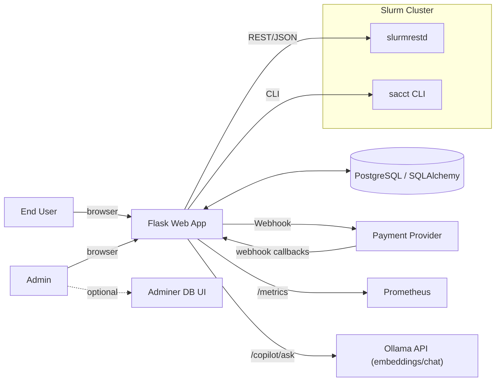
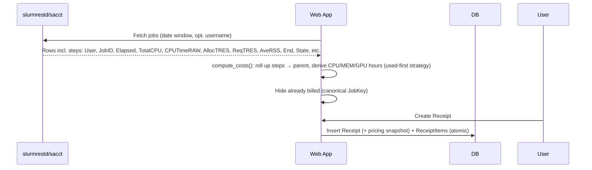
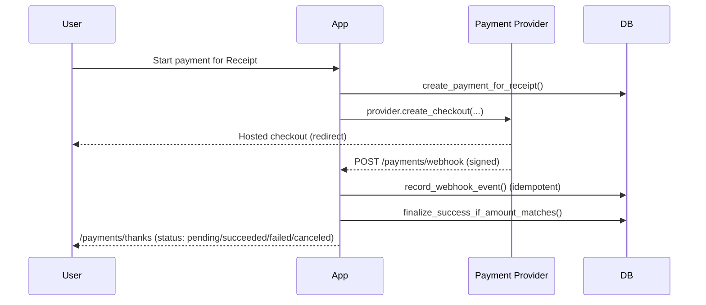

# Overview

> High-level introduction to the **HPC Billing Platform**: what it does, who it’s for, and how the pieces fit together.

!!! abstract "What this platform is"
A Flask-based web app that **pulls Slurm job usage**, **prices it** (tiered CPU/GPU/MEM hour rates), **issues receipts**, and (optionally) **collects payments via pluggable providers**. It exposes simple UI pages for users and admins, a minimal API for rates, health/ready checks for ops, and Prometheus metrics for observability.

---

## Goals & non-goals

- **Goals**

  - Import Slurm usage (via `slurmrestd`, `sacct`, or CSV fallback).
  - Compute costs with a simple, explainable formula and tiered pricing.
  - Let users generate **receipts** for unbilled jobs; let admins view/mark receipts paid.
  - Optionally take **online payments** via adapters (Stripe/Omise/…); verify by **webhook** before marking receipts paid.
  - Log **auditable, tamper-evident** actions; expose **metrics**; support **health** and **readiness** checks.

- **Non-goals**

  - Deep Slurm administration, quota management, or scheduler control.
  - Complex accounting policy; this app intentionally keeps pricing simple and transparent.

---

## Who uses this?

- **End users**: view their historical usage, create receipts, optionally pay online.
- **Admins/Finance**: adjust rates, view all users’ usage/aggregates, manage receipts and audit trail.
- **Ops**: deploy and monitor the app, DB, and integrations (Slurm REST/CLI; payment provider).

---

## Quick feature tour

- **Usage ingestion with fallbacks**: try `slurmrestd` → fall back to `sacct` → fall back to `test.csv`. Returns a uniform dataset including:
  `User, JobID (+ steps), Elapsed, TotalCPU, CPUTimeRAW, AllocTRES, ReqTRES, AveRSS, End, State`. Parent/step rows are normalized and rolled up.
- **Cost engine (updated)**:

  - **CPU core-hours**: sum of **step `TotalCPU`** (HH\:MM\:SS); fallback to **`CPUTimeRAW/3600`**; fallback to **`AllocCPUS × Elapsed`**.
  - **Memory GB-hours**: prefer **used** from steps (**`AveRSS` → GB × Elapsed**, summed); fallback to **allocated** from TRES (`mem=`) × Elapsed.
  - **GPU hours**: allocation-based from TRES (`gres/gpu=`) × Elapsed.
  - Users are classified to a **tier** (`mu|gov|private`) and rates applied.

- **Receipts**: create from unbilled jobs (server filters by **canonical JobKey** to prevent duplicates). Each receipt now stores a **snapshot of pricing** at creation time: `pricing_tier`, `rate_cpu`, `rate_gpu`, `rate_mem`, `rates_locked_at` (ensures future rate changes don’t alter historical totals).
- **Admin UI**: rates editor, usage (detail/aggregate), billing queue, audit export, and a **Dashboard** (KPIs + charts for 90-day cost trend, cost by tier, and top users).
- **Payments**: provider adapters, success via webhook only (amount & currency must match). Local payment status includes **`pending` / `succeeded` / `failed` / `canceled`** (provider-driven).
- **Security**: CSRF, login throttling/lockout, role-based access.
- **Observability**: Prometheus `/metrics` plus structured request logging.
- **Ops endpoints**: `/healthz` (liveness), `/readyz` (DB readiness).
- **Docs Copilot**: an in-app helper backed by **Ollama**. It embeds Markdown docs at `/docs/*.md` and answers questions with cited sources. Endpoints: `POST /copilot/ask`, `POST /copilot/reindex`; widget script at `/copilot/widget.js`.
- **User Tier Overrides (admin)**: set a per-user pricing tier (mu|gov|private). If the override tier chosen is the same as the natural classifier, the override is removed.

---

## System context (C4-ish)



- Primary ingestion is **`slurmrestd`**; if unavailable, **`sacct`**; CSV is last resort for demos.
- Payments flow through provider-hosted checkout → **provider webhook** → app finalization (idempotent).
- **Adminer** runs alongside for DB inspection in dev.

---

## Runtime architecture

**Flask app** with blueprints: `auth`, `user`, `admin`, `api`, `payments`, `copilot`. CSRF enabled globally; **payments webhook** is CSRF-exempt by design (_Copilot: keep `/copilot/reindex` admin-only; if CSRF is global, have the widget send `X-CSRFToken` when posting to `/copilot/ask`_). i18n via Flask-Babel (`en`, `th`).

- **Auth & roles**: local users DB (`admin|user`), login throttling/lockout, `admin_required` gate.
- **User area**: usage (detail/aggregate), CSV export, receipt creation.
- **Admin area**: rate management, all-users tables, billing, **dashboard**, audit viewer/CSV.
- **Rates API**: `GET /formula`, `POST /formula` (admin). ETag support on GET.
- **Ops**: `/healthz`, `/readyz`, `/metrics`.

---

## Key flows (high level)

### 1) Usage → Receipt



- Dedup via **global unique JobKey** across receipts.
- **Rates snapshot** stored on the receipt to lock historical totals.

### 2) Payment (optional)



---

## Data model (bird’s-eye)

Main tables (SQLAlchemy models):

- `users(username, password_hash, role, created_at)` with role constraint.
- `rates(tier, cpu, gpu, mem, updated_at)` seeded defaults on first load.
- `receipts(id, username, start, end, total, status, paid_at, method, tx_ref, created_at, pricing_tier, rate_cpu, rate_gpu, rate_mem, rates_locked_at)` — includes **pricing snapshot** fields.
- `receipt_items(receipt_id, job_key, job_id_display, cpu_core_hours, gpu_hours, mem_gb_hours, cost)` with **PK(receipt_id, job_key)** and **`UNIQUE(job_key)`** (prevents double-billing).
- `payments(id, provider, receipt_id, username, status[pending|succeeded|failed|canceled], currency, amount_cents, external_payment_id, checkout_url, idempotency_key, created_at, updated_at)` with checks + indexes.
- `payment_events(id, provider, external_event_id, payment_id, event_type, raw, signature_ok, received_at)` with **UNIQUE(provider, external_event_id)**.
- `audit_log(..., prev_hash, hash, extra)` forming a **hash chain**.
- `auth_throttle(username, ip, window_start, fail_count, locked_until)` with **UNIQUE(user,ip)** index.

---

## Configuration (env)

Key `.env` knobs (dev defaults shown):

| Key                                                                  | Purpose                                                 |
| -------------------------------------------------------------------- | ------------------------------------------------------- |
| `DATABASE_URL`                                                       | SQLAlchemy DB URL (Postgres recommended).               |
| `ADMIN_PASSWORD`                                                     | Seeds an `admin` user on first run.                     |
| `FLASK_SECRET_KEY`                                                   | Required in production for sessions/CSRF.               |
| `APP_ENV`                                                            | `development`/`production`.                             |
| `FALLBACK_CSV`                                                       | Path to pipe-delimited demo CSV.                        |
| `SEED_DEMO_USERS`, `DEMO_USERS`                                      | Demo users seeding in dev.                              |
| `AUTH_THROTTLE_*`                                                    | Lockout thresholds & windows.                           |
| `SLURMRESTD_URL` (+ `*_TOKEN`/TLS knobs)                             | Slurm REST daemon access.                               |
| `METRICS_ENABLED`                                                    | Toggle `/metrics`.                                      |
| `PAYMENT_PROVIDER`, `PAYMENT_CURRENCY`, `SITE_BASE_URL`, `PAYMENT_*` | Payment adapter selection + redirects + webhook secret. |
| `COPILOT_ENABLED`                                                    | Toggle feature (`true` default).                        |
| `COPILOT_DOCS_DIR`                                                   | Docs root to index (e.g., `./docs`).                    |
| `COPILOT_INDEX_DIR`                                                  | Vector cache dir (e.g., `./instance/copilot_index`).    |
| `OLLAMA_BASE_URL`                                                    | Ollama host (e.g., `http://localhost:11434`).           |
| `COPILOT_EMBED_MODEL`                                                | Embeddings model (e.g., `nomic-embed-text`).            |
| `COPILOT_LLM`                                                        | Chat model (e.g., `llama3.2`).                          |
| `COPILOT_TOP_K`                                                      | Retrieved chunks (default `6`).                         |
| `COPILOT_MIN_SIM`                                                    | Min cosine sim for answers (default `0.28`).            |
| `COPILOT_RATE_LIMIT_PER_MIN`                                         | Per-IP asks/min (default `12`).                         |

!!! tip "Dev sanity"
Use `PAYMENT_PROVIDER=dummy` to test the full flow locally (`/payments/simulate`), then swap to Stripe/Omise with real secrets and a public webhook URL.

---

## Security snapshot

- **Sessions/CSRF**: global CSRF protection; webhook route is CSRF-exempt by design.
- **Auth throttling**: per-user+IP counters with timed lockout; neutral UX messages; audit on start/active/end.
- **RBAC**: `admin_required` decorator and safe redirects for forbidden access.
- **Audit trail**: hash-chained records; CSV export for compliance.
- **Payments**: webhook signature check in provider adapter; mark receipt **only** after amount/currency verification.

---

## Observability & ops

- **/metrics** (Prometheus): request counters/latency, auth counters, billing/payment events; series pre-warmed to avoid empty dashboards.
- **Request logging**: method, path, status, latency ms; excludes static & `/metrics` to keep series clean.
- **Health checks**:

  - `/healthz` = process up.
  - `/readyz` = DB connectivity.

---

## Deployment (dev)

- **Docker Compose** quick start:

  ```bash
  docker compose up -d --build
  ```

  App → `http://localhost:8000`, Adminer → `http://localhost:8080`. Postgres is started automatically.

!!! warning "Production notes"
Provide a real `FLASK_SECRET_KEY`, use a managed Postgres, secure `slurmrestd` behind HTTPS/JWT, enable a real payment adapter with verified webhooks, and set proper `SITE_BASE_URL`.

---

## File map (what to read next)

- **`app.py`** – app factory, blueprints, logging, i18n, CSRF, health/ready/metrics.
- **Controllers** – `auth.py`, `user.py`, `admin.py`, `api.py`, `payments.py`, `copilot.py`.
- **Models** – DB base/session, schema, billing/rates/users, payments, audit, throttle.
- **Services** – usage sources (`data_sources.py`, `slurm_rest.py`), cost engine (`billing.py`), metrics, payments base/registry, `copilot.py` (Copilot RAG).
- **Guides** – Slurm integration & Payment integration deep dives.
- **`.env.example.txt`** – full list of configurable env vars.
- **Static** - `static/js/copilot-widget.js` (embeddable help widget).

---

## Glossary

- **slurmrestd** – Slurm REST daemon exposing job/accounting endpoints.
- **`sacct`** – Slurm CLI for accounting history.
- **Receipt** – A priced bundle of unbilled jobs for a user and period; **locks rates at creation**.
- **Provider adapter** – A small module that maps a payment gateway to the app’s `PaymentProvider` interface.
- **Docs Copilot** – An in-app assistant that answers questions about this project by retrieving from the Markdown docs and using an LLM to draft short answers with sources.
- **Ollama** – Local HTTP service that serves embeddings and chat models used by the Copilot.

---
